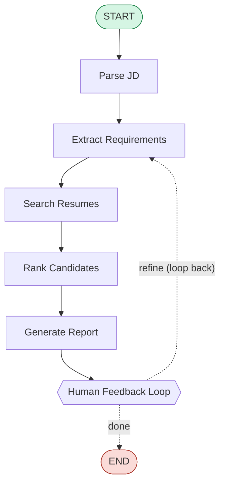

# State Machine Diagram

The agent is a LangGraph state machine. The diagram below is generated
directly from the compiled graph (`diagrams/render_diagram.py`) and renders
natively on GitHub.



This matches the assignment's required workflow exactly:

```
START → Parse JD → Extract Requirements → Search Resumes →
Rank Candidates → Generate Report → Human Feedback Loop → END
```

## Node responsibilities

| Node | Responsibility | Key tools used |
|------|----------------|----------------|
| **Parse JD** | Load / confirm the job description; count the corpus | `read_job_description` |
| **Extract Requirements** | Parse must-have vs nice-to-have + min years; merge live refinements | `extract_requirements`, `parse_query_criteria` |
| **Search Resumes** | RAG semantic search to build a candidate pool | `rag_search` |
| **Rank Candidates** | Score every candidate; keep prior ranking for deltas | `rank_candidates`, `score_candidate` |
| **Generate Report** | Human-readable shortlist + "what changed" explanation | — |
| **Human Feedback Loop** | `interrupt()` for human input; route back to refine or END | — |

## The Human-Feedback Loop

`human_feedback` calls LangGraph's `interrupt()`, which **pauses** the graph
and returns control to the caller (CLI). When resumed with
`Command(resume="<feedback>")`:

- free-text criteria (e.g. *"require Next.js and 5+ years"*) → route back to
  **Extract Requirements**, which merges the new criteria and re-ranks, then
  **Generate Report** explains the ranking changes;
- `done` / `end` / empty → route to **END**.

A `MemorySaver` checkpointer persists state across the interrupt so the
conversation (and shortlist reasoning) is retained between turns.

## Agent State

```python
class AgentState(TypedDict, total=False):
    messages: Annotated[list, add_messages]   # conversation history
    job_description: str
    query: str                                # active refinement / NL query
    requirements: dict                        # must / nice / min_years
    candidates_considered: int
    search_pool: list[str]                    # RAG-retrieved ids
    shortlist: list[dict]                     # ranked rows + reasoning
    previous_shortlist: list[dict]            # for change explanations
    report: str
    round: int
    rounds: dict                              # multi-round screening output
    feedback: str
    next_action: str                          # routing decision
```

## Multi-round screening (Part C)

Multi-round screening is orchestrated by the agent over the ranked shortlist
(`ResumeMatchingAgent.screen()`), keeping the core graph faithful to the
required linear diagram:

```
Round 1  initial screen  → top 10 of 100     (rank_candidates)
Round 2  deep analysis    → strengths/gaps    (deep_analysis)
Round 3  recommendation   → HIRE / NO-HIRE    (hire_recommendation)
```
