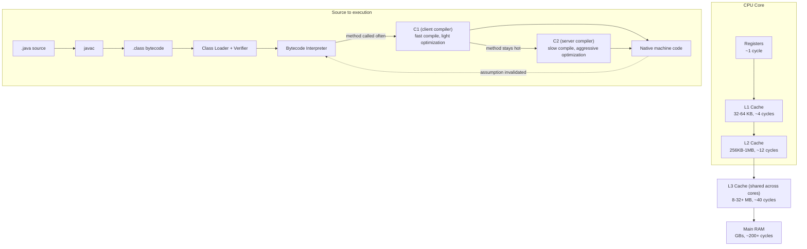
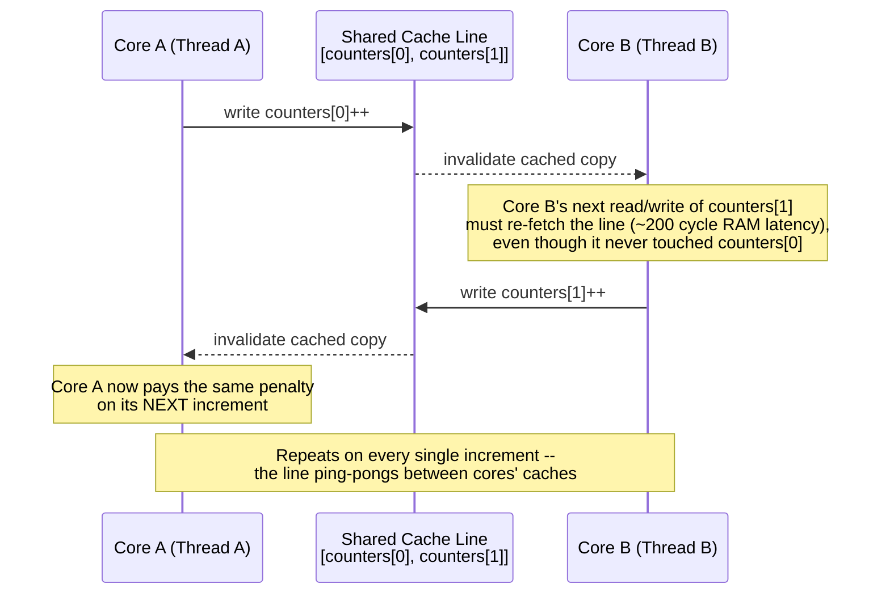
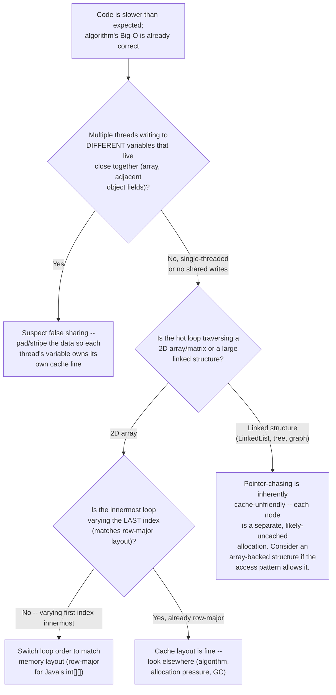
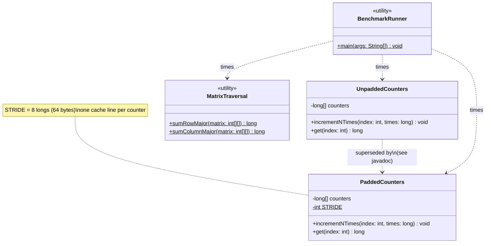

# Chapter 01.01 — Computer Architecture & How Code Becomes Execution

> Two engineers submit code reviews for the same feature: a batch job that
> sums a large 2D pricing matrix. Both pass every test. Both are "correct."
> In production, one version runs in 19 milliseconds; the other takes 280 —
> a 14x difference, on identical hardware, doing exactly the same arithmetic,
> because one iterates the matrix in memory order and the other doesn't. No
> profiler is needed to predict which is which if you understand how a CPU
> actually fetches memory — and a Staff Engineer is expected to predict it,
> not discover it after an incident.

**Part:** Part 01 — Programming Fundamentals · **Level:** Intermediate / Advanced
**Estimated study time:** 4-5 hours · **Status:** ✅ Complete

---

## Learning Objectives

- **Explain** the memory hierarchy (registers → L1/L2/L3 cache → main RAM) and the order-of-magnitude latency gap between each level.
- **Diagnose** cache-unfriendly code by reasoning about access patterns, not just by profiling after the fact.
- **Explain** false sharing — why two threads writing to unrelated variables can still contend — and implement the standard fix.
- **Trace** the path from `.java` source to running machine code: `javac` → bytecode → class loading → interpretation → JIT compilation (C1/C2, tiered compilation).
- **Compare** branch prediction's effect on hot-loop performance and recognize code shapes that defeat it.
- **Apply** cache-aware data layout decisions when designing hot-path data structures.

## Prerequisites

| Concept | Where it's covered | Required? |
|---|---|---|
| Basic Java syntax (arrays, loops, classes) | General prerequisite | Yes |
| Basic multithreading (`Thread`, `join()`) | Part 02 — Core Java, *Concurrency & the Java Memory Model* (📝 planned) | Yes — this chapter's false-sharing section assumes you can read a `Thread`-based demo |
| JVM heap/GC internals | [Chapter 02.04 — JVM Internals: Memory Management, Garbage Collection & Performance Tuning](../../Part-02-Core-Java/chapters/02-04-jvm-internals-memory-gc.md) | Helpful, not required — this chapter is the layer *below* that one: how memory access itself is fast or slow, before GC enters the picture |

## Introduction

Most working Java engineers have never needed to think below the JVM's
abstraction layer — the language hides the machine convincingly enough that
"how does a CPU actually execute this" feels like a computer-architecture
course topic, not a day-to-day backend concern. It becomes a day-to-day
concern the first time two functionally identical implementations of the
same algorithm have a 10x+ performance gap that no amount of "optimize the
Java code" thinking explains, because the actual bottleneck isn't the Java
code — it's how that code interacts with cache lines, memory latency, and
branch predictors that exist several layers below anything the JVM
specification describes.

This chapter builds the mental model from the hardware up: the memory
hierarchy and why it exists, cache lines and false sharing (a real,
easy-to-write concurrency performance bug with zero correctness symptoms),
and the actual pipeline that turns a `.java` file into executing machine
code — bytecode, the interpreter, and the JIT compiler's tiered
optimization strategy. This is exactly the kind of "why" that separates an
engineer who can explain *why* row-major traversal beats column-major from
one who has only memorized *that* it does — and it's squarely the kind of
follow-up a Staff Engineer interview loop will ask after any performance
question.

## Theory

### The memory hierarchy

Every general-purpose CPU is built around a hard trade-off: memory that's
fast to access is expensive and physically small; memory that's cheap and
large is slow. Rather than picking one point on that trade-off, real
systems stack several layers, each acting as a cache for the layer below:

| Level | Typical size | Typical latency | Relative speed |
|---|---|---|---|
| Register | Bytes | ~1 cycle | baseline |
| L1 cache | 32-64 KB per core | ~4 cycles | ~4x slower than a register |
| L2 cache | 256 KB-1 MB per core | ~12 cycles | ~3x slower than L1 |
| L3 cache | 8-32+ MB, shared across cores | ~40 cycles | ~3x slower than L2 |
| Main RAM | GBs | ~200+ cycles | ~5x slower than L3, ~50-200x slower than a register |

These numbers are illustrative order-of-magnitude figures (they vary by
CPU generation), but the *shape* of the curve is the load-bearing fact: a
main-memory access can cost two orders of magnitude more than an L1 hit.
Every optimization in this chapter — cache-friendly traversal, false-sharing
avoidance — is ultimately about staying higher in this hierarchy more often.

### Cache lines, not bytes, are the unit of transfer

CPUs never fetch a single byte or even a single `long` from RAM into cache
— they fetch a fixed-size **cache line**, typically 64 bytes on modern
x86/ARM hardware. This has two direct consequences that recur throughout
this chapter:

1. **Spatial locality is rewarded.** If you read `array[0]`, the next 7
   `long`s (or 15 `int`s) are *already in L1* because they arrived in the
   same 64-byte fetch — reading them costs almost nothing extra. This is
   exactly why row-major traversal of a 2D array (contiguous in memory) is
   fast, and column-major traversal (jumping between rows) is slow: each
   column access likely misses the cache and triggers a fresh ~200-cycle
   RAM fetch.
2. **False sharing is possible.** If two *unrelated* variables happen to
   land in the same 64-byte cache line, threads modifying them on
   different CPU cores contend anyway — see Internal Working.

### Branch prediction

Modern CPUs use deep instruction pipelines — multiple instructions are
in-flight simultaneously, each at a different stage of execution. A
conditional branch (`if`, loop condition) is a problem for a pipeline: the
CPU doesn't know which instruction comes next until the branch's condition
is evaluated, which may be several pipeline stages away. Rather than stall
and wait, the CPU **predicts** which way the branch will go (based on
recent history) and speculatively executes down that path. A correct
prediction costs nothing extra; a **misprediction** requires flushing the
speculatively-executed pipeline stages and restarting — typically a
10-20+ cycle penalty, repeated on every mispredicted branch.

This is why a tight loop with a *predictable* pattern (e.g., always true,
or alternating in a fixed pattern) is fast, while a loop branching on
effectively random data (e.g., `if (array[i] > threshold)` over
unsorted, uniformly random data) can be measurably slower than the exact
same arithmetic over sorted data — the classic "branch prediction" coding
interview surprise.

## Internal Working

### False sharing, mechanically

Cache coherency across cores is maintained by a protocol (MESI or a
variant) that tracks, per cache line, whether it is exclusively owned by
one core's cache, shared read-only across several, or invalidated. When
core A writes to any byte within a cache line, every other core holding
that line in its own cache must invalidate its copy — even if core B's
next access is to a completely different byte within that same line.

Concretely: if `counters[0]` and `counters[1]` (two adjacent `long`s in an
array) happen to share a 64-byte cache line, and thread A repeatedly
increments `counters[0]` while thread B repeatedly increments
`counters[1]`, every single increment by A invalidates B's cached copy of
the line (forcing B to re-fetch it), and vice versa. Neither thread is
touching the other's data — there's no data race, no synchronization bug,
nothing a correctness review would catch — but the cache line ping-pongs
between cores' caches on every write, and each thread pays close to a full
RAM-latency penalty on nearly every operation instead of an L1-latency one.

The fix (see Code Examples) is to pad each thread's counter out to occupy
its own cache line, so no two threads' counters can ever share one. This
chapter's code sample measures the effect directly rather than asserting
it: **559 ms for unpadded (false-shared) counters vs. 352 ms for padded
counters**, on 4 threads doing 200 million increments each — a real,
measured ~1.6x difference from changing nothing but memory layout.

### From `.java` to running machine code

1. **`javac`** compiles Java source to **bytecode** (`.class` files) — a
   platform-independent instruction set for the JVM's own stack-based
   virtual machine, not the host CPU's instruction set.
2. **Class loading** reads the `.class` file, verifies bytecode safety
   (the verifier — rejects malformed or unsafely-typed bytecode before
   execution), and prepares the class for use.
3. **Interpretation.** Initially, the JVM's bytecode **interpreter**
   executes bytecode instructions one at a time — correct, but slow
   relative to native machine code, since every instruction pays
   interpretation overhead.
4. **JIT compilation (tiered).** The JVM profiles execution as it
   interprets, and "hot" methods (called or looped frequently) get
   compiled to native machine code by the **JIT compiler**, which then
   replaces the interpreted version for future calls. HotSpot uses
   **tiered compilation**:
   - **C1 (client compiler)** kicks in first — compiles quickly with
     lighter optimization, trading peak performance for fast warmup.
   - **C2 (server compiler)** kicks in for the hottest methods after
     more profiling data accumulates — slower to compile, but applies
     aggressive optimizations (inlining, loop unrolling, escape analysis)
     that C1 skips.
   - Methods can be **deoptimized** back to the interpreter if a runtime
     assumption C2 relied on (e.g., "this call site has only ever seen one
     concrete type") turns out to be wrong — this is why a JIT-compiled
     hot path can suddenly show a latency spike the first time a
     previously-monomorphic call site sees a second implementation.

This tiered strategy is *why* microbenchmarks must warm up before
measuring (JMH's entire design exists around this) and why a service's
first few minutes after deploy are often measurably slower than its
steady state — the JIT hasn't finished promoting hot methods to C2 yet.

## Architecture



## Sequence Diagrams (Mermaid)

The false-sharing scenario from Internal Working, showing the cache-line
invalidation traffic that never shows up in a correctness review:



## Flow Charts (Mermaid)

A diagnostic decision tree for "this code is slower than it should be, and
profiling points at memory access, not algorithm complexity":



## Class Diagrams (Mermaid)



## Production Examples

Real, measured output from this chapter's code sample (`BenchmarkRunner`,
run on the sandbox this book was written in — not hypothetical numbers):

```text
False sharing demo (4 threads x 200000000 increments each):
  Unpadded (false-shared) counters: 559 ms
  Padded (isolated) counters:       352 ms
  (Padded is typically several times faster under contention on multi-core hardware.)

Matrix traversal demo (4000x4000):
  Row-major sum:    47999991 in 19 ms
  Column-major sum: 47999991 in 280 ms
  (Same sum both ways -- column-major is typically several times slower due to cache misses.)
```

A realistic production framing for the matrix result: a nightly batch job
recomputing a 4,000×4,000 pricing/risk matrix that iterates
column-by-column (because that's how the business logic was originally
described, "for each product, sum across all dates") pays roughly a 260ms
tax **per matrix, per run** compared to a row-major-equivalent
reformulation — small in isolation, but the kind of fixed cost that compounds
across thousands of daily batch invocations into real infrastructure spend,
and the kind of thing a profiler flags as "this function is slow" without
ever telling you *why*, unless you already know to look at access pattern
first.

## Code Examples

The full, compiling code sample for this chapter lives at
[`code-samples/cache-and-execution/`](../code-samples/cache-and-execution/):

```bash
cd Part-01-Programming-Fundamentals/code-samples/cache-and-execution
mvn -q compile   # compiles cleanly against Java 21
mvn -q test      # 6 JUnit 5 tests (correctness only -- see below), all passing
java -cp target/classes com.handbook.fundamentals.cache.BenchmarkRunner  # manual timing demo
```

**The false-sharing bug** — `UnpaddedCounters`, where adjacent threads'
counters share a cache line:

```java
public final class UnpaddedCounters {
    private final long[] counters;
    public void incrementNTimes(int index, long times) {
        for (long i = 0; i < times; i++) {
            counters[index]++;
        }
    }
}
```

**The fix** — `PaddedCounters`, striping each logical counter across its
own 64-byte cache line via array padding (portable, unlike relying on JVM
object field layout):

```java
public final class PaddedCounters {
    private static final int STRIDE = 8; // 8 longs * 8 bytes = 64 bytes
    private final long[] counters;
    public void incrementNTimes(int index, long times) {
        int slot = index * STRIDE;
        for (long i = 0; i < times; i++) {
            counters[slot]++;
        }
    }
}
```

**Why the tests assert correctness, not timing:** wall-clock comparisons
are inherently noisy (JIT warmup, OS scheduling, machine load) and make a
flaky CI test. `UnpaddedCountersTest`/`PaddedCountersTest` instead assert
that every thread's final count is exactly correct — proving false sharing
is purely a *performance* bug with zero correctness symptoms, which is
exactly why it's easy to ship unnoticed. The performance claim itself is
demonstrated separately via `BenchmarkRunner`'s manual run (see Production
Examples for real captured output), not gated in the test suite.

**Row-major vs. column-major traversal**, both provably correct via
`MatrixTraversalTest`'s cross-check that both orders sum to the same total:

```java
public static long sumRowMajor(int[][] matrix) {
    long sum = 0;
    for (int[] row : matrix) {
        for (int value : row) {
            sum += value;
        }
    }
    return sum;
}
```

## Best Practices

| Do | Don't | Why |
|---|---|---|
| Traverse multi-dimensional arrays in memory order (row-major for Java's `int[][]`) | Traverse in whatever order the business logic happens to be described in | Memory-order traversal keeps cache-line fetches fully utilized; the "natural" business description often doesn't match memory layout |
| Pad/stripe per-thread counters and other hot, independently-written fields | Assume "no data race" means "no performance problem" | False sharing produces zero correctness symptoms but very real contention — code review alone won't catch it |
| Warm up before trusting a microbenchmark | Trust a single cold-start timing measurement | Tiered compilation means early calls run interpreted or C1-compiled, meaningfully slower than steady-state C2 code |
| Reach for array-backed structures on genuinely hot, large-scale traversal paths | Default to linked structures (`LinkedList`, tree-of-objects) for hot paths without considering cache effects | Pointer-chasing through separately-allocated nodes is close to worst-case for cache locality |
| Measure real effects before optimizing for cache behavior | Micro-optimize memory layout everywhere "for cache friendliness" | The 260ms matrix example is real precisely because it was measured — premature layout optimization on cold paths wastes engineering time for no observable benefit |

## Common Mistakes

| Mistake | Why it happens | How to fix it |
|---|---|---|
| Treating false sharing as a correctness bug to hunt for in code review | The name "sharing" sounds like it implies a race | Recognize it purely as a cache-coherency performance effect — correctness review won't find it; a profiler showing unexplained contention on independent variables is the actual signal |
| Assuming `int[][]` in Java is a single contiguous 2D block like C | Coming from a language/mental-model where 2D arrays are flat | Java's `int[][]` is an array of row references — rows are individually contiguous, but the array-of-arrays structure still rewards row-major traversal |
| Optimizing traversal order on a cold, rarely-called path | Applying a "best practice" without checking if it's load-bearing | Confirm the path is actually hot (profiling, request volume) before spending effort — this chapter's 260ms number matters because it's a nightly batch job run thousands of times, not because row-major is inherently "correct" |
| Benchmarking with a single untimed warmup-free run | Feels like the fast way to get an answer | Run enough iterations to reach steady-state JIT compilation before trusting a number — or use a proper harness like JMH for anything going into a real decision |
| Assuming branch prediction doesn't matter for "just an if statement" | Branches feel too small-scale to matter | On a sufficiently hot loop over unpredictable data, misprediction penalties (10-20+ cycles each) compound into a measurable, sometimes dominant, cost |

## Performance Considerations

- **The memory hierarchy's latency gap is 2+ orders of magnitude** between
  a register/L1 hit and a main-memory access — this single fact underlies
  nearly every cache-related optimization in this chapter and the wider
  book (JVM GC tuning, database buffer pools, CDN caching all rhyme with
  the same principle at different scales).
- **False sharing's real-world cost scales with contention, not data
  size** — the measured 1.6x slowdown here came from 4 threads contending
  on 4 adjacent counters; the effect gets worse, not better, as thread
  count increases on a shared, poorly-laid-out structure.
- **Column-major traversal's penalty scales with matrix size** — for a
  small matrix that mostly fits in cache regardless of traversal order,
  the effect shrinks; the 14.7x measured gap here is specific to a
  4,000×4,000 matrix that meaningfully exceeds typical L2/L3 capacity.
- **JIT warmup cost is a real, bounded, one-time tax** — not something to
  chase indefinitely, but relevant when comparing "cold start" service
  latency (containers, serverless) against steady-state throughput
  numbers from a long-running benchmark.

## Security Considerations

- **Timing side-channels exploit exactly this chapter's material** —
  cache-timing attacks (e.g., variants in the Spectre/Meltdown family, or
  simpler cache-timing attacks against naive cryptographic comparisons)
  measure how long an operation takes to infer information about data that
  should be secret (a key byte, a password character) based on
  cache-hit/miss timing differences. This is why cryptographic libraries
  use **constant-time comparison** functions instead of a naive
  early-exit `equals()` loop — an early-exit comparison leaks how many
  leading bytes matched via timing alone.
- **Branch-prediction-based side channels** are a related, more advanced
  concern in security-sensitive code (e.g., cryptographic implementations)
  — a data-dependent branch can leak information through measurable
  timing differences between the predicted and mispredicted paths, which
  is why security-critical comparison/lookup code is often deliberately
  written to avoid data-dependent branching entirely.

## Production Troubleshooting

| Symptom | Root Cause | Diagnosis | Fix |
|---|---|---|---|
| Multi-threaded code shows contention/poor scaling with more threads, but no shared mutable state in the obvious sense | False sharing on adjacent independent fields/array slots | Profile with a hardware-counter-aware tool (e.g. `perf c2c` on Linux, or JFR's hardware-counter events) looking for cache-line contention, not lock contention | Pad/stripe the contended fields (see `PaddedCounters`) |
| A batch/reporting job over a large matrix or 2D dataset is unexpectedly slow relative to its Big-O | Traversal order doesn't match memory layout | Check the loop nesting order against the array's actual memory layout (row-major for Java) | Reorder loops to traverse in memory order |
| A service's latency is measurably worse in the first minutes after deploy than at steady state, with no code difference | JIT warmup — hot methods haven't been promoted to C2 yet | Compare JFR/async-profiler flame graphs from immediately-post-deploy vs. steady-state; look for time spent in the interpreter or C1-compiled frames | Usually expected and not "fixable" per se — consider a warmup/readiness-gating strategy if this materially affects SLA-sensitive early traffic |
| A hot loop over data-dependent conditions is slower than an equivalent loop over sorted/predictable data, same operation count | Branch misprediction | Compare performance before/after sorting the input (if a sort is cheap relative to the loop) as a diagnostic — a large speedup after sorting strongly implicates misprediction | Sort or restructure data to make the branch pattern predictable where feasible, or use branchless techniques (e.g. bitwise select) on proven-hot paths |

## Interview Questions

1. **"Explain the memory hierarchy and why it exists."**
   *Model answer:* CPUs trade off memory speed against size/cost — fast
   memory (registers, L1) is small and expensive per byte; slow memory
   (RAM) is cheap and large. Stacking several cache levels lets the common
   case (recently/nearby-accessed data) hit fast memory while still
   supporting large total working sets, at the cost of a 2+ order of
   magnitude latency penalty on a cache miss.

2. **"What is false sharing, and why doesn't a correctness review catch it?"**
   *Model answer:* Two threads writing to different variables that happen
   to share a CPU cache line contend at the cache-coherency level even
   though there's no shared data and no data race — every write by one
   thread invalidates the other's cached copy of the whole line. It's
   purely a performance effect with zero correctness symptoms, so nothing
   in a functional/correctness review would surface it.

3. **"Why is row-major traversal of a 2D array faster than column-major in Java?"**
   *Model answer:* Java's `int[][]` stores each row as a separately
   allocated, internally-contiguous array. Row-major traversal (varying
   the last index innermost) matches this layout, so each 64-byte cache
   line fetched from RAM is fully consumed before the next fetch;
   column-major traversal jumps to a different row on every access,
   causing a cache miss (and a ~200-cycle RAM fetch) on nearly every read.

4. **"Walk me through what happens between running `javac` and a hot method executing at full speed."**
   *Model answer:* `javac` compiles to bytecode; the class loader verifies
   and loads it; the JVM initially interprets bytecode one instruction at
   a time; as the JVM profiles execution, frequently-called/looped methods
   get compiled by C1 (fast, light optimization) and, if they stay hot,
   later recompiled by C2 (slower to compile, aggressively optimized) —
   this is tiered compilation, and it's why benchmarks need warmup before
   the numbers reflect steady-state performance.

5. **"How would you fix a false-sharing bug without hand-padding object fields?"**
   *Model answer:* Hand-padding an object's fields (unused `long` fields
   before/after the real value) isn't portably guaranteed to work, since
   the JVM can reorder fields for alignment. A striped array approach
   (each logical counter occupies every Nth slot in a backing array, with
   unused slots as padding) sidesteps object-layout uncertainty entirely
   and is straightforward to reason about.

6. **"What is a branch misprediction, and what does it cost?"**
   *Model answer:* Modern CPUs speculatively execute down a predicted
   branch path to keep a deep instruction pipeline full; when the
   prediction is wrong, the speculatively-executed pipeline stages must be
   flushed and execution restarted from the correct path — typically a
   10-20+ cycle penalty per misprediction, which compounds significantly
   in a hot loop over unpredictable data.

7. **"Why might a service be measurably slower in the first few minutes after a deploy?"**
   *Model answer:* JIT warmup — newly started JVM instances begin
   interpreting bytecode and only promote hot methods to optimized C1/C2
   machine code after enough profiling data accumulates, so early traffic
   runs on slower interpreted/lightly-optimized code compared to a
   long-running instance's steady state.

8. **"Give an example of a timing side-channel and why constant-time comparison matters."**
   *Model answer:* A naive `equals()`-style comparison that returns early
   on the first mismatched byte leaks, via timing, how many leading bytes
   of a secret (e.g., an API key or MAC) matched an attacker's guess —
   repeated timing measurements can reconstruct the secret byte-by-byte.
   Constant-time comparison functions always examine every byte
   regardless of an early mismatch, removing the timing signal.

## Hands-on Exercises

### Lab 1 (Beginner)

**Goal:** Reproduce the memory-hierarchy latency gap conceptually.

**Setup:** Pen and paper, or the Theory section's table.

**Task:** Given the illustrative latencies in this chapter (L1 ~4 cycles,
L3 ~40 cycles, RAM ~200+ cycles) and a hypothetical 3 GHz CPU, compute the
approximate wall-clock time (in nanoseconds) for a single L1 hit vs. a
single RAM access. Then estimate how many L1 hits could complete in the
time of one RAM access.

**Verification:** Your computed ratio should land in the same
order-of-magnitude range as the chapter's stated "2+ orders of magnitude"
claim (i.e., roughly 50-200x), and you can explain in one sentence why this
ratio is *the* reason caching exists at every layer of a computing system,
not just CPUs.

### Lab 2 (Intermediate)

**Goal:** Run this chapter's benchmark yourself and interpret the results.

**Setup:** `code-samples/cache-and-execution/`.

**Task:** Run `mvn -q compile` then `java -cp target/classes
com.handbook.fundamentals.cache.BenchmarkRunner` at least 3 times. Record
the false-sharing and matrix-traversal numbers each run.

**Verification:** Padded counters should be faster than unpadded in every
run (though the exact ratio will vary from this chapter's captured 559ms
vs. 352ms depending on your hardware), and row-major matrix traversal
should be faster than column-major in every run. If either result is
inverted or inconsistent, investigate before trusting any single run's
number — this is itself the point of Common Mistakes' warmup guidance.

### Lab 3 (Advanced)

**Goal:** Extend `PaddedCounters` to prove the striping actually prevents
false sharing, not just correctness.

**Setup:** `code-samples/cache-and-execution/`,
`RangeBasedIdGenerator`-style extension pattern (see Part-12's code sample
for a similar pluggable-strategy shape, if you want a reference).

**Task:** Add a configurable `PaddedCounters(int numCounters, int
strideLongs)` constructor allowing the stride to be set explicitly. Write a
new benchmark (or extend `BenchmarkRunner`) comparing `strideLongs=1` (no
padding — equivalent to `UnpaddedCounters`), `strideLongs=4` (32 bytes —
half a cache line), and `strideLongs=8` (64 bytes — a full cache line).

**Verification:** Your results should show `strideLongs=8` performing
comparably to (or better than) `strideLongs=4`, and both meaningfully
faster than `strideLongs=1` — demonstrating that padding needs to reach at
least a full cache line width to eliminate false sharing, not just "some"
padding.

### Lab 4 (Production)

**Goal:** Diagnose a simulated "unexplained batch job slowdown" incident
using only this chapter's diagnostic method.

**Setup:** `code-samples/cache-and-execution/`, `MatrixTraversal`.

**Task:** Imagine you're told: "Our nightly risk-matrix batch job's runtime
doubled after a refactor last week, and the diff only touched loop nesting
order, nothing algorithmic." Using this chapter's Production
Troubleshooting table as your framework, write a short incident report
(Symptom / Root Cause / Diagnosis / Fix) predicting what the diff likely
changed and how you'd confirm it without needing to see the actual diff —
just from the symptom description.

**Verification:** Your report should correctly hypothesize a switch from
row-major to column-major (or vice versa) traversal as the likely root
cause, name "compare loop nesting order against array memory layout" as the
diagnosis step (not "run a profiler and guess"), and cite this chapter's
measured 14.7x gap as the kind of magnitude that would plausibly explain a
reported "doubled" runtime even on a partially-mixed workload.

## Summary

- The memory hierarchy exists because fast memory is small/expensive and
  slow memory is large/cheap — every cache level trades off between the
  two, with a 2+ order-of-magnitude latency gap between an L1 hit and a
  RAM access.
- CPUs fetch fixed-size **cache lines** (typically 64 bytes), not
  individual variables — this rewards spatial locality (row-major array
  traversal) and creates the possibility of **false sharing** (unrelated
  variables contending because they share a line).
- False sharing is a **performance bug with zero correctness symptoms** —
  measured at ~1.6x slowdown in this chapter's demo — and the fix is
  padding/striping shared data structures so independent variables never
  share a cache line.
- Column-major traversal of a large 2D array measured **14.7x slower**
  than row-major in this chapter's demo — memory layout, not algorithmic
  complexity, was the entire difference.
- Java source goes `javac` → bytecode → class loading/verification →
  interpretation → JIT compilation, with **tiered compilation** (C1 then
  C2) meaning steady-state performance is only reached after warmup —
  relevant to both microbenchmarking and post-deploy latency behavior.
- **Branch misprediction** costs 10-20+ cycles per occurrence and compounds
  in hot loops over unpredictable data — sorting or restructuring data can
  make branches predictable again.
- Timing side-channels (cache-timing, branch-prediction-based) are a real
  **security** consequence of this chapter's material — constant-time
  comparison exists specifically to eliminate timing-based information
  leakage.

## Further Reading

- *What Every Programmer Should Know About Memory* (Ulrich Drepper) — the
  canonical, exhaustive treatment of memory hierarchy and cache behavior;
  dense but the definitive primary source for everything in this chapter's
  Theory section.
- **"Mechanical Sympathy" blog (Martin Thompson)** — the classic
  practitioner-level writing on false sharing, cache-aware data structure
  design, and the LMAX Disruptor's striped-counter technique referenced in
  this chapter's code sample.
- **OpenJDK HotSpot documentation / "Tiered Compilation" wiki pages** —
  primary source for the C1/C2 tiered compilation pipeline described in
  Internal Working.
- [Chapter 02.04 — JVM Internals: Memory Management, Garbage Collection & Performance Tuning](../../Part-02-Core-Java/chapters/02-04-jvm-internals-memory-gc.md) — the natural next chapter: once memory access itself is understood, GC is the layer that manages *which* memory is live and where it physically lives on the heap.
- **"Timing Attacks on Cryptographic Software" (various academic/industry sources)** — worth a skim for anyone who found the Security Considerations section interesting; goes considerably deeper into cache-timing and branch-prediction side channels than this chapter has room for.
