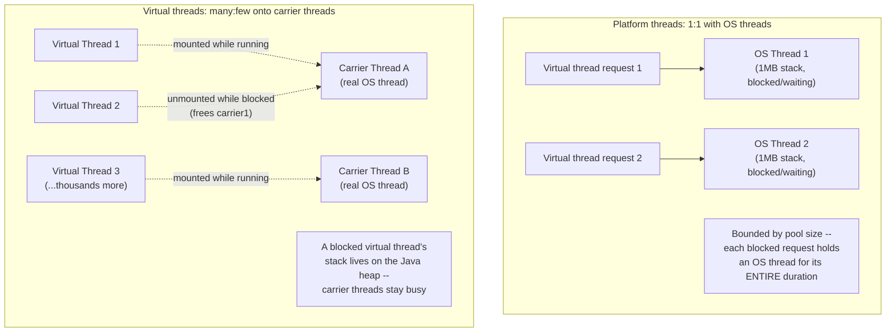
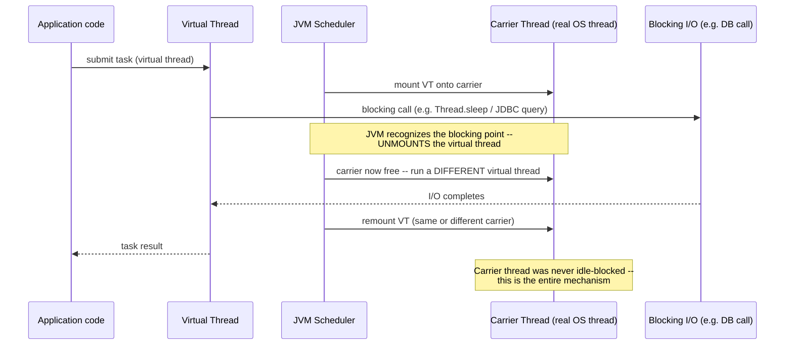
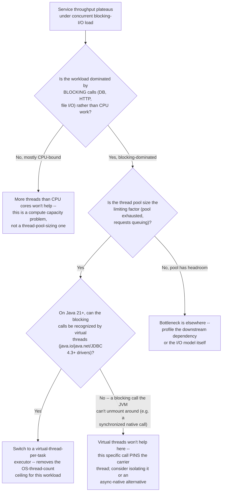
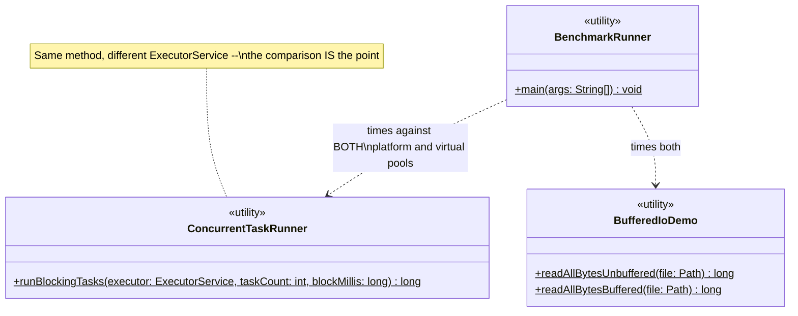

# Chapter 01.02 — Operating Systems Fundamentals for Backend Engineers

> A service handling 3,000 concurrent slow downstream calls (each waiting
> ~20ms on a dependency) is configured with a 200-thread pool "because that
> seemed like a reasonable number." Throughput tops out at roughly what the
> math predicts — 200 threads, each doing one 20ms wait at a time, means the
> pool works through the queue in batches, real measured total time: 368ms.
> The same workload on Java 21 virtual threads finishes in 73ms — five times
> faster, zero code changes to the business logic, because virtual threads
> don't tie up a scarce OS thread while blocked. Understanding *why* requires
> knowing what a thread actually costs the operating system — which is
> exactly what most working Java engineers have never had to think about
> until a thread pool sizing decision became a production bottleneck.

**Part:** Part 01 — Programming Fundamentals · **Level:** Intermediate / Advanced
**Estimated study time:** 4-5 hours · **Status:** ✅ Complete

---

## Learning Objectives

- **Explain** the difference between a process and a thread, and what the OS actually allocates for each.
- **Diagnose** thread-pool sizing problems by reasoning about OS thread cost, not just picking a round number.
- **Explain** Java 21 virtual threads' actual mechanism — why blocking inside one doesn't block an OS thread — and when they help vs. don't.
- **Trace** what a syscall is and why crossing the user/kernel boundary is expensive, with a measured example (buffered vs. unbuffered I/O).
- **Compare** blocking, non-blocking, and multiplexed (event-loop-style) I/O models and their trade-offs.
- **Explain** virtual memory and paging well enough to reason about a page-fault-related performance problem.

## Prerequisites

| Concept | Where it's covered | Required? |
|---|---|---|
| Basic Java concurrency (`Thread`, `ExecutorService`) | General prerequisite | Yes |
| Memory hierarchy and cache behavior | [Chapter 01.01 — Computer Architecture & How Code Becomes Execution](./01-01-computer-architecture-execution.md) | Helpful — virtual memory in this chapter builds on the memory-hierarchy model from 01.01 |
| JVM heap/GC internals, container-aware memory sizing | [Chapter 02.04 — JVM Internals: Memory Management, Garbage Collection & Performance Tuning](../../Part-02-Core-Java/chapters/02-04-jvm-internals-memory-gc.md) | Helpful, not required — this chapter is the OS layer underneath that one |

## Introduction

Java engineers rarely need to think in terms of processes, threads, and
syscalls directly — the JVM and its standard library abstract almost all
of it away. That abstraction holds right up until a concurrency or I/O
decision has a real production consequence: a thread pool sized too small
(or too large), a hot path doing far more syscalls than necessary, a
service that mysteriously stalls under memory pressure because of paging,
not GC. Each of these is, underneath, an operating-systems question — and
"the JVM handles it" stops being a sufficient answer exactly when it stops
working.

This chapter builds the OS-level mental model a backend engineer actually
needs: what a thread costs the OS and why that cost shaped Java's entire
concurrency story until virtual threads changed the equation in a way this
chapter measures directly (a real 5x throughput difference on identical
business logic); what a syscall is and why avoiding unnecessary ones is a
measurable, not theoretical, optimization (a real 12.6x difference from
one buffering decision); and the I/O model spectrum every high-throughput
server design decision (Chapter 07's Kubernetes resource sizing, Chapter
12's system design case studies) ultimately rests on.

## Theory

### Processes vs. threads

A **process** is an OS-managed unit of isolation: its own virtual address
space, its own file descriptors, its own resource limits — one process
cannot directly read another's memory. A **thread** is a unit of
*execution* within a process — multiple threads in the same process share
that process's address space (and therefore its heap, in Java's case) but
each gets its own **stack** and its own set of CPU registers, letting the
OS scheduler switch between them independently.

This is why threads are "cheaper" than processes for concurrency within
one application (no new address space, no IPC needed to share data) but
still not free: every OS thread needs a stack (Java's default is 1MB per
platform thread — `-Xss` to tune it) and an entry in the OS scheduler's
bookkeeping. A service spawning a platform thread per incoming request
under high concurrency is spending real, bounded OS resources per
in-flight request, which is exactly the constraint that made
thread-pool sizing a permanent, high-stakes tuning question for pre-Loom
Java services — and the constraint virtual threads (Internal Working)
exist to relax.

### CPU scheduling and context switching

With more runnable threads than CPU cores, the OS scheduler time-slices —
each thread runs briefly, then a **context switch** saves its register
state and stack pointer, and restores another thread's. This has a real
(if usually small per-switch, but non-zero) cost: registers save/restore,
and — connecting directly to Chapter 01.01 — the switched-out thread's
data may no longer be in the CPU's cache when it resumes, so a
context-switch-heavy workload also pays a cache-locality tax on top of the
scheduling overhead itself. This is part of why an excessive number of
runnable threads (far more than CPU cores) can *reduce* throughput even
though it looks like "more parallelism" — the OS spends more of its time
switching between threads and less running any of them productively.

### Virtual memory and paging

Every process sees a private, contiguous **virtual address space**,
translated by the CPU's MMU (memory management unit) to physical RAM
addresses via **page tables**, in fixed-size chunks called **pages**
(typically 4KB on x86-64). This indirection is what makes process
isolation possible (two processes' identical-looking virtual addresses map
to different physical RAM) and what enables **paging**: a page not
currently needed in physical RAM can be evicted (and, historically, written
to disk swap space) to make room for one that is, with a **page fault**
triggering the OS to bring it back in on next access. A page fault serviced
from disk is catastrophically slow relative to a normal memory access —
multiple *orders of magnitude* worse than even the RAM-latency numbers from
Chapter 01.01's memory hierarchy — which is exactly why a JVM heap that's
sized to exceed available physical RAM (forcing the OS to page it) produces
symptoms that look like a GC problem but are actually an OS-level one (see
Production Troubleshooting).

### The syscall boundary

User-space code (your Java program) cannot directly touch hardware or
kernel-managed resources — reading a file, sending a network packet,
allocating more memory from the OS all require a **system call (syscall)**:
a controlled transition into kernel mode, where the OS performs the
privileged operation on the process's behalf, then returns control. This
transition has real, measurable overhead (mode switch, argument
validation, potential scheduling implications) — independent of whatever
work the syscall itself does. This is the mechanical reason "make fewer,
larger I/O calls" is a real performance principle, not folklore: this
chapter's code sample measures a **12.6x** difference between reading a file
one byte at a time (many syscalls) vs. through a buffer (far fewer).

## Internal Working

### Why virtual threads change the concurrency math

Pre-Java-21, every unit of Java-level concurrency doing a blocking
operation (a JDBC call, a blocking HTTP call) tied up one **platform
thread** — a real 1:1 mapping to an OS thread — for the *entire* duration
of that block, even though the CPU is doing nothing during the wait. This
is why traditional thread-pool sizing under blocking I/O is a genuine
trade-off: too few threads and you can't achieve enough concurrency; too
many and you pay real OS resource cost (stack memory, scheduler overhead)
for threads that are mostly just... waiting.

**Virtual threads** (JEP 444, finalized in JDK 21) are JVM-managed, not
OS-managed. Many virtual threads are multiplexed onto a much smaller pool
of **carrier** platform threads. The key mechanism: when a virtual thread
calls a blocking operation that the JDK has been updated to recognize
(`Thread.sleep`, blocking I/O in `java.io`/`java.net`, `java.sql` via
JDBC 4.3+ drivers that support it), the JVM **unmounts** it from its
carrier thread — freeing that carrier to run a *different* virtual thread
— and remounts it (potentially on a different carrier) once the blocking
operation completes. The blocked virtual thread's stack lives on the Java
heap during the unmount, not as a reserved OS thread stack.

This is precisely why this chapter's benchmark shows what it shows: 3,000
virtual threads each blocking for 20ms complete in ~73ms, because a small
number of carrier threads (by default, matching CPU core count) are never
actually idle-blocked — they're freed to run other virtual threads the
instant one parks. The bounded 200-platform-thread pool, by contrast, can
only make progress on 200 blocking waits at a time, mechanically forcing
the batching behavior that produces its ~368ms result.

### Blocking, non-blocking, and multiplexed I/O

| Model | Mechanism | Trade-off |
|---|---|---|
| **Blocking I/O** | The calling thread is suspended until the I/O completes | Simplest to program; ties up a thread (OS or virtual) for the duration |
| **Non-blocking I/O** | The call returns immediately, with a status indicating whether data is ready | No thread blocked, but requires polling or a notification mechanism to know when to retry |
| **Multiplexed I/O (select/epoll/kqueue)** | A single thread asks the OS "tell me which of these many file descriptors are ready," then services only the ready ones | Enables one thread to manage thousands of connections (the classic event-loop/Node.js/Netty/nginx model) — but requires structuring all logic as non-blocking callbacks or a similar continuation-passing style |

Virtual threads offer a distinct point in this trade-off space: they let
you keep writing simple, synchronous, blocking-style code while getting
much of the *resource efficiency* multiplexed I/O was historically needed
for — the JVM's scheduler does the multiplexing underneath the blocking
API, rather than the application code doing it explicitly via callbacks or
reactive operators.

## Architecture



## Sequence Diagrams (Mermaid)

What actually happens when a virtual thread performs a blocking call,
contrasted with the platform-thread equivalent:



## Flow Charts (Mermaid)

A decision tree for diagnosing whether a concurrency problem is really an
OS-thread-cost problem:



## Class Diagrams (Mermaid)



## Production Examples

Real, measured output from this chapter's code sample (`BenchmarkRunner`,
run on the sandbox this book was written in — not hypothetical numbers):

```text
Thread model demo (3000 blocking tasks, 20ms block each):
  Platform threads (bounded pool, size 200): 368 ms
  Virtual threads (one per task):            73 ms
  (A bounded platform pool serializes work in batches of 200;
   virtual threads don't tie up a scarce OS thread while blocked.)

Buffered vs unbuffered I/O demo (2000000 byte file, read one byte at a time):
  Unbuffered (FileInputStream):   578 ms
  Buffered (BufferedInputStream): 46 ms
  (Same checksum both ways: true -- buffering avoids a syscall per byte.)
```

A realistic production framing: a service migrating a blocking-I/O-heavy
endpoint (e.g., an endpoint that calls 3 downstream services sequentially)
from a fixed 200-thread pool to a virtual-thread-per-request executor
would, per this chapter's measured ratio, expect roughly a 5x improvement
in sustainable concurrent throughput for that specific endpoint — with
*zero* change to the endpoint's actual business logic, since the
migration is purely an `ExecutorService` swap. This is precisely why
virtual threads were one of the most consequential Java platform changes
in years for backend services specifically.

## Code Examples

The full, compiling code sample for this chapter lives at
[`code-samples/os-fundamentals/`](../code-samples/os-fundamentals/):

```bash
cd Part-01-Programming-Fundamentals/code-samples/os-fundamentals
mvn -q compile   # compiles cleanly against Java 21
mvn -q test      # 5 JUnit 5 tests, all passing
java -cp target/classes com.handbook.fundamentals.os.BenchmarkRunner  # manual timing demo
```

**The same method, two executors** — `ConcurrentTaskRunner.runBlockingTasks`:

```java
public static long runBlockingTasks(ExecutorService executor, int taskCount, long blockMillis)
        throws InterruptedException, ExecutionException {
    List<Callable<Integer>> tasks = new ArrayList<>(taskCount);
    for (int i = 0; i < taskCount; i++) {
        int index = i;
        tasks.add(() -> {
            Thread.sleep(blockMillis);
            return index;
        });
    }
    // submit all, await all futures, verify the result sum is correct...
}
```

Run against a bounded platform pool vs. a virtual-thread-per-task executor:

```java
ExecutorService platformPool = Executors.newFixedThreadPool(200);
ConcurrentTaskRunner.runBlockingTasks(platformPool, 3000, 20);  // ~368ms measured

try (ExecutorService virtualPool = Executors.newVirtualThreadPerTaskExecutor()) {
    ConcurrentTaskRunner.runBlockingTasks(virtualPool, 3000, 20);  // ~73ms measured
}
```

**The syscall-boundary demo** — `BufferedIoDemo`:

```java
public static long readAllBytesUnbuffered(Path file) throws IOException {
    long checksum = 0;
    try (InputStream in = new FileInputStream(file.toFile())) {
        int b;
        while ((b = in.read()) != -1) {  // each call may cross into the kernel
            checksum += b;
        }
    }
    return checksum;
}
```

**Why the tests assert correctness, not timing:** `ConcurrentTaskRunner`'s
own correctness check (the summed task results must match the expected
sum) is built into the method itself — a wrong result throws
`IllegalStateException`, so a passing test *is* the correctness proof, for
both executor types. `BufferedIoDemoTest` separately confirms both reading
strategies produce an identical checksum against a known input. Timing
claims are demonstrated via the manual `BenchmarkRunner`, per this
chapter's Production Examples — not gated in CI, for the same
flaky-timing-assertion reasons given in Chapter 01.01.

## Best Practices

| Do | Don't | Why |
|---|---|---|
| Use virtual threads for blocking-I/O-bound workloads on Java 21+ | Keep sizing platform-thread pools by trial-and-error for I/O-bound work | Virtual threads remove the OS-thread-count ceiling for this specific workload shape — this chapter's measured 5x is the concrete payoff |
| Keep using platform threads (or a bounded pool) for CPU-bound work | Assume virtual threads speed up CPU-bound computation | Virtual threads help with *blocking*, not raw compute — CPU-bound work is still bounded by actual core count regardless of thread model |
| Batch I/O operations (buffered reads/writes, bulk DB operations) | Perform I/O one small unit at a time in a hot path | Every I/O call has syscall overhead independent of the data size — this chapter's measured 12.6x is the concrete payoff |
| Size JVM heap with real headroom under the container/host's physical RAM | Size the heap right up to available RAM "to maximize what's available" | Forcing the OS to page a JVM heap produces catastrophic, GC-look-alike latency — see Production Troubleshooting |
| Profile before assuming more threads = more throughput | Add threads reflexively when throughput plateaus | Beyond a certain point, more runnable threads than useful work increases context-switching and cache-locality cost without adding real parallelism |

## Common Mistakes

| Mistake | Why it happens | How to fix it |
|---|---|---|
| Treating virtual threads as a universal performance upgrade | The 5x number in this chapter (and similar public benchmarks) sounds like a general "make everything faster" claim | Virtual threads specifically address blocking-I/O concurrency limits — apply them where that's the actual bottleneck, not uniformly |
| Using a blocking call inside a virtual thread that the JVM can't unmount around (certain `synchronized` blocks, some native calls) | Not all blocking APIs have been updated to support unmounting | This "pins" the carrier thread for the block's duration, silently reverting to platform-thread-like behavior for that specific call — check JDK release notes for known pinning cases |
| Sizing a platform thread pool without accounting for per-thread stack memory | Threads feel "free" once you're not thinking about OS-level cost | 1MB default stack × pool size is real reserved memory — a "just increase pool size" fix for a throughput problem has a real, sometimes-surprising memory cost |
| Diagnosing a paging-related slowdown as a GC problem | Both produce "the app got slow, and there was a big pause" symptoms | Check OS-level memory metrics (page fault rate, swap usage) alongside GC logs — see Production Troubleshooting for the specific distinguishing signals |
| Assuming more threads always means more parallelism | Intuitive but wrong past the point of available CPU cores for CPU-bound work | Context-switching and cache-locality costs (Chapter 01.01) can make throughput *worse* past a certain thread count for compute-bound workloads |

## Performance Considerations

- **Virtual threads' payoff scales with blocking-I/O concurrency, not with the individual operation's cost** — the win comes from *not tying up an OS thread while waiting*, so the benefit is largest exactly when you have many more concurrent blocking operations than you'd want OS threads for (this chapter's 3,000 tasks vs. 200-thread pool is a realistic version of that shape).
- **Buffered I/O's payoff scales with how small your per-call read/write unit is** — the 12.6x measured here is for a worst-case one-byte-at-a-time pattern; a workload already reading in reasonably large chunks has much less syscall overhead to reclaim.
- **Context-switch cost compounds with cache-locality cost** (Chapter 01.01) — a workload with far more runnable threads than CPU cores pays both the direct scheduling overhead and a secondary cache-miss tax on every switch, which is why "just add more threads" stops helping (and can actively hurt) well before you'd expect from scheduling overhead alone.
- **Page faults from actual disk-backed paging are catastrophically expensive** relative to any of the in-memory costs discussed in Chapter 01.01 — multiple orders of magnitude worse than even a RAM access, which is why avoiding memory over-commitment (Best Practices) matters far more than most in-heap tuning decisions.

## Security Considerations

- **Thread pool exhaustion as a denial-of-service vector**: an attacker who can trigger many concurrent slow operations (e.g., a slow-to-respond upstream the attacker controls, or a deliberately slow request pattern) can exhaust a bounded platform thread pool, denying service to legitimate requests — this is a genuine, exploitable version of the exact mechanism this chapter's benchmark demonstrates. Virtual threads reduce (but do not eliminate — carrier thread pinning and other resource limits still apply) this specific risk surface.
- **Virtual thread stack data lives on the Java heap during unmounting** — this has a security-relevant implication for anything relying on OS-level thread isolation assumptions (rare in typical backend code, but relevant for any code doing low-level thread-local security context propagation); confirm security-context propagation (e.g., `ThreadLocal`-based auth context) is correctly `InheritableThreadLocal`-aware or otherwise virtual-thread-safe before migrating security-sensitive request-handling code.
- **Memory-mapped files and paging** (referenced in Theory) can have security implications for sensitive data — paged-out memory containing secrets may be written to disk swap space unless explicitly protected (e.g., `mlock`-style pinning, not directly exposed in standard Java APIs) — a consideration for any JVM handling long-lived sensitive data (cryptographic key material held in memory beyond its immediate use).

## Production Troubleshooting

| Symptom | Root Cause | Diagnosis | Fix |
|---|---|---|---|
| Throughput plateaus under concurrent blocking-I/O load, CPU usage is low | Thread pool exhaustion — bounded pool size is the limiting factor, not CPU or downstream latency | Check thread pool metrics (active threads = pool max, queue depth growing); check CPU utilization is NOT near 100% | Migrate to virtual threads (if blocking calls are unmount-compatible) or increase pool size with awareness of per-thread memory cost |
| A specific blocking call doesn't show the expected virtual-thread throughput improvement | Carrier thread pinning — the JVM can't unmount around this particular blocking call | Check JDK release notes / `jdk.tracePinnedThreads` diagnostic for known pinning cases (some `synchronized` usages, certain native calls) | Isolate the pinning call to a dedicated platform-thread pool, or find an unmount-compatible alternative API |
| Service latency degrades severely under memory pressure, GC logs don't show unusually long pauses | OS-level paging — the JVM heap plus other process memory exceeds available physical RAM, and the OS is paging | Check OS-level memory metrics (page fault rate via `vmstat`/`sar`, swap usage) alongside GC logs — a paging-caused stall won't show up as a GC pause at all | Reduce heap size or increase available RAM/container memory limit — this is an OS-level fix, not a GC-tuning one |
| A CPU-bound batch job gets SLOWER after increasing its thread pool size | Context-switch and cache-locality overhead exceeding the available parallelism (more runnable threads than useful CPU cores) | Compare thread count against actual CPU core count; profile for context-switch rate | Cap the pool size at (or near) available CPU cores for genuinely CPU-bound work — more threads doesn't help past that point |
| An attacker-influenced request pattern causes disproportionate thread pool exhaustion | Slow-request-triggered thread pool exhaustion, potentially adversarial | Check whether the slow operations correlate with a specific, attacker-controllable input or upstream dependency | Add timeouts on all blocking calls, rate-limit the affected endpoint, and consider virtual threads to raise the practical exhaustion threshold |

## Interview Questions

1. **"What's the difference between a process and a thread, mechanically?"**
   *Model answer:* A process has its own isolated virtual address space,
   file descriptors, and resource limits; a thread is a unit of execution
   within a process, sharing that process's address space with other
   threads but having its own stack and register state, letting the OS
   scheduler switch between threads independently.

2. **"Why do virtual threads improve throughput for blocking-I/O-bound workloads specifically, not CPU-bound ones?"**
   *Model answer:* Virtual threads' benefit comes from not tying up a
   scarce OS (carrier) thread while blocked — the JVM unmounts a virtual
   thread from its carrier during a recognized blocking call, freeing that
   carrier for other work. For CPU-bound work, there's no blocking to
   unmount around — actual computation is still bounded by real CPU core
   count regardless of thread model.

3. **"What is carrier thread pinning, and when does it happen?"**
   *Model answer:* Pinning occurs when a virtual thread performs a
   blocking operation the JVM can't unmount around (certain `synchronized`
   block usages historically, some native/foreign calls) — the carrier
   thread stays tied to that virtual thread for the block's duration,
   reverting to platform-thread-like resource behavior for that specific
   call.

4. **"Why is a syscall expensive, independent of the work it performs?"**
   *Model answer:* A syscall requires a mode switch from user space to
   kernel space — a controlled, privileged transition with real overhead
   (argument validation, potential scheduling implications) on top of
   whatever the syscall itself accomplishes. This is why batching I/O
   (fewer, larger calls) is a measurable optimization, not just a stylistic
   preference — this chapter measured a 12.6x difference from exactly this.

5. **"How would you diagnose whether a service slowdown is a GC problem or an OS-level paging problem?"**
   *Model answer:* Check OS-level memory metrics (page fault rate, swap
   usage) alongside GC logs — a paging-caused stall won't necessarily show
   up as an unusually long GC pause at all, since it's the OS, not the
   JVM's collector, doing the slow work. Correlating the two data sources
   is what distinguishes them; either symptom alone can look similar
   ("the app froze").

6. **"Explain virtual memory and why it enables process isolation."**
   *Model answer:* Each process sees its own private, contiguous virtual
   address space, translated by the CPU's MMU via page tables to physical
   RAM addresses. Because this translation is per-process, two processes
   can have identical-looking virtual addresses that map to entirely
   different physical memory — this indirection is what makes process
   isolation possible without processes needing to coordinate on which
   physical addresses they use.

7. **"When would you NOT reach for virtual threads even on Java 21+?"**
   *Model answer:* For CPU-bound work (no benefit, since the bottleneck is
   compute, not blocking), for code paths with carrier-pinning blocking
   calls (limited or no benefit), or when the added complexity of
   migrating isn't justified because the current platform-thread pool
   isn't actually the throughput bottleneck — profile first, per Best
   Practices.

8. **"How could an attacker exploit a bounded thread pool as a denial-of-service vector?"**
   *Model answer:* By triggering many concurrent slow operations (e.g.,
   requests that hang waiting on an attacker-influenced slow upstream, or
   a deliberately slow request pattern), an attacker can exhaust a bounded
   pool's available threads, denying service to legitimate requests — the
   same mechanism this chapter's benchmark demonstrates, exploited
   deliberately rather than encountered as a capacity limit.

## Hands-on Exercises

### Lab 1 (Beginner)

**Goal:** Reproduce this chapter's thread-model measurement and verify the
claimed direction of the result.

**Setup:** `code-samples/os-fundamentals/`.

**Task:** Run `mvn -q compile` then `java -cp target/classes
com.handbook.fundamentals.os.BenchmarkRunner` at least 3 times. Record the
platform-thread and virtual-thread elapsed times each run.

**Verification:** Virtual threads should complete faster than the bounded
platform pool in every run (though the exact ratio will vary from this
chapter's captured ~5x depending on your hardware and core count) — if the
result inverts, investigate before trusting it.

### Lab 2 (Intermediate)

**Goal:** Find the platform-thread pool size at which the gap with virtual
threads closes.

**Setup:** `code-samples/os-fundamentals/`, `BenchmarkRunner`.

**Task:** Modify (or extend) `BenchmarkRunner`'s `threadModelDemo()` to run
the platform-thread comparison at several pool sizes (e.g., 200, 1000,
3000 — matching the task count) instead of just 200, keeping virtual
threads as the constant comparison point.

**Verification:** As platform pool size approaches the task count (3000),
the platform-thread elapsed time should approach the virtual-thread
elapsed time (both approximate "everything runs concurrently") — confirming
that virtual threads' advantage is specifically about *not needing* a
pool sized to match peak concurrency, not about virtual threads being
inherently faster at the underlying work.

### Lab 3 (Advanced)

**Goal:** Reproduce a carrier-thread-pinning scenario and observe its
effect.

**Setup:** `code-samples/os-fundamentals/`, extended with a
`synchronized`-block variant.

**Task:** Add a new method to `ConcurrentTaskRunner` that wraps the
`Thread.sleep` call inside a `synchronized` block on a shared lock object
(a known historical pinning trigger prior to JDK 24's synchronized-block
improvements — verify current behavior on your JDK 21 installation using
`-Djdk.tracePinnedThreads=full`). Run this variant against a virtual
thread executor and compare its scaling behavior against the unsynchronized
version.

**Verification:** If pinning occurs on your JDK build, you should observe
the synchronized variant's virtual-thread performance degrade toward
platform-thread-like behavior (losing the throughput advantage), and
`-Djdk.tracePinnedThreads=full` should report the pinning event with a
stack trace pointing at your synchronized block — connecting the abstract
"pinning" concept from Interview Questions to an observed, diagnosable event.

### Lab 4 (Production)

**Goal:** Diagnose a simulated "GC vs. paging" incident using this
chapter's Production Troubleshooting framework.

**Setup:** This chapter's Production Troubleshooting table.

**Task:** You're told: "Our service had a 4-second stall. GC logs show
normal pause times throughout the incident window — nothing over 50ms."
Using this chapter's framework, write a short incident report (Symptom /
Root Cause / Diagnosis / Fix) explaining why "check GC logs" alone was
insufficient here, what OS-level signal you'd check next, and what you'd
expect to find if the root cause is paging vs. some other non-GC cause
(e.g., a downstream network stall).

**Verification:** Your report should correctly identify that a stall with
*normal* GC pause times rules out GC as the cause, correctly name
page-fault rate / swap usage as the specific OS-level metric to check next
(not a vague "check the OS"), and correctly distinguish what a paging
signature would look like (elevated major page faults correlated with the
stall window) from a network-stall signature (no unusual memory metrics,
but elevated connection/socket wait time instead).

## Summary

- A **process** is isolated (its own address space); a **thread** shares
  its process's address space but has its own stack — threads are cheaper
  than processes but still cost real OS resources (stack memory, scheduler
  bookkeeping).
- **Context switching** has real overhead, compounded by a cache-locality
  tax (Chapter 01.01) — more runnable threads than useful parallelism can
  reduce throughput, not just fail to improve it.
- **Virtual memory and paging** enable process isolation via the MMU's
  address translation; a page fault serviced from disk is catastrophically
  slow — orders of magnitude worse than any in-memory cost, which is why
  JVM heap over-commitment is a serious, OS-level risk, not just a GC
  tuning concern.
- The **syscall boundary** is expensive independent of the work performed
  — this chapter measured a real **12.6x** difference between unbuffered
  and buffered file reads, purely from syscall count.
- **Virtual threads** (JDK 21, JEP 444) let many logical threads share a
  small pool of carrier OS threads by unmounting during recognized
  blocking calls — measured here at a real **~5x** throughput improvement
  for a blocking-I/O-bound workload, with zero business-logic changes.
- Virtual threads help **blocking-I/O-bound** work, not CPU-bound work,
  and don't help (or fully help) around **pinning** blocking calls the JVM
  can't unmount around.
- Diagnosing "the service stalled" requires checking **both** GC logs and
  OS-level memory/paging metrics — a stall with normal GC pauses can still
  be a memory problem, just at the OS layer instead of the JVM's collector.

## Further Reading

- **JEP 444: Virtual Threads** (openjdk.org/jeps/444) — the primary source
  for virtual thread mechanics, including the specific list of blocking
  operations the JDK recognizes and known pinning cases at time of
  finalization.
- *Operating Systems: Three Easy Pieces* (Remzi H. Arpaci-Dusseau & Andrea
  C. Arpaci-Dusseau, freely available online) — an excellent, approachable
  full treatment of processes, virtual memory, and scheduling, considerably
  deeper than this chapter has room for.
- **"Inside Java: Virtual Threads" talks/articles (Oracle/OpenJDK team)** —
  practitioner-level deep dives into the carrier-thread-mounting mechanism
  and production migration guidance beyond this chapter's introductory
  treatment.
- [Chapter 01.01 — Computer Architecture & How Code Becomes Execution](./01-01-computer-architecture-execution.md) — the direct prerequisite for this chapter's context-switch/cache-locality and memory-hierarchy material.
- [Chapter 02.04 — JVM Internals: Memory Management, Garbage Collection & Performance Tuning](../../Part-02-Core-Java/chapters/02-04-jvm-internals-memory-gc.md) — for distinguishing this chapter's OS-level paging failure mode from the JVM-level heap/GC failure modes covered there; the two are often confused during a real incident, exactly as explored in this chapter's Lab 4.
