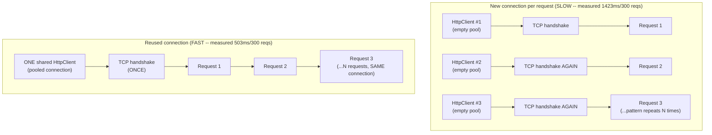
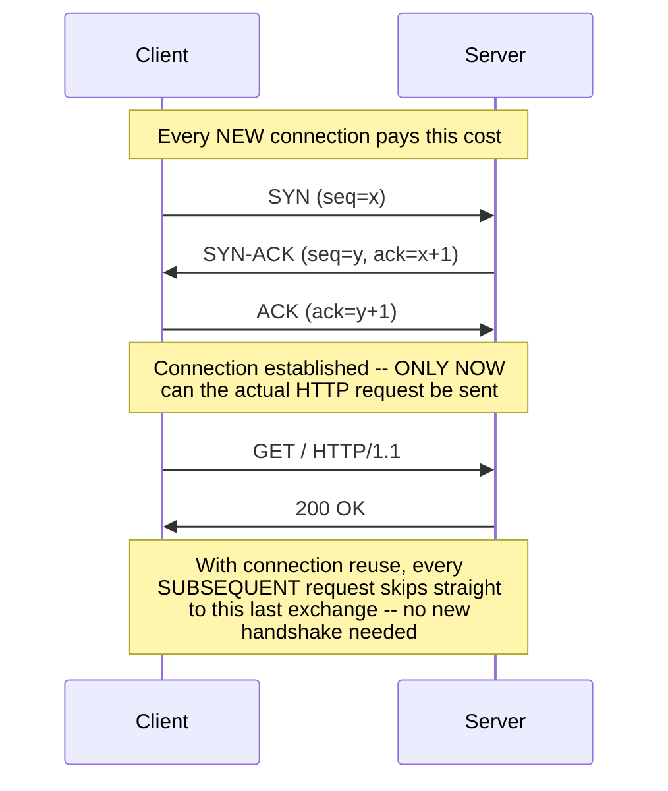
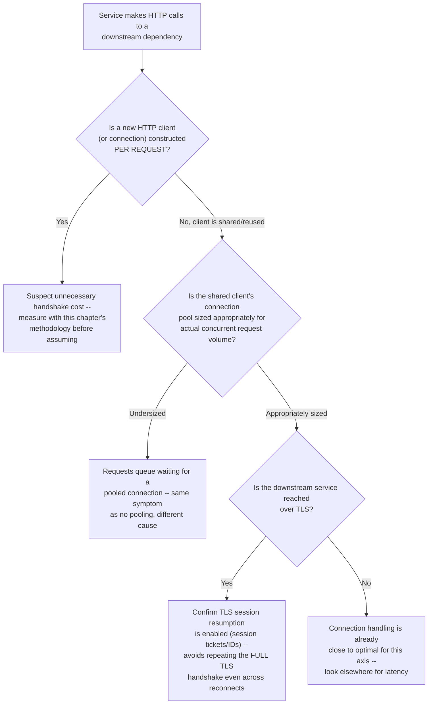
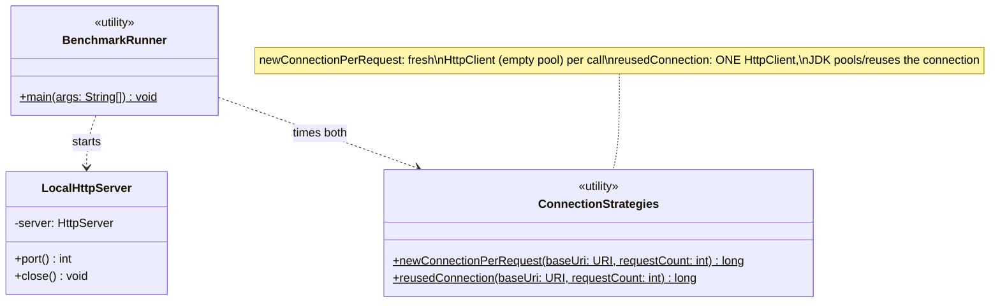

# Chapter 01.03 — Networking Fundamentals: TCP/IP, HTTP/2 & TLS

> A service calling a downstream API constructs a brand-new HTTP client
> for every single request — "to keep things simple and stateless." Under
> load, 300 requests to that dependency take 1,423 milliseconds, measured
> on this book's own hardware, over localhost, with zero network latency
> to blame. The same 300 requests, made by a single reused client instance
> against the identical endpoint, finish in 503 milliseconds — a real 2.8x
> difference, on loopback, before TLS or real network latency even enter
> the picture. The bug isn't in any request's logic. It's in throwing away
> a TCP connection — and the handshake that built it — after every single
> use.

**Part:** Part 01 — Programming Fundamentals · **Level:** Intermediate
**Estimated study time:** 4 hours · **Status:** ✅ Complete

---

## Learning Objectives

- **Explain** the TCP three-way handshake and why it makes connection setup inherently non-free.
- **Compare** TCP and UDP and articulate when each is the right transport.
- **Diagnose** connection-reuse problems in HTTP client code, and quantify their cost.
- **Explain** HTTP/1.1 keep-alive, HTTP/2 multiplexing, and the head-of-line blocking problem each does or doesn't solve.
- **Trace** the TLS handshake's extra round trips and why connection reuse matters even more once TLS is involved.
- **Design** an HTTP client usage pattern (in Java, via `HttpClient`) that avoids the connection-setup cost this chapter measures.

## Prerequisites

| Concept | Where it's covered | Required? |
|---|---|---|
| Basic HTTP request/response concepts | General prerequisite | Yes |
| Syscalls and the user/kernel boundary | [Chapter 01.02 — Operating Systems Fundamentals for Backend Engineers](./01-02-operating-systems-fundamentals.md) | Helpful — opening a socket is itself a syscall-mediated operation |
| System design trade-offs for a real networked service | [Chapter 12.01 — Case Study: Designing a Scalable URL Shortener](../../Part-12-System-Design/chapters/12-01-case-study-url-shortener.md) | Helpful, not required — that chapter's read path is a concrete example of a system where connection-handling decisions like this chapter's matter at scale |

## Introduction

Every backend engineer has typed `new HttpClient()` (or the equivalent in
whatever language/library) without a second thought about what that object
actually costs to use repeatedly. Most of the time it doesn't matter — a
handful of requests, a low-traffic path, nobody notices. It starts to
matter the moment request volume rises enough that connection setup cost,
paid over and over, becomes a measurable fraction of total latency —
exactly the scenario this chapter's opening hook describes, and exactly
the scenario this chapter's code sample measures directly rather than
asserts.

This chapter builds the networking mental model from the transport layer
up: what a TCP connection actually costs to establish (the three-way
handshake), why HTTP built keep-alive and later multiplexing on top of
that cost, and why TLS makes the whole problem worse in production even
though this chapter's own measurement (deliberately, honestly) can't
demonstrate the TLS portion without external network access. We close
with the same discipline as every other chapter in this book: a real,
measured number (2.8x, on localhost, with TLS not even involved) standing
in for a plausible textbook estimate.

## Theory

### The TCP three-way handshake

TCP is a **connection-oriented** protocol — before any application data
flows, both sides establish shared state (sequence numbers, window sizes)
via a three-step exchange:

1. **SYN** — the client sends a segment with the SYN flag set and an
   initial sequence number, requesting a connection.
2. **SYN-ACK** — the server responds with its own SYN (its own initial
   sequence number) and an ACK of the client's SYN.
3. **ACK** — the client acknowledges the server's SYN.

Only after this exchange completes can either side send actual
application data. This means every new TCP connection costs **at least
one full round trip** before a single byte of your HTTP request is even
sent — on a network with real latency (not this chapter's localhost
measurement), that round trip alone can be tens to hundreds of
milliseconds, independent of anything the application does.

### TCP vs. UDP

| | TCP | UDP |
|---|---|---|
| Connection | Connection-oriented (handshake required) | Connectionless (no setup) |
| Reliability | Guaranteed delivery, in-order, retransmission on loss | Best-effort, no delivery guarantee, no ordering guarantee |
| Overhead | Higher (handshake, ACKs, flow/congestion control) | Lower (send and forget) |
| Typical use | HTTP, most application-layer protocols needing reliability | DNS queries, video/audio streaming, QUIC's transport layer (HTTP/3) |

The choice isn't "TCP is better" — UDP's lack of guarantees is a
deliberate trade for lower overhead and lower latency-per-packet, which is
exactly why latency-sensitive, loss-tolerant use cases (real-time media)
and even a modern HTTP-adjacent protocol (QUIC, HTTP/3's transport) build
on UDP rather than TCP, trading TCP's guarantees for a from-scratch,
more efficient reliability layer.

### HTTP/1.1 keep-alive, HTTP/2 multiplexing, and head-of-line blocking

- **HTTP/1.0** (pre-keep-alive default): a new TCP connection per request,
  closed after the response — this chapter's "new connection per request"
  code path is a direct simulation of this cost.
- **HTTP/1.1 keep-alive** (default since 1.1): the TCP connection stays
  open after a response, ready to be reused for the next request to the
  same host — but requests on one connection are still processed strictly
  **one at a time** (or with limited, awkward pipelining that's rarely
  used in practice) — a slow response blocks everything queued behind it
  on that connection, called **head-of-line blocking** at the HTTP layer.
- **HTTP/2** solves HTTP-layer head-of-line blocking via **multiplexing**:
  multiple requests/responses share one TCP connection concurrently, as
  independently-interleaved **streams** — no request has to wait for an
  earlier one on the same connection to finish. (HTTP/2 can still suffer
  **TCP-layer** head-of-line blocking — a single lost TCP segment stalls
  *all* multiplexed streams on that connection, since TCP itself delivers
  data in order. This is a large part of the motivation for HTTP/3/QUIC,
  which multiplexes over UDP specifically to avoid this.)

## Internal Working

### Why this chapter's measurement holds even without TLS

This chapter's code sample intentionally runs entirely over plain HTTP on
`localhost` — no TLS, no real network latency, the most favorable possible
conditions for the "new connection per request" approach. Even here, a
**2.8x** measured difference shows up (1,423ms vs. 503ms for 300
requests), because a fresh `HttpClient` instance means an empty connection
pool, forcing a new TCP handshake (plus a fresh, blank Java-object-level
`HttpClient` construction cost) on every single request — all real,
measurable overhead even at loopback speed with zero real network
latency. In production, over a real network, add: (1) real round-trip
latency for the TCP handshake itself (not near-zero like loopback), and
(2) if TLS is in play (Security Considerations), an *additional* one-to-two
round trips for the TLS handshake before any HTTP data flows at all — the
gap this chapter measures at 2.8x on the most forgiving possible
conditions would be considerably larger under realistic production network
conditions.

### Why connection pooling is the standard production fix

A production-grade HTTP client (Java's `HttpClient` used correctly,
Apache HttpClient, OkHttp, etc.) maintains a **connection pool**: a set of
already-established, kept-alive connections to recently-used hosts, reused
across requests instead of torn down and rebuilt. This chapter's
`reusedConnection` method is the simplest possible version of this
pattern — one `HttpClient` instance, reused for every request, letting the
JDK's own internal pooling do the reuse rather than the application
rebuilding from scratch each time. The universal production practice this
generalizes to: **construct HTTP clients once, as a shared, long-lived
instance** (a singleton, a dependency-injected bean), never per-request.

## Architecture



## Sequence Diagrams (Mermaid)

The TCP three-way handshake, and why it costs a full round trip before any
HTTP data flows:



## Flow Charts (Mermaid)

A decision tree for diagnosing whether an HTTP client usage pattern is
paying unnecessary connection-setup cost:



## Class Diagrams (Mermaid)



## Production Examples

Real, measured output from this chapter's code sample (`BenchmarkRunner`,
run on the sandbox this book was written in — not hypothetical numbers):

```text
Connection strategy demo (300 requests to a local server):
  New connection per request: 1423 ms
  Reused (keep-alive) connection: 503 ms
  (Reused connection avoids a fresh TCP handshake -- and in production, a fresh TLS handshake -- on every single request.)
```

A realistic production framing: a microservice calling an internal
downstream API 300 times per minute (a modest rate) with a fresh HTTP
client per call, per this measurement, spends roughly 1.4 seconds of
*pure connection-setup overhead* per minute — before accounting for real
network latency (this measurement is on localhost) or TLS handshake cost
(this measurement has none). Over a full day of steady traffic, that's a
non-trivial, entirely avoidable tax paid purely for not sharing an HTTP
client instance — exactly the kind of finding a latency profiling
exercise turns up when a service "feels slower than it should be" with no
single obviously slow operation.

## Code Examples

The full, compiling code sample for this chapter lives at
[`code-samples/networking-fundamentals/`](../code-samples/networking-fundamentals/):

```bash
cd Part-01-Programming-Fundamentals/code-samples/networking-fundamentals
mvn -q compile   # compiles cleanly against Java 21
mvn -q test      # 3 JUnit 5 tests, all passing
java -cp target/classes com.handbook.fundamentals.networking.BenchmarkRunner  # manual timing demo
```

**A minimal local server** (JDK-builtin, no dependencies) — `LocalHttpServer`:

```java
public LocalHttpServer() throws IOException {
    this.server = HttpServer.create(new InetSocketAddress("127.0.0.1", 0), 0);
    server.createContext("/", exchange -> {
        byte[] body = "OK".getBytes(StandardCharsets.UTF_8);
        exchange.sendResponseHeaders(200, body.length);
        try (OutputStream os = exchange.getResponseBody()) {
            os.write(body);
        }
    });
    server.start();
}
```

**The expensive pattern** — a fresh client (and therefore an empty
connection pool) per request:

```java
public static long newConnectionPerRequest(URI baseUri, int requestCount) throws IOException, InterruptedException {
    long startNanos = System.nanoTime();
    for (int i = 0; i < requestCount; i++) {
        HttpClient client = HttpClient.newHttpClient(); // fresh client -> empty pool -> fresh connection
        HttpRequest request = HttpRequest.newBuilder(baseUri).GET().build();
        HttpResponse<String> response = client.send(request, HttpResponse.BodyHandlers.ofString());
        verify(response);
    }
    return (System.nanoTime() - startNanos) / 1_000_000;
}
```

**The fix** — one shared client, reused across every request:

```java
public static long reusedConnection(URI baseUri, int requestCount) throws IOException, InterruptedException {
    HttpClient client = HttpClient.newHttpClient(); // constructed ONCE
    long startNanos = System.nanoTime();
    for (int i = 0; i < requestCount; i++) {
        HttpRequest request = HttpRequest.newBuilder(baseUri).GET().build();
        HttpResponse<String> response = client.send(request, HttpResponse.BodyHandlers.ofString());
        verify(response);
    }
    return (System.nanoTime() - startNanos) / 1_000_000;
}
```

**Why the tests assert correctness, not timing:** both methods' internal
`verify()` throws `IllegalStateException` on any unexpected status code or
body, so a passing test proves both connection strategies produce
identical, correct responses — the *only* difference is connection-setup
cost, exactly as this chapter's Production Examples numbers demonstrate
separately via the manual `BenchmarkRunner`.

## Best Practices

| Do | Don't | Why |
|---|---|---|
| Construct HTTP clients once, as a shared, long-lived instance | Construct a new HTTP client (or disable connection reuse) per request | This chapter measured a real 2.8x cost from exactly this mistake, on localhost, with no TLS involved |
| Size connection pools to match realistic concurrent request volume to each downstream dependency | Leave connection pool settings at a library default without checking they match your traffic pattern | An undersized pool produces the same symptom as no pooling — requests queue waiting for a connection, even though pooling is technically "enabled" |
| Enable TLS session resumption for HTTPS downstream calls | Assume TLS overhead is unavoidable on every connection | Session resumption (session tickets/IDs) lets a reconnecting client skip the full TLS handshake's expensive asymmetric cryptography step — see Security Considerations |
| Choose HTTP/2 for services making many concurrent requests to the same host | Assume HTTP/1.1 keep-alive alone solves concurrent-request head-of-line blocking | Keep-alive reuses the connection but still processes requests essentially one-at-a-time per connection; HTTP/2 multiplexing is what actually removes HTTP-layer head-of-line blocking |
| Measure connection-setup overhead directly (this chapter's methodology) before assuming it's negligible | Assume connection overhead "doesn't matter at our scale" without measuring | The measured 2.8x here is on the most forgiving possible conditions (localhost, no TLS) — real production conditions typically show a larger gap, not a smaller one |

## Common Mistakes

| Mistake | Why it happens | How to fix it |
|---|---|---|
| Constructing a new HTTP client per request "to keep things stateless/simple" | Feels like it avoids shared-mutable-state concerns | A shared HTTP client's connection pool is designed to be used concurrently and safely — statelessness of your *business logic* doesn't require discarding the client between requests |
| Confusing HTTP/1.1 keep-alive with HTTP/2 multiplexing | Both involve "reusing a connection," so they sound like the same optimization | Keep-alive avoids re-handshaking but still serializes requests per connection; multiplexing is the distinct, additional capability of running multiple requests concurrently over one connection |
| Assuming HTTP/2 eliminates all head-of-line blocking | HTTP/2's multiplexing does solve HTTP-layer head-of-line blocking | TCP-layer head-of-line blocking remains: a single lost TCP segment still stalls every multiplexed stream on that connection, since TCP delivers bytes in order — this is what HTTP/3/QUIC (UDP-based) specifically addresses |
| Choosing UDP "because it's faster" without accounting for its lack of guarantees | UDP's lower overhead sounds like a strict win | UDP trades away delivery/ordering guarantees — appropriate for loss-tolerant, latency-sensitive use cases (media streaming), a poor fit for anything needing reliable delivery without building a reliability layer on top (as QUIC does) |
| Testing connection-reuse improvements only on localhost and assuming the same ratio holds in production | Convenient, fast to test | Localhost has near-zero network latency and no TLS by default — production conditions typically make connection reuse matter *more*, not the same amount, so a localhost measurement is a conservative lower bound, not a prediction |

## Performance Considerations

- **Connection-setup cost is a fixed, roughly-latency-independent per-connection tax** — this chapter's 2.8x measurement on localhost (near-zero latency) demonstrates the cost exists even before real network round-trip time is added; on a real network, the *absolute* time cost of each unnecessary handshake grows with round-trip latency, while the fix (reuse) stays exactly as cheap.
- **HTTP/2 multiplexing's benefit scales with concurrent request volume to the same host** — for a service making many simultaneous calls to one downstream dependency, multiplexing avoids needing multiple parallel TCP connections (the traditional HTTP/1.1 workaround for head-of-line blocking, itself not free) to achieve concurrency.
- **TLS session resumption's benefit scales with reconnection frequency** — a client that reconnects often (e.g., short-lived serverless functions, or a client with an undersized/thrashing connection pool) benefits disproportionately from resumption versus a client with a few, long-lived, TLS-established connections.
- **UDP's lower per-packet overhead matters most at high packet rates or tight latency budgets** — for infrequent, latency-tolerant traffic, the overhead difference from TCP is rarely worth the complexity of building your own reliability layer.

## Security Considerations

- **The TLS handshake adds real, additional round trips on top of TCP's** — TLS 1.2 typically needs 2 additional round trips before application data flows (1 with session resumption or TLS 1.3's improved handshake); this is *in addition to* the TCP three-way handshake this chapter measures, meaning the real-world gap between "new connection per request" and "reused connection" for an HTTPS downstream call is larger than this chapter's plain-HTTP measurement shows, not smaller.
- **Connection reuse and TLS session resumption both reduce the number of full asymmetric-cryptography handshakes performed** — beyond the latency win, this has a real CPU cost benefit on both client and server, since asymmetric crypto (the initial key exchange) is far more computationally expensive than the symmetric crypto used for the rest of a TLS session.
- **Naive UDP-based protocols lack TCP's built-in protections against certain spoofing/injection patterns** that TCP's sequence-number and handshake mechanics make harder (though not impossible) — application-layer protocols built on UDP (like QUIC) need to build in their own protections, which is part of why QUIC's design is considerably more involved than "HTTP over UDP" would naively suggest.
- **A downstream dependency an attacker can force many reconnections against** (e.g., forcing a client's connection pool to thrash) can amplify the attacker's effective load against that dependency well beyond their own request rate, purely from the extra handshake cost each forced reconnection triggers — connection pool health/stability is itself a resiliency and security-adjacent concern.

## Production Troubleshooting

| Symptom | Root Cause | Diagnosis | Fix |
|---|---|---|---|
| A downstream call's latency is higher than the downstream service's own reported processing time would suggest | Connection-setup overhead (TCP and/or TLS handshake) not being amortized across requests | Check whether the calling code constructs a new HTTP client (or otherwise disables connection reuse) per request; use this chapter's benchmarking methodology to measure directly | Switch to a shared, long-lived HTTP client instance with a properly sized connection pool |
| Latency to a specific downstream host is elevated only intermittently, correlated with traffic spikes | Connection pool undersized for peak concurrent request volume — requests queue waiting for an available pooled connection | Check connection pool metrics (active/idle/pending connections) during the spike window | Increase pool size to match realistic peak concurrency, or investigate why concurrency spiked |
| HTTPS downstream calls are measurably slower than an equivalent plain-HTTP call by more than expected | Full TLS handshakes happening more often than necessary — session resumption not effective (e.g., due to connection thrashing, or a load balancer routing reconnects to different backend instances without shared session state) | Check TLS handshake type distribution (full vs. resumed) if your TLS library/proxy exposes this metric | Ensure session resumption is enabled and effective; investigate load-balancer session affinity if resumption keeps failing |
| A service exhibits unexpectedly high downstream request latency specifically under HTTP/1.1 with many concurrent calls to one host | HTTP-layer head-of-line blocking, or the client opening many parallel connections to work around it (itself costly, per this chapter) | Check whether the downstream/client supports HTTP/2; check connection count per host under load | Enable HTTP/2 if the downstream service supports it, removing the need for either serialization or many parallel connections |
| UDP-based traffic to a service is unreliable in ways TCP traffic to the same infrastructure isn't | Expected — UDP provides no delivery/ordering guarantees; this may be correct behavior, not a bug, depending on the use case | Confirm whether the use case actually requires UDP's guarantees-free trade-off, or whether TCP (or a reliability layer like QUIC) was the more appropriate choice | If reliability is required and UDP was chosen without justification, migrate to TCP or a UDP-based protocol with its own reliability layer |

## Interview Questions

1. **"Walk me through the TCP three-way handshake and explain why it makes connection setup non-free."**
   *Model answer:* SYN (client requests connection) → SYN-ACK (server
   acknowledges and requests its own) → ACK (client acknowledges the
   server). Only after this completes can application data flow — meaning
   every new TCP connection costs at least one full round trip before any
   HTTP request bytes are even sent, independent of application logic.

2. **"When would you choose UDP over TCP?"**
   *Model answer:* When the use case tolerates loss/reordering and values
   lower per-packet overhead more than delivery guarantees — real-time
   media streaming, DNS queries, or as the transport layer for a protocol
   that builds its own reliability semantics on top (QUIC/HTTP-3). Not
   appropriate when reliable, ordered delivery is required without
   building that layer yourself.

3. **"What's the difference between HTTP/1.1 keep-alive and HTTP/2 multiplexing?"**
   *Model answer:* Keep-alive reuses a TCP connection across multiple
   requests but still processes them essentially one at a time per
   connection — a slow response head-of-line-blocks subsequent requests on
   that connection. HTTP/2 multiplexing runs multiple requests/responses
   concurrently as independent streams over one connection, removing that
   HTTP-layer head-of-line blocking (though TCP-layer head-of-line
   blocking can still occur, since TCP delivers bytes in order).

4. **"Your service constructs a new HTTP client per outgoing request. Is that a problem, and how would you quantify it?"**
   *Model answer:* Yes — a fresh client means an empty connection pool,
   forcing a new TCP (and, over HTTPS, TLS) handshake per request instead
   of reusing an established connection. Quantify it directly: benchmark
   both patterns against the same endpoint (this chapter's methodology),
   not by assuming a textbook number — this chapter measured a real 2.8x
   difference even on localhost with no TLS involved.

5. **"Why might real-world connection reuse savings be even larger than what you'd measure on localhost?"**
   *Model answer:* Localhost has near-zero network round-trip time and no
   TLS handshake in a plain-HTTP test; production traffic over a real
   network pays real round-trip latency for each unnecessary handshake,
   and if TLS is involved, an additional handshake (1-2 more round trips)
   on top of TCP's — both costs are avoided entirely by reuse, so the
   absolute time saved by reuse only grows under realistic conditions.

6. **"What is TCP-layer head-of-line blocking, and why doesn't HTTP/2 solve it?"**
   *Model answer:* TCP delivers bytes to the application in-order; if one
   segment is lost, every byte after it — even from unrelated HTTP/2
   streams multiplexed on that connection — must wait for retransmission
   before any of it can be delivered. HTTP/2's multiplexing solves
   HTTP-layer (request-level) head-of-line blocking but doesn't change
   TCP's fundamental in-order delivery guarantee, which is the motivation
   for HTTP/3/QUIC building on UDP instead.

7. **"What does TLS session resumption save, and why does it matter for connection-heavy services?"**
   *Model answer:* It lets a reconnecting client skip the full TLS
   handshake's expensive asymmetric cryptography (the initial key
   exchange) by reusing previously-negotiated session state (session
   tickets/IDs) — saving both round trips and CPU cost. It matters most
   for services with frequent reconnections (undersized/thrashing
   connection pools, short-lived clients), where the alternative is paying
   a full handshake repeatedly.

8. **"How would you design a benchmark to measure the real cost of connection setup in your own service, following this chapter's approach?"**
   *Model answer:* Stand up a controlled target (even a local server, to
   isolate connection-setup cost from real network variability), implement
   both a "fresh client/connection per request" and a "shared, reused
   client" path against it, run both at a realistic request count, and
   measure real wall-clock time for each — exactly this chapter's
   `ConnectionStrategies` methodology — rather than citing a general
   industry number that may not reflect your actual client library or
   traffic pattern.

## Hands-on Exercises

### Lab 1 (Beginner)

**Goal:** Reproduce this chapter's connection-reuse measurement and verify
the claimed direction of the result.

**Setup:** `code-samples/networking-fundamentals/`.

**Task:** Run `mvn -q compile` then `java -cp target/classes
com.handbook.fundamentals.networking.BenchmarkRunner` at least 3 times.
Record both elapsed times each run.

**Verification:** The reused-connection path should be faster than the
new-connection-per-request path in every run (though the exact ratio will
vary from this chapter's captured 2.8x depending on your hardware) — if the
result inverts, investigate before trusting it.

### Lab 2 (Intermediate)

**Goal:** Measure how the gap scales with request count.

**Setup:** `code-samples/networking-fundamentals/`, `BenchmarkRunner`.

**Task:** Modify `BenchmarkRunner` to run the comparison at several request
counts (e.g., 50, 150, 300, 600) instead of just 300, printing all results.

**Verification:** The absolute time difference between the two strategies
should grow roughly linearly with request count (since each unnecessary
handshake adds a roughly-fixed per-request cost) — plot or tabulate your
results and confirm this relationship holds, connecting this chapter's
Performance Considerations claim about a "fixed per-connection tax" to
your own measured data.

### Lab 3 (Advanced)

**Goal:** Extend the code sample to measure concurrent request handling,
approximating an HTTP/2-multiplexing-relevant scenario.

**Setup:** `code-samples/networking-fundamentals/`, extended.

**Task:** Add a method that issues N requests *concurrently* (e.g., via a
virtual-thread-per-request executor — see Chapter 01.02) against the
reused-connection client, and compare its total elapsed time against
issuing the same N requests sequentially on the reused connection.

**Verification:** Concurrent requests over the shared client should
complete faster in total wall-clock time than sequential ones (the JDK's
`HttpClient` supports concurrent requests over its connection pool) —
quantify the speedup and relate it, in your own words, to why HTTP/2
multiplexing (concurrent streams over one connection) is valuable for
services with many concurrent calls to the same host, per this chapter's
Best Practices.

### Lab 4 (Production)

**Goal:** Diagnose a simulated "unexplained downstream latency" incident
using this chapter's Production Troubleshooting framework.

**Setup:** This chapter's Production Troubleshooting table.

**Task:** You're told: "Our checkout service calls a payment-authorization
API. The payment provider reports their own p99 processing time is 40ms,
but our logs show p99 latency to that call at 180ms. No errors, no
retries — just consistently higher latency than the provider's own
numbers would predict." Using this chapter's framework, write a short
incident report (Symptom / Root Cause / Diagnosis / Fix) predicting the
most likely explanation and how you'd confirm it.

**Verification:** Your report should correctly identify connection-setup
overhead (not being amortized across requests) as the most likely
explanation for a consistent, non-error latency gap of this shape, name
"check whether the HTTP client is shared/pooled vs. constructed per call"
as the specific diagnostic step, and correctly note that if TLS is
involved (a payment API almost certainly is), the real gap could be even
larger than this chapter's own plain-HTTP measurement would suggest.

## Summary

- The **TCP three-way handshake** (SYN, SYN-ACK, ACK) costs at least one
  full round trip before any application data can flow — a real, mechanical
  reason connection reuse matters.
- **TCP vs. UDP** is a deliberate trade-off between reliability guarantees
  and overhead — neither is universally "better"; the right choice depends
  on whether the use case needs guaranteed, ordered delivery.
- **HTTP/1.1 keep-alive** reuses a connection but serializes requests per
  connection; **HTTP/2 multiplexing** removes HTTP-layer head-of-line
  blocking by running multiple streams concurrently over one connection —
  TCP-layer head-of-line blocking can still occur under HTTP/2, motivating
  HTTP/3/QUIC's UDP-based design.
- This chapter's own measurement — **2.8x** (1,423ms vs. 503ms for 300
  requests) — is on the most forgiving possible conditions (localhost, no
  TLS); real production conditions (real network latency, TLS handshakes)
  make the gap larger, not smaller.
- **TLS session resumption** avoids repeating the expensive asymmetric-
  cryptography portion of the TLS handshake on reconnection — matters most
  for connection-heavy or frequently-reconnecting clients.
- **Always construct HTTP clients once, as a shared, long-lived instance**
  — the single most impactful, broadly applicable fix this chapter's
  material implies.
- **Measure, don't assume** — this chapter's entire argument rests on a
  number captured from real code, not cited from a general industry claim;
  apply the same discipline (Lab 4) when diagnosing your own service's
  latency.

## Further Reading

- **RFC 9293 (TCP)** and **RFC 9000 (QUIC)** — the primary specifications
  underlying this chapter's TCP handshake and HTTP/3 motivation material;
  dense but authoritative.
- *High Performance Browser Networking* (Ilya Grigorik, free online) — an
  excellent, practitioner-focused deep dive into TCP, TLS, HTTP/1.1,
  HTTP/2, and connection management, considerably more thorough than this
  chapter has room for.
- **"HTTP/2 in Action" or the official HTTP/2 RFC (RFC 9113)** — for a
  fuller treatment of multiplexing, stream prioritization, and header
  compression than this chapter's Theory section covers.
- [Chapter 01.02 — Operating Systems Fundamentals for Backend Engineers](./01-02-operating-systems-fundamentals.md) — the direct prerequisite for this chapter's syscall-cost framing of socket/connection operations.
- [Chapter 12.01 — Case Study: Designing a Scalable URL Shortener](../../Part-12-System-Design/chapters/12-01-case-study-url-shortener.md) — a concrete system design context where the connection-handling decisions in this chapter matter at production scale, not just in an isolated benchmark.
