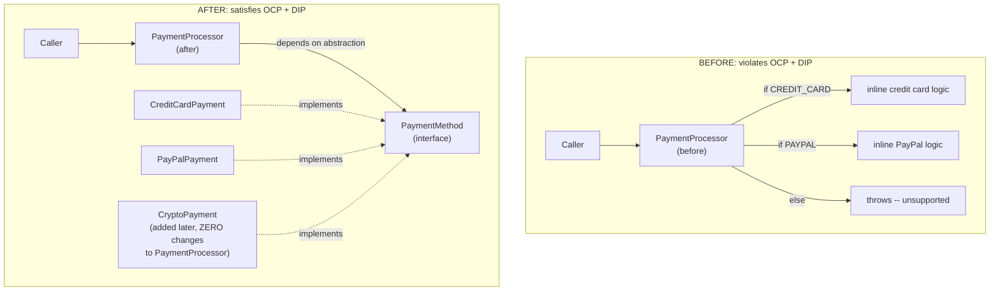
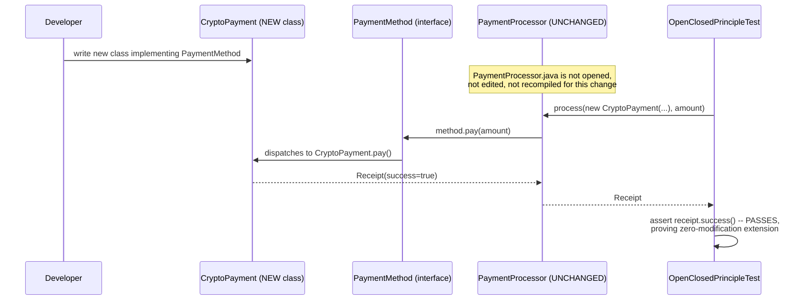
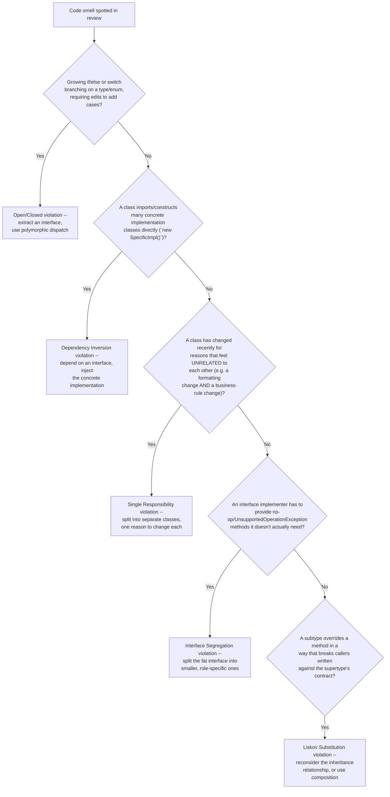
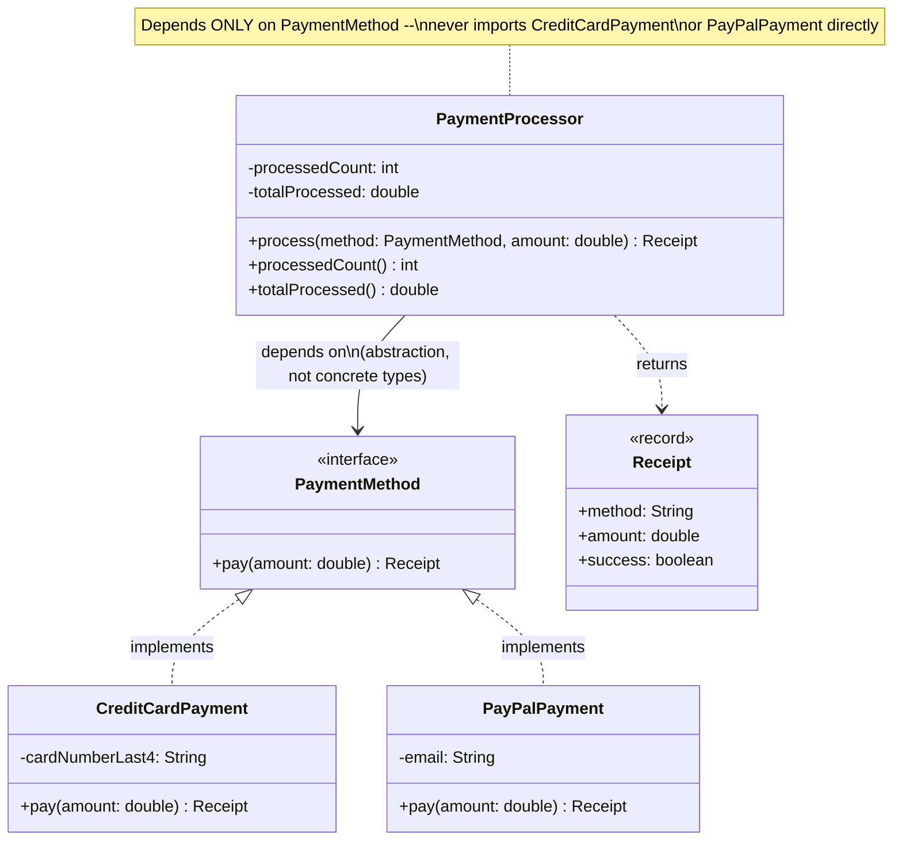

# Chapter 01.04 — OOP Principles & SOLID in Practice

> A payment processor class ships with support for credit cards and
> PayPal. Six months later, product wants crypto payments added. The
> engineer opens `PaymentProcessor.java`, finds a 200-line `if/else if`
> chain, adds a third branch, and re-tests every existing payment type
> because now there's a real chance the new branch's edit broke something
> adjacent to it. This isn't a hypothetical — it's the default outcome of
> code that "just works" without being designed against a principle that
> predicts this exact failure mode: the Open/Closed Principle. Knowing
> SOLID by name is table stakes; recognizing *this specific smell* before
> it costs a re-test cycle is the actual skill.

**Part:** Part 01 — Programming Fundamentals · **Level:** Intermediate
**Estimated study time:** 3-4 hours · **Status:** ✅ Complete

---

## Learning Objectives

- **Explain** each of the 4 OOP pillars (encapsulation, abstraction, inheritance, polymorphism) with a concrete Java example, not a dictionary definition.
- **Diagnose** SOLID violations in existing code by pattern-matching against known smells (a growing `if/else` chain on type, a class importing many unrelated concrete dependencies).
- **Refactor** a class that violates the Open/Closed and Dependency Inversion Principles into one that satisfies both, using interfaces and composition.
- **Prove** (not just assert) that a refactored design is genuinely open for extension, via a test that adds new behavior without modifying existing classes.
- **Compare** inheritance vs. composition and articulate when each is the better tool.
- **Recognize** when applying SOLID is over-engineering for the problem's actual scale, not a universal mandate.

## Prerequisites

| Concept | Where it's covered | Required? |
|---|---|---|
| Java classes, interfaces, and basic polymorphism | General prerequisite | Yes |
| Unit testing with JUnit 5 | Part 14 — Testing (📝 planned) | Helpful — this chapter's tests assume basic JUnit familiarity |
| Design patterns (Strategy, Factory) | Part 01 — Programming Fundamentals, *Design Patterns for Enterprise Java* (📝 planned) | Helpful, not required — this chapter's fix is a Strategy pattern in substance, explained from first principles here |

## Introduction

Every engineer can recite SOLID's five letters. Far fewer can look at a
200-line `if/else` chain and immediately name *which* principle it
violates and *why that specific violation* will cost the team real time —
and that gap is exactly what separates reciting a checklist from applying
judgment under review. SOLID isn't a compliance exercise; each principle
predicts a specific, observable failure mode, and the fix for each is
concrete enough to write a test that proves the fix actually worked.

This chapter grounds all five principles (plus the four classic OOP
pillars underneath them) in one running example: a payment processor that
starts by violating the Open/Closed Principle and the Dependency Inversion
Principle, gets refactored to satisfy both, and — critically — has a test
that adds an entirely new payment method to the *refactored* version with
zero changes to the processor class, making the abstract claim "this is
now open for extension" into something you can watch pass or fail.

## Theory

### The 4 pillars of OOP

- **Encapsulation** — bundling data with the methods that operate on it,
  and controlling access (`private` fields, a deliberate public API). The
  payoff: a class's internal representation can change without breaking
  callers, as long as its public contract doesn't.
- **Abstraction** — exposing *what* something does without exposing *how*.
  An interface like `PaymentMethod` (Code Examples) is pure abstraction: a
  caller knows it can `pay(amount)` and get a `Receipt`, with zero
  knowledge of whether that means a credit card network call, a PayPal API
  call, or something else entirely.
- **Inheritance** — a subtype reuses and specializes a supertype's
  implementation. Powerful, but also the pillar most associated with
  overuse — see Common Mistakes for the "inheritance for code reuse" trap.
- **Polymorphism** — code written against a supertype/interface works
  correctly with any subtype/implementation, without knowing which one at
  compile time. This is the mechanism that makes the Open/Closed Principle
  achievable in practice: `PaymentProcessor.process(PaymentMethod method,
  ...)` works identically whether `method` is a `CreditCardPayment`, a
  `PayPalPayment`, or a type that doesn't exist yet.

### SOLID, each principle predicting a specific failure mode

| Principle | States | Predicts (if violated) |
|---|---|---|
| **S** — Single Responsibility | A class should have one reason to change | Unrelated changes (a formatting tweak, a business-rule change) end up touching the same class, increasing the chance an unrelated change breaks something |
| **O** — Open/Closed | Open for extension, closed for modification | Every new variant (payment type, notification channel, discount rule) requires editing and re-testing an already-deployed class |
| **L** — Liskov Substitution | A subtype must be usable anywhere its supertype is expected, without surprising behavior | Code that type-checks against the supertype breaks at runtime when handed a specific subtype — classically, a `Square extends Rectangle` that overrides `setWidth`/`setHeight` to keep both equal breaks any code that sets them independently expecting a `Rectangle`'s contract |
| **I** — Interface Segregation | Clients shouldn't depend on methods they don't use | A "fat" interface forces every implementer to provide dummy/no-op implementations of methods irrelevant to them, and forces every caller to depend on (and potentially be broken by) methods they never call |
| **D** — Dependency Inversion | Depend on abstractions, not concrete implementations | High-level policy code becomes directly coupled to low-level implementation details, making the policy code untestable in isolation and unextendable without modification |

Notice O and D are tightly linked in practice (as in this chapter's
example): a class can't be genuinely open for extension without also
depending on an abstraction rather than concrete types — that's *why* the
running example's fix addresses both at once with a single refactor.

## Internal Working

### Why the `if/else` chain is structurally fragile, not just "ugly"

The `before.PaymentProcessor.process(String paymentType, double amount)`
method (Code Examples) has a closed set of branches, each hard-coded to a
string literal. Two structural problems follow directly:

1. **The set of supported types is enumerated in exactly one place, and
   every caller's correctness depends on that enumeration staying
   synchronized with what actually exists.** There's no compiler-enforced
   relationship between "a payment type exists" and "the processor knows
   about it" — a typo in a string literal (`"PAY_PAL"` vs. `"PAYPAL"`)
   fails at runtime, not compile time.
2. **Every edit to add a branch touches a class that every existing
   payment type also runs through.** Even a syntactically trivial addition
   carries non-zero risk of breaking an unrelated branch (a misplaced
   brace, an accidentally-shared local variable) — this is the concrete
   mechanism behind "this class isn't safe to extend without re-testing
   everything."

### Why the interface-based fix removes both problems

`after.PaymentProcessor.process(PaymentMethod method, double amount)`
depends only on the `PaymentMethod` interface. Adding `CryptoPayment`
means writing a brand-new class that implements that interface — the
*existing* `PaymentProcessor.class` bytecode is never recompiled, never
re-reviewed, never re-tested for this change, because it was never
touched. The compiler enforces the relationship string-based dispatch
couldn't: any class claiming to implement `PaymentMethod` *must* provide a
`pay(double)` method with the right signature, or it won't compile at all
— catching the "typo in a string literal" failure mode at compile time
instead of runtime.

## Architecture



## Sequence Diagrams (Mermaid)

Adding `CryptoPayment` to the *after* design — note that
`PaymentProcessor` is never touched:



## Flow Charts (Mermaid)

A decision tree for diagnosing which SOLID principle a given code smell
actually violates — useful for code review, and for correctly naming the
problem in an interview answer instead of vaguely gesturing at "SOLID":



## Class Diagrams (Mermaid)



## Production Examples

A realistic before/after code-review exchange, illustrating why this
matters beyond the abstract principle:

```text
PR #4127: "Add crypto payment support"

Reviewer comment on the `before`-style implementation:
  "This adds a 4th branch to PaymentProcessor.process(). That method now
  has 4 payment types' worth of inline logic in one function, and this PR
  touches lines that CREDIT_CARD and PAYPAL both flow through. Please
  re-run the full payment regression suite (47 min) before merge, since
  we can't be confident this change is isolated to CRYPTO."

Same PR, against the `after`-style implementation:
  "This adds a new CryptoPayment.java implementing PaymentMethod --
  PaymentProcessor.java has a zero-line diff. Approving; the existing
  payment regression suite doesn't even need to re-run for the untouched
  payment types, since nothing they depend on changed."
```

The time difference (a mandatory 47-minute full regression run vs. none)
is the Open/Closed Principle's payoff made concrete — not a stylistic
preference, a measurable review/CI cost difference that compounds every
time a new payment type is added.

## Code Examples

The full, compiling code sample for this chapter lives at
[`code-samples/solid-principles/`](../code-samples/solid-principles/):

```bash
cd Part-01-Programming-Fundamentals/code-samples/solid-principles
mvn -q compile   # compiles cleanly against Java 21
mvn -q test      # 7 JUnit 5 tests, all passing
```

**The violation** — `before.PaymentProcessor`:

```java
public String process(String paymentType, double amount) {
    if (amount <= 0) {
        throw new IllegalArgumentException("amount must be positive: " + amount);
    }
    String receipt;
    if ("CREDIT_CARD".equals(paymentType)) {
        receipt = "CREDIT_CARD charged " + amount;
    } else if ("PAYPAL".equals(paymentType)) {
        receipt = "PAYPAL charged " + amount;
    } else {
        throw new IllegalArgumentException("Unsupported payment type: " + paymentType
                + " -- adding support requires editing this method directly.");
    }
    // ...
}
```

**The abstraction** — `after.PaymentMethod`:

```java
public interface PaymentMethod {
    Receipt pay(double amount);
}
```

**The fix** — `after.PaymentProcessor` depends only on the interface:

```java
public Receipt process(PaymentMethod method, double amount) {
    if (amount <= 0) {
        throw new IllegalArgumentException("amount must be positive: " + amount);
    }
    Receipt receipt = method.pay(amount);
    if (receipt.success()) {
        processedCount++;
        totalProcessed += amount;
    }
    return receipt;
}
```

**The proof** — `OpenClosedPrincipleTest` defines a brand-new
`CryptoPayment` class *inside the test file itself*, and asserts the
existing, unmodified `PaymentProcessor` handles it correctly:

```java
private static final class CryptoPayment implements PaymentMethod {
    private final String walletAddress;
    CryptoPayment(String walletAddress) { this.walletAddress = walletAddress; }
    @Override
    public Receipt pay(double amount) {
        return new Receipt("CRYPTO:" + walletAddress, amount, true);
    }
}

@Test
void existingUnmodifiedProcessorSupportsABrandNewPaymentMethod() {
    PaymentProcessor processor = new PaymentProcessor();
    Receipt receipt = processor.process(new CryptoPayment("0xABC123"), 250.0);
    assertTrue(receipt.success());
    assertEquals(1, processor.processedCount());
}
```

This is the chapter's central claim turned into something you can run and
watch pass — `PaymentProcessor.java`'s source is unchanged from the credit
card/PayPal version, and this test still passes against a payment type
that didn't exist when that class was written.

## Best Practices

| Do | Don't | Why |
|---|---|---|
| Extract an interface the moment a second concrete implementation appears | Wait for a third or fourth implementation "to be sure it's needed" | Two implementations is already enough signal that a third is likely, and retrofitting an interface onto established call sites is more work than starting with one |
| Depend on interfaces in high-level/policy code, inject concrete implementations | Directly instantiate (`new ConcreteThing()`) inside business logic classes | Direct instantiation couples policy to implementation, making both harder to test in isolation and impossible to extend without modification |
| Prefer composition (a class holds a reference to an interface) over inheritance for "reuse" | Extend a class purely to reuse its methods, without an actual is-a relationship | Composition doesn't inherit unwanted behavior or create fragile coupling to a superclass's internals — see Common Mistakes |
| Write a test that actually adds new behavior to prove extensibility | Just assert "the design follows SOLID" in a code comment | An assertion in a comment can silently go stale; a test that exercises the extension point fails loudly if the design regresses |
| Apply SOLID where the problem's variability actually warrants it | Apply every principle maximally everywhere, regardless of scale | A two-branch `if/else` that will never grow a third case doesn't need an interface — see Common Mistakes' over-engineering trap |

## Common Mistakes

| Mistake | Why it happens | How to fix it |
|---|---|---|
| Using inheritance purely for code reuse, with no genuine is-a relationship | Inheritance feels like the "OOP way" to share code | Prefer composition — hold a reference to the shared-behavior object as a field, delegate to it, rather than extending a class you don't conceptually subtype |
| Over-engineering: adding an interface, a factory, and a strategy pattern for a two-branch condition that will realistically never grow a third | SOLID feels like a universal mandate rather than a response to actual variability | Apply Open/Closed where change is genuinely anticipated (payment types, notification channels); a stable two-way branch doesn't need the machinery this chapter's example does |
| Violating Liskov Substitution with an "is-a" relationship that's only true in the easy cases (`Square extends Rectangle`) | The is-a relationship looks correct from a natural-language standpoint | Check whether every method on the supertype's contract holds for the subtype under all callers' expectations, not just the common case — if not, don't inherit; compose instead |
| Fat interfaces that force irrelevant no-op implementations | Adding "just one more method" to an existing interface feels cheaper than creating a new one | Split by actual client need — an interface should represent one coherent capability a caller actually depends on |
| Testing the "after" design only for the payment types it already has | Feels like sufficient coverage since both known types pass | Explicitly test the *extension* claim with a new type defined only in the test, exactly as `OpenClosedPrincipleTest` does — this is the only way to actually verify "open for extension," not just "correctly handles known cases" |

## Performance Considerations

- **Polymorphic dispatch (interface method calls) has a small, usually
  negligible runtime cost** compared to a direct method call or an
  `if/else` chain — modern JITs aggressively optimize monomorphic
  (single-implementation-seen) call sites via inlining, and even
  megamorphic call sites (many implementations) cost single-digit
  nanoseconds per call, dwarfed by almost any real business logic (a
  network call, a DB query) the method would actually perform.
- **The real cost/benefit trade-off is engineering time, not CPU time** —
  as shown in Production Examples, the measurable cost of the Open/Closed
  violation is regression-suite runtime and review risk, not method-call
  overhead. Don't justify SOLID refactors on performance grounds; justify
  them on extensibility and review-safety grounds, where the actual payoff is.
- **Excessive abstraction has its own cost**: too many indirection layers
  (interfaces wrapping interfaces wrapping interfaces) makes code harder
  to navigate and debug — stack traces and IDE "go to definition" both get
  noisier. This is the practical argument against the over-engineering
  trap in Common Mistakes, independent of runtime performance.

## Security Considerations

- **Dependency Inversion enables security-relevant testability** — a
  `PaymentProcessor` that depends on the `PaymentMethod` abstraction can be
  tested against a deliberately-failing or malicious mock implementation
  (e.g., one that throws mid-transaction, or returns a `Receipt` claiming
  success falsely) to verify the processor's error handling doesn't leave
  inconsistent state — this kind of fault-injection testing is much harder
  against the `before` version, since it can't be handed a fake payment
  type without editing production code.
- **Interface Segregation reduces blast radius** — an interface with only
  the methods a given caller actually needs limits what a compromised or
  buggy caller could misuse; a fat interface exposing administrative or
  destructive methods to every caller (because "it was already on the
  interface") is a common way over-broad interfaces become an unintended
  privilege-escalation surface.
- **Liskov violations are a source of real security bugs**, not just
  design smells — if a subtype's overridden method silently weakens a
  security-relevant contract (e.g., a subclass of a validator that skips a
  check the base class's callers assume always runs), callers written
  against the supertype's contract can be silently bypassed.

## Production Troubleshooting

| Symptom | Root Cause | Diagnosis | Fix |
|---|---|---|---|
| A "small" bugfix in one branch of an `if/else`-on-type method broke an unrelated type | Open/Closed violation — all types' logic shares one method's blast radius | Check whether the changed method has multiple type-dispatched branches sharing local state/variables | Extract each branch into its own class behind a shared interface; each fix then only touches its own class |
| A class is hard to unit test without spinning up real external dependencies (a real DB, a real payment gateway) | Dependency Inversion violation — the class directly constructs concrete, side-effecting dependencies | Check whether the class does `new ConcreteExternalThing()` internally vs. receiving an interface via constructor/parameter | Inject an interface; substitute a test double in unit tests |
| A subclass override causes confusing behavior only in specific caller code paths | Liskov Substitution violation | Check whether the override changes behavior callers reasonably assumed from the supertype's documented contract | Reconsider whether inheritance is the right relationship; often composition avoids the problem entirely |
| Every implementer of an interface has several methods throwing `UnsupportedOperationException` | Interface Segregation violation — the interface bundles unrelated capabilities | Look at which methods each implementer actually uses vs. stubs out | Split the interface along the lines of what real implementers actually need |
| A class's changelog shows edits for clearly unrelated reasons (a UI label change, then a tax-calculation change, in the same file) | Single Responsibility violation | Check git blame/log for the class — do commit messages cluster into unrelated concerns? | Split the class along those concern boundaries |

## Interview Questions

1. **"Explain the Open/Closed Principle and give a concrete example of a violation."**
   *Model answer:* A class should be open for extension but closed for
   modification — new behavior should be addable without editing existing,
   tested code. Classic violation: an `if/else` or `switch` chain
   dispatching on a type/enum, where adding a new case means editing the
   method directly (this chapter's `before.PaymentProcessor`).

2. **"How does Dependency Inversion relate to Open/Closed in practice?"**
   *Model answer:* They're usually satisfied or violated together — a
   class can't be genuinely open for extension without depending on an
   abstraction, because if it depends on concrete types directly, adding a
   new concrete type still requires editing the class to reference it.
   Depending on an interface is what lets new implementations plug in
   without modification.

3. **"When would you choose composition over inheritance?"**
   *Model answer:* When the relationship is "has-a behavior" rather than
   genuinely "is-a" — inheriting purely to reuse a method, without the
   subtype actually satisfying the supertype's full behavioral contract,
   risks Liskov Substitution violations and couples the subclass to the
   superclass's implementation details. Composition (holding a reference,
   delegating) avoids both.

4. **"What is the classic Liskov Substitution violation example, and why does it violate the principle?"**
   *Model answer:* `Square extends Rectangle`, overriding `setWidth`/
   `setHeight` to keep both dimensions equal (since a square's sides are
   equal). Code written against `Rectangle`'s contract — e.g., "setting
   width doesn't change height" — breaks when handed a `Square`, even
   though a square is mathematically a rectangle. The inheritance
   relationship doesn't hold at the behavioral-contract level Liskov
   requires.

5. **"How would you prove a refactored design is actually open for extension, not just claim it is?"**
   *Model answer:* Write a test that adds genuinely new behavior (a new
   implementation of the relevant interface, defined only in the test) and
   verifies the existing, unmodified production class handles it
   correctly — exactly `OpenClosedPrincipleTest` in this chapter's code
   sample. A design review claim isn't verifiable the way a passing test is.

6. **"Is applying every SOLID principle everywhere always correct?"**
   *Model answer:* No — SOLID responds to anticipated variability and
   change. A two-branch condition that will realistically never grow a
   third case doesn't need an interface, factory, and strategy pattern;
   that's over-engineering, adding indirection cost (navigability,
   debuggability) without a matching extensibility payoff. Apply it where
   the problem's actual shape (multiple current or clearly-anticipated
   future variants) warrants it.

7. **"What's the difference between Interface Segregation and Single Responsibility?"**
   *Model answer:* Single Responsibility is about a class having one
   reason to change; Interface Segregation is about an interface not
   forcing implementers/clients to depend on methods they don't use.
   They're related (a fat interface often signals a class trying to do too
   much) but distinct — a class can have a single responsibility while
   still exposing an interface that's too broad for some of its clients'
   actual needs.

8. **"Walk me through refactoring a class that violates OCP and DIP."**
   *Model answer:* Identify the varying behavior (per-type logic in this
   chapter's payment example), extract an interface representing that
   behavior's contract, move each type's logic into its own class
   implementing that interface, then change the original class to depend
   on the interface (via constructor/parameter injection) instead of
   containing type-dispatch logic directly — exactly the `before` → `after`
   transformation in this chapter's code sample.

## Hands-on Exercises

### Lab 1 (Beginner)

**Goal:** Identify which SOLID principle a given code smell violates.

**Setup:** This chapter's Flow Chart in "Flow Charts (Mermaid)".

**Task:** For each of these three smells, name the violated principle and
justify it in one sentence: (a) a `NotificationService` interface with 12
methods, where an `SmsNotifier` implementation throws
`UnsupportedOperationException` for 8 of them; (b) an `OrderValidator`
class that directly constructs `new PostgresInventoryClient()` inside its
`validate()` method; (c) a `ReportGenerator` class whose git history shows
alternating commits for "fix currency formatting" and "add new tax bracket
calculation."

**Verification:** Your three answers should be, respectively: Interface
Segregation, Dependency Inversion, and Single Responsibility — and each
justification should reference the specific mechanism from this chapter's
Theory table, not just restate the principle's name.

### Lab 2 (Intermediate)

**Goal:** Reproduce the `before` → `after` refactor for a new domain.

**Setup:** `code-samples/solid-principles/` as a structural reference.

**Task:** Design (and implement, with tests) a `before`/`after` pair for a
`NotificationSender` that currently uses an `if/else` on a
`String channel` parameter ("EMAIL", "SMS") to send notifications inline.
Refactor it to a `NotificationChannel` interface with `EmailChannel` and
`SmsChannel` implementations, following this chapter's `PaymentMethod`
pattern exactly.

**Verification:** Write a test analogous to `OpenClosedPrincipleTest` that
adds a new `PushNotificationChannel` (defined only in the test) and proves
your refactored `NotificationSender` handles it with zero modification.

### Lab 3 (Advanced)

**Goal:** Deliberately construct and then fix a Liskov Substitution
violation.

**Setup:** Any Java environment (can extend `code-samples/solid-principles/`
or work standalone).

**Task:** Implement the classic `Rectangle`/`Square extends Rectangle`
example with `setWidth`/`setHeight` overridden in `Square` to keep both
dimensions equal. Write a test against `Rectangle`'s contract (e.g., "after
calling `setWidth(5)`, `getHeight()` is unchanged from before the call")
that passes for `Rectangle` but fails when the same test is run against a
`Square` instance. Then refactor away from inheritance (composition, or a
shared interface with independent implementations) so no such contract
violation is possible.

**Verification:** Your test demonstrably fails against the naive
`Square extends Rectangle` design (capturing the LSP violation as a real,
observable test failure, not just a claim) and passes once you've
refactored to avoid the inheritance relationship.

### Lab 4 (Production)

**Goal:** Estimate the real cost of an Open/Closed violation using this
chapter's Production Examples framing.

**Setup:** This chapter's Production Examples section.

**Task:** Imagine your team's payment regression suite takes 47 minutes
and must fully re-run for any change touching `PaymentProcessor.java` (per
your team's CI policy for "shared, high-risk" files). Over the last 12
months, 6 new payment types were added under the `before`-style design.
Calculate the total CI time this cost versus the `after`-style design
(where each addition is an isolated, independently-testable class not
requiring the full suite). Then write a one-paragraph justification memo
(as if proposing the refactor to a tech lead) using this number.

**Verification:** Your calculation should be straightforward (6 × 47
minutes = 282 minutes of mandatory full-suite CI time attributable
specifically to the OCP violation, not to the payment types' own testing)
and your memo should tie the number back to the specific mechanism (shared
blast radius) rather than a vague "it's better design" argument — this is
the difference between an interview answer that sounds right and one that
would actually convince a skeptical tech lead.

## Summary

- The 4 OOP pillars (encapsulation, abstraction, inheritance,
  polymorphism) are the mechanisms; SOLID is the set of principles that
  tells you *when and how* to use them well.
- Each SOLID letter **predicts a specific, observable failure mode** —
  Open/Closed violations predict "adding new behavior requires editing and
  re-testing existing code"; Dependency Inversion violations predict
  "classes are hard to test in isolation."
- This chapter's running example (`before`/`after` `PaymentProcessor`)
  shows Open/Closed and Dependency Inversion are usually satisfied or
  violated **together**: depending on an abstraction is what makes a class
  genuinely extensible without modification.
- **Prove extensibility with a test**, not a design-review claim —
  `OpenClosedPrincipleTest` defines a brand-new payment type inside the
  test itself and verifies the existing, unmodified processor handles it.
- **Composition over inheritance** for code reuse without a genuine is-a
  relationship — avoids Liskov Substitution risk and superclass coupling.
- **SOLID is not a universal mandate** — apply it where a problem's actual
  or clearly-anticipated variability warrants it; over-applying it to
  stable, simple logic adds indirection cost without an extensibility payoff.
- The real-world payoff of these principles is measured in **engineering
  time** (review risk, regression-suite scope), not runtime performance —
  polymorphic dispatch overhead is negligible next to almost any real
  business logic.

## Further Reading

- *Design Patterns: Elements of Reusable Object-Oriented Software* (Gang of
  Four) — the original catalog underlying the Strategy-pattern shape this
  chapter's fix takes; read this once you want the broader pattern
  vocabulary beyond SOLID's five principles.
- *Agile Software Development, Principles, Patterns, and Practices*
  (Robert C. Martin) — the original, fullest treatment of SOLID as
  articulated by the person who coined the acronym; considerably deeper
  than any single chapter can cover.
- **"Composition over Inheritance" (various canonical blog treatments, e.g.
  from the Effective Java community)** — worth a skim for the Liskov
  Substitution / inheritance-misuse material in this chapter's Common
  Mistakes and Lab 3.
- [Chapter 12.01 — Case Study: Designing a Scalable URL Shortener](../../Part-12-System-Design/chapters/12-01-case-study-url-shortener.md) — its `RangeBasedIdGenerator.BlockAllocator` interface is a real, production-shaped instance of the same Dependency Inversion pattern this chapter teaches from a payment-processing example.
- [Chapter 17.01 — Staff/Principal Engineer Interview Playbook](../../Part-17-Interview/chapters/17-01-staff-engineer-interview-playbook.md) — its `ImmutableMoney` code sample pairs well with this chapter's `Receipt` record as two takes on the same immutable-value-object idea underlying good encapsulation.
