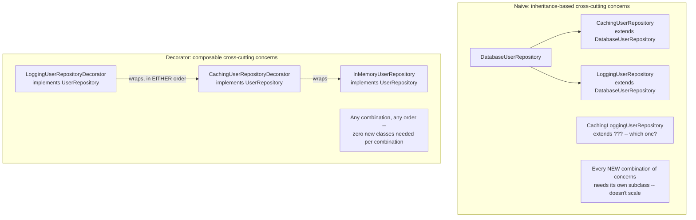
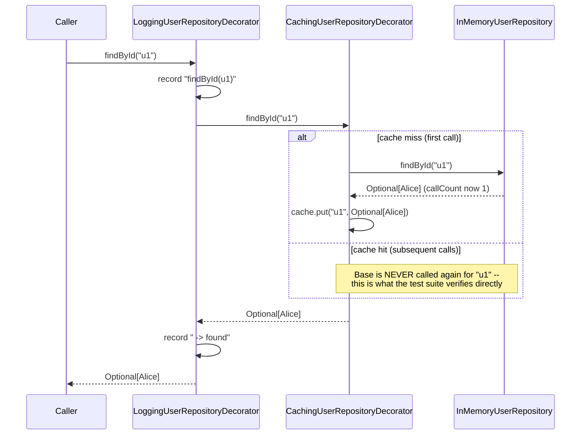
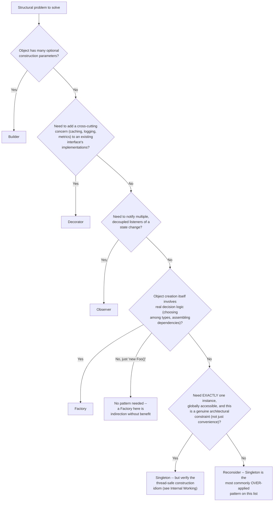
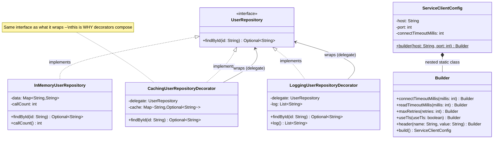

# Chapter 01.05 — Design Patterns for Enterprise Java

> A `UserRepository` needs caching added in front of it. One engineer's
> instinct: subclass it — `CachingUserRepository extends
> DatabaseUserRepository`, override `findById`, add a cache check. Then
> logging needs adding too. Now there's `CachingLoggingUserRepository`, or
> two separate subclasses that can't be composed, or a growing tangle of
> boolean flags threaded through one class's constructor. None of this is
> a hypothetical — it's the exact shape of what happens when "add a
> cross-cutting concern" is solved with inheritance instead of the pattern
> built for precisely this problem. This chapter's code sample proves the
> alternative works, not just describes it: two decorators, wrapped in
> either order, composed cleanly, each independently tested.

**Part:** Part 01 — Programming Fundamentals · **Level:** Intermediate
**Estimated study time:** 3-4 hours · **Status:** ✅ Complete

---

## Learning Objectives

- **Implement** the Builder pattern to solve the telescoping-constructor problem for objects with many optional parameters.
- **Implement** the Decorator pattern to add cross-cutting concerns (caching, logging) to an interface without modifying its implementations or causing a subclass explosion.
- **Explain** the Observer, Factory, and Singleton patterns and identify their most common real-world (and most common *mis*-)uses.
- **Recognize** Strategy pattern in code you've already seen (Chapter 01.04's `PaymentMethod`) without needing it re-taught from scratch.
- **Diagnose** Singleton's concurrency pitfalls and know the correct thread-safe construction idioms.
- **Choose** the right pattern for a given structural problem, and recognize when no pattern is the right answer.

## Prerequisites

| Concept | Where it's covered | Required? |
|---|---|---|
| Interfaces, composition vs. inheritance | [Chapter 01.04 — OOP Principles & SOLID in Practice](./01-04-oop-solid-principles.md) | Yes — this chapter builds directly on 01.04's Dependency Inversion / composition material |
| Basic Java generics and collections | General prerequisite | Yes |
| Thread safety basics (`synchronized`, visibility) | Part 02 — Core Java, *Concurrency & the Java Memory Model* (📝 planned) | Helpful — needed for this chapter's Singleton concurrency discussion |

## Introduction

Design patterns get a mixed reputation in practice: cited too reflexively
by some ("this needs a Factory"), dismissed too readily by others ("just
write the code, patterns are overhead"). Both positions miss the actual
value. A pattern isn't a mandate to apply everywhere — it's a *named,
well-understood solution* to a structural problem that recurs often enough
to deserve a name, so that "I used a Decorator here" communicates a precise
design intent in three words instead of a paragraph.

This chapter covers the enterprise Java patterns that come up constantly
in real codebases — Builder, Decorator, Observer, Factory, Singleton — with
two of them (Builder and Decorator) backed by full, tested implementations
rather than illustrative snippets, because a pattern you've only read
about and a pattern you've built, tested, and watched compose correctly
are different levels of understanding. Strategy — the fifth pattern most
lists include — isn't re-taught here at all: Chapter 01.04's `PaymentMethod`
*is* a Strategy pattern, already fully built and tested; this chapter just
names what you've already seen.

## Theory

### Builder: solving the telescoping-constructor problem

An object with 2 required fields and 5 optional ones has an ugly set of
choices without Builder: one constructor per meaningful combination of
optional parameters (**telescoping constructors** — a combinatorial mess),
a single constructor taking all 7 parameters positionally (unreadable and
error-prone — which `int` argument is the timeout, and which is the retry
count?), or a mutable setter-based object (loses immutability, and leaves
a window where the object exists in a partially-configured, invalid
state). The **Builder** pattern separates construction from
representation: required fields are captured up front, optional fields are
set via clearly-named chained methods in any order, and the final object
is only ever exposed once fully and validly constructed via `build()`.

### Decorator: composable cross-cutting concerns

The **Decorator** pattern wraps an object implementing some interface with
another object implementing the *same* interface, adding behavior before
and/or after delegating to the wrapped object. Because a decorator has the
same type as what it wraps, decorators **compose**: wrapping a decorator
in another decorator works transparently, and callers never need to know
how many layers deep the "real" implementation sits. This is the
structural fix for the subclass-explosion problem in this chapter's
opening hook: adding caching and logging as two independent decorators
means either can be applied alone, both together in either order, or
neither — without ever writing a `CachingLoggingRepository` class.

### Observer, Factory, and Singleton (with their pitfalls)

- **Observer**: a **subject** maintains a list of **observers** and
  notifies them of state changes, without the subject needing to know
  concretely who's listening. The event-listener pattern underlying GUI
  frameworks, message buses, and reactive streams (`Flow.Publisher`/
  `Flow.Subscriber` in the JDK) is Observer at its core. Pitfall: forgetting
  to unregister observers is a classic memory-leak pattern (this book's
  Chapter 02.04 covers the general shape — a collection that grows without
  bound because nothing ever removes from it).
- **Factory** (Factory Method / Simple Factory): centralizes *object
  creation logic* behind a method or class, so callers depend on an
  abstraction rather than a specific constructor. Most valuable when
  construction itself is non-trivial (choosing among several concrete
  types based on input, assembling several dependencies) — for a plain
  `new Foo()` with no decision logic, a Factory adds indirection without
  benefit (see Common Mistakes).
- **Singleton**: ensures exactly one instance of a class exists,
  accessible globally. The pattern most often *misused* in practice — see
  Internal Working for its specific thread-safety pitfall and Best
  Practices for when it's actually justified vs. when it's really just
  global mutable state wearing a design-pattern name.

## Internal Working

### Why the caching decorator's test is the real proof

`CachingUserRepositoryDecorator.findById()` uses
`cache.computeIfAbsent(id, delegate::findById)` — a single line that's
easy to *claim* implements correct caching, and easy to get subtly wrong
(a common bug: checking `cache.containsKey()` then separately calling
`cache.put()`, which isn't atomic and can call the delegate more than
once under certain conditions, or a bug in cache-miss handling for
`Optional.empty()` results specifically — see below). This chapter's test
suite doesn't just call `findById()` and check the returned value is
correct; `CachingUserRepositoryDecoratorTest` asserts the **underlying
repository's call count** stays at 1 after 3 logical lookups of the same
key — proving the decorator actually avoids redundant delegate calls, not
just that it returns the right *value* (which a broken, always-delegating
"caching" decorator would also do).

One specific correctness trap the implementation and test both address: a
naive cache using `Map<String, String>` (not `Map<String, Optional<String>>`)
would be unable to distinguish "never looked up" from "looked up and not
found," since a not-found result would need to be represented as `null` —
and `computeIfAbsent` explicitly does **not** cache a `null` result (it
calls the mapping function again next time). Using `Optional<String>` as
the cached value type sidesteps this entirely: `Optional.empty()` is a
real, non-null object, so a cached "not found" result is correctly
retained and not re-delegated — exactly what
`cachesAbsentResultsTooNotJustPresentOnes` verifies.

### Why the composability test matters

`LoggingUserRepositoryDecoratorTest.composesWithCachingDecorator` wraps a
`LoggingUserRepositoryDecorator` around a `CachingUserRepositoryDecorator`
around the base `InMemoryUserRepository`, then verifies **both** decorators'
claims hold simultaneously: the base repository is still only called once
(caching decorator's guarantee holds even when wrapped further), and the
logging decorator records all 3 logical calls regardless of whether each
one was a cache hit or miss (logging decorator's guarantee — it logs at
its own layer, unaffected by what's happening beneath it). This is the
concrete, testable version of "decorators compose" — not just an assertion
in prose.

## Architecture



## Sequence Diagrams (Mermaid)

A call through both composed decorators, showing exactly what happens at
each layer:



## Flow Charts (Mermaid)

A decision tree for choosing among this chapter's patterns for a given
structural problem:



## Class Diagrams (Mermaid)



## Production Examples

A realistic before/after code-review exchange showing the inheritance vs.
decorator trade-off made concrete, mirroring Chapter 01.04's review-cost
framing:

```text
PR #2891: "Add response caching to the notification-preferences lookup"

Reviewer comment on an inheritance-based approach:
  "This adds CachingNotificationPreferencesRepository extends
  DatabaseNotificationPreferencesRepository. We already have
  AuditedNotificationPreferencesRepository extends the same base class
  for the compliance-logging requirement from last quarter. If we ever
  need BOTH caching and audit logging on the same call path, we're stuck
  -- Java doesn't support multiple inheritance, and duplicating logic
  into a third subclass is exactly the maintenance trap we should avoid
  here."

Same PR, using a decorator:
  "This adds CachingNotificationPreferencesDecorator implementing the
  existing NotificationPreferencesRepository interface, wrapping
  whatever's passed to its constructor. It composes cleanly with the
  existing AuditingNotificationPreferencesDecorator (also independently
  implementing the interface) in either order. Approving -- this is the
  right shape for a concern that might need to combine with others later."
```

This mirrors the exact composability property `LoggingUserRepositoryDecoratorTest.composesWithCachingDecorator`
proves in this chapter's code sample — not a hypothetical, a directly
tested structural guarantee.

## Code Examples

The full, compiling code sample for this chapter lives at
[`code-samples/design-patterns/`](../code-samples/design-patterns/):

```bash
cd Part-01-Programming-Fundamentals/code-samples/design-patterns
mvn -q compile   # compiles cleanly against Java 21
mvn -q test      # 12 JUnit 5 tests, all passing
```

**Builder** — `ServiceClientConfig`, required fields up front, optional
fields via chained, validated methods:

```java
public static Builder builder(String host, int port) {
    return new Builder(host, port);
}

public Builder connectTimeoutMillis(int millis) {
    if (millis <= 0) {
        throw new IllegalArgumentException("connectTimeoutMillis must be positive: " + millis);
    }
    this.connectTimeoutMillis = millis;
    return this;
}
```

Usage — required fields only, or fully configured, in any order:

```java
ServiceClientConfig minimal = ServiceClientConfig.builder("api.example.com", 443).build();

ServiceClientConfig full = ServiceClientConfig.builder("internal-api", 8443)
        .useTls(true)
        .maxRetries(3)
        .header("X-Request-Source", "handbook")
        .connectTimeoutMillis(2_000)
        .build();
```

**Decorator** — the caching implementation, using `Optional` as the cache
value type specifically to correctly cache "not found" results too:

```java
public final class CachingUserRepositoryDecorator implements UserRepository {
    private final UserRepository delegate;
    private final Map<String, Optional<String>> cache = new HashMap<>();

    @Override
    public Optional<String> findById(String id) {
        return cache.computeIfAbsent(id, delegate::findById);
    }
}
```

**The proof, not just the claim** — `CachingUserRepositoryDecoratorTest`:

```java
@Test
void firstLookupDelegatesButSecondLookupHitsTheCacheInstead() {
    InMemoryUserRepository base = new InMemoryUserRepository(Map.of("u1", "Alice"));
    CachingUserRepositoryDecorator cached = new CachingUserRepositoryDecorator(base);

    cached.findById("u1");
    cached.findById("u1");
    cached.findById("u1");

    assertEquals(1, base.callCount(),
            "second and third lookups must be served from cache, not delegate again");
}
```

**Composability, tested directly**:

```java
CachingUserRepositoryDecorator cached = new CachingUserRepositoryDecorator(base);
LoggingUserRepositoryDecorator logged = new LoggingUserRepositoryDecorator(cached);
// logged wraps cached wraps base -- both decorators' guarantees hold simultaneously
```

## Best Practices

| Do | Don't | Why |
|---|---|---|
| Use Builder once an object has 3+ optional parameters or any validation logic on construction | Use Builder for a 1-2-field data class | For a trivially simple object, a Builder adds ceremony without payoff — a compact constructor or record is clearer |
| Use Decorator for cross-cutting concerns that might need to combine or toggle independently | Reach for inheritance when a *second* cross-cutting concern is anticipated | Inheritance can't compose two independent concerns cleanly (no multiple inheritance in Java); Decorator does, by construction |
| Justify Singleton with a genuine architectural constraint (e.g., a hardware resource that truly has one instance) | Default to Singleton for "things we only need one of" as a convenience | Most "only need one" cases are really about lifecycle management (a DI container's singleton *scope*, not the Singleton *pattern*) — see Common Mistakes |
| Use Factory when construction involves real decision logic | Wrap every `new Foo()` in a `FooFactory.create()` reflexively | A Factory with no actual decision logic is pure indirection — it doesn't satisfy Open/Closed any better than the direct constructor call it wraps |
| Prove a pattern's claimed property with a test (like this chapter's call-count assertion) | Assume a pattern is implemented correctly because it "looks like" the textbook shape | A caching decorator that always delegates (a real, easy-to-write bug) still returns correct *values* — only a call-count-style test catches it |

## Common Mistakes

| Mistake | Why it happens | How to fix it |
|---|---|---|
| Classic double-checked-locking Singleton without `volatile` | The double-checked-locking IDIOM is widely copied, but its correctness *depends* on the field being `volatile` — without it, another thread can observe a partially-constructed instance due to instruction reordering | Use `volatile` on the instance field with double-checked locking, or (simpler and equally correct) the initialization-on-demand holder idiom, or an `enum` singleton |
| Applying Factory to every object construction reflexively | Feels like "following best practices" | A Factory earns its place when it centralizes real decision logic — for a bare `new Foo()`, it's indirection without a corresponding Open/Closed or testability benefit |
| Building a "God" cross-cutting-concern subclass (`CachingLoggingAuditedUserRepository`) | Inheritance was reached for first, and each new concern got bolted onto the same subclass | Refactor to independent Decorators per concern, composed at the call site — exactly this chapter's fix |
| Forgetting to unregister Observers, causing a memory leak | An observer/listener registration is easy to add and easy to forget to remove on the observed object's disposal | Use weak references for long-lived subjects with short-lived observers, or ensure explicit unregistration in a `close()`/lifecycle hook |
| Treating "I used pattern X" as inherently good design | Patterns are a vocabulary for solutions, not a scorecard | Judge the actual outcome (does this genuinely reduce coupling/improve testability/solve the real problem) — a correctly-identified *lack* of need for a pattern is just as much a design skill as correctly applying one |

## Performance Considerations

- **Decorator adds one virtual method call per layer** — for the two-layer
  composition in this chapter's code sample, this is negligible (see
  Chapter 01.04's Performance Considerations on polymorphic dispatch cost);
  a very deep decorator chain (10+ layers) is a code-smell before it's a
  performance concern, since it usually signals the concerns should be
  restructured, not that the pattern itself is slow.
- **A caching decorator's memory cost scales with distinct keys seen**,
  unboundedly, unless capacity-bounded — this chapter's simple
  `HashMap`-backed cache is illustrative; a production caching decorator
  should use a bounded structure (see Chapter 02.04's `BoundedRequestCache`
  for exactly this fix, applied to a different scenario with the same
  underlying unbounded-cache risk).
- **Builder's per-object construction cost is a handful of extra method
  calls and one extra (builder) object allocation** — negligible relative
  to almost any real business logic; not a consideration that should
  factor into whether to use Builder.

## Security Considerations

- **A logging decorator is a natural place to accidentally leak sensitive
  data** — this chapter's `LoggingUserRepositoryDecorator` logs the
  looked-up ID and a found/not-found status, deliberately not the actual
  returned value; a naive logging decorator that logs full response
  payloads (including PII, credentials, or tokens) turns a debugging aid
  into a data-exposure surface. Decide explicitly what a logging
  decorator is allowed to log, don't just log everything that passes
  through by default.
- **Singleton-held mutable state is a natural place for cross-request data
  leakage** in a multi-tenant or multi-user server — if a Singleton
  accidentally accumulates per-request or per-user state (rather than
  being genuinely stateless or explicitly scoped), one user's data can
  leak into another user's response. This is a real, historically-seen bug
  class, not a theoretical concern.
- **A caching decorator can cache stale authorization decisions** if not
  carefully scoped — caching "is user X allowed to do Y" without a
  correctly short TTL or explicit invalidation on permission changes can
  let a revoked permission remain effectively granted until the cache
  entry expires or is evicted.

## Production Troubleshooting

| Symptom | Root Cause | Diagnosis | Fix |
|---|---|---|---|
| A cross-cutting concern (caching, logging) needs to be conditionally disabled for specific call sites, and the code can't easily do it | The concern was implemented via inheritance, baked into a specific subclass hierarchy | Check whether the concern is a subclass override vs. an independently-composable decorator | Refactor to Decorator — a decorator can simply not be applied at a given call site, no subclass restructuring needed |
| A Singleton's state appears corrupted or inconsistent under concurrent access | Non-thread-safe lazy initialization (classic double-checked-locking bug, or no synchronization at all) | Check the Singleton's initialization code for `volatile` on double-checked-locking, or absence of any synchronization | Switch to the initialization-on-demand holder idiom or an `enum` singleton, both of which are correctly thread-safe by construction |
| Memory grows unboundedly in a service using the Observer pattern for internal eventing | Observers registered but never unregistered, on a long-lived subject | Check observer registration/deregistration lifecycle — is there a `close()`/cleanup path that actually runs? | Add explicit unregistration on observer disposal, or use weak references for the registration if that's not reliably achievable |
| A caching decorator's cache never seems to actually reduce load on the underlying resource | The decorator claims to cache but has a bug (e.g., checking `containsKey` then separately calling the delegate unconditionally, or caching by the wrong key) | Add the same call-count-style test this chapter uses — instrument the delegate, verify call count against expected cache-hit behavior | Fix the caching logic; `computeIfAbsent` (this chapter's approach) is a simpler, less bug-prone idiom than manual check-then-put |
| A Factory class exists but every caller passes the same fixed arguments, no branching logic inside it | The Factory was added speculatively, never grew the decision logic that would justify it | Check whether the Factory's `create()` method has any actual conditional logic | Consider removing the Factory in favor of direct construction, if no real decision logic ever materialized |

## Interview Questions

1. **"What problem does the Builder pattern solve, and when would you NOT use it?"**
   *Model answer:* It solves the telescoping-constructor problem for
   objects with several optional parameters, letting required fields be
   captured up front and optional ones set via clear, chainable,
   independently-validated methods. Not worth it for objects with only 1-2
   fields — a compact constructor or record is clearer with less ceremony.

2. **"Explain the Decorator pattern and why decorators can be composed but subclasses generally can't (for multiple independent concerns)."**
   *Model answer:* A decorator implements the SAME interface as what it
   wraps, so wrapping a decorator in another decorator is type-compatible
   and transparent to callers — each layer just delegates to the next.
   Java doesn't support multiple inheritance, so combining two independent
   cross-cutting concerns via subclassing requires either picking one
   parent or duplicating logic into a combined subclass, which doesn't
   scale as more concerns are added.

3. **"How would you prove a caching decorator actually caches, beyond just checking it returns the right value?"**
   *Model answer:* Instrument the underlying (wrapped) implementation with
   a call counter, then assert the counter doesn't increase on repeated
   lookups of the same key — exactly this chapter's
   `firstLookupDelegatesButSecondLookupHitsTheCacheInstead` test. A broken
   "caching" decorator that always delegates would still return correct
   values, so value-correctness alone doesn't prove caching is happening.

4. **"What's wrong with classic double-checked-locking Singleton implementations?"**
   *Model answer:* Without the instance field being `volatile`, instruction
   reordering can let another thread observe a reference to a
   partially-constructed object — the null-check can pass while the
   constructor hasn't finished initializing all fields from that thread's
   perspective. The fix is adding `volatile`, or preferring the
   initialization-on-demand holder idiom or an `enum` singleton, both of
   which are correctly thread-safe without this pitfall.

5. **"When is a Factory pattern actually justified, versus just extra indirection?"**
   *Model answer:* When object construction involves real decision logic —
   choosing among several concrete implementations based on input,
   assembling multiple dependencies, or centralizing construction that
   would otherwise be duplicated across many call sites. A Factory
   wrapping a bare `new Foo()` with no branching or assembly logic adds
   indirection without a corresponding benefit.

6. **"Where have you already seen the Strategy pattern in this handbook, even though it wasn't named as such at the time?"**
   *Model answer:* Chapter 01.04's `PaymentMethod` interface with
   `CreditCardPayment`/`PayPalPayment`/`CryptoPayment` implementations,
   used interchangeably by `PaymentProcessor` — that's Strategy: an
   interchangeable family of algorithms/behaviors selected and injected at
   runtime, depended on via a common abstraction.

7. **"What's a common memory-leak pattern associated with Observer, and how do you avoid it?"**
   *Model answer:* Observers that register with a long-lived subject but
   are never unregistered — the subject's observer list grows unboundedly,
   each entry keeping the (possibly otherwise-disposable) observer object
   reachable. Avoid it with explicit unregistration on observer disposal,
   or weak references in the subject's observer list if explicit cleanup
   isn't reliably achievable.

8. **"How would you decide whether a cross-cutting concern should be a Decorator or handled by a framework's AOP/interceptor mechanism (e.g., Spring's `@Around` advice)?"**
   *Model answer:* Both solve the same structural problem (adding behavior
   without modifying the target); the trade-off is explicitness and
   dependency footprint. Decorator is explicit, plain-Java, and requires
   nothing beyond the interface itself — better when you want the
   composition visible in code and no framework runtime dependency.
   Framework AOP centralizes cross-cutting concerns declaratively across
   many classes at once, better when the same concern needs applying
   broadly and consistently without hand-wiring each decorator.

## Hands-on Exercises

### Lab 1 (Beginner)

**Goal:** Identify which pattern (if any) fits a given structural problem.

**Setup:** This chapter's Flow Chart.

**Task:** For each of these three scenarios, name the best-fit pattern (or
"no pattern needed") and justify it in one sentence: (a) a `ReportConfig`
object with 8 optional formatting parameters; (b) a notification system
where multiple unrelated subsystems (email, SMS, audit log) need to react
whenever an order ships; (c) a `UserService.create(User u)` method that
just calls `new UserRepositoryImpl().save(u)` with no branching logic.

**Verification:** Your answers should be Builder, Observer, and "no
pattern needed" respectively — for (c), justify specifically why wrapping
the direct call in a Factory wouldn't add real value here.

### Lab 2 (Intermediate)

**Goal:** Add a third decorator, proving the composability claim scales
beyond two layers.

**Setup:** `code-samples/design-patterns/`.

**Task:** Implement a `MetricsUserRepositoryDecorator` that counts total
`findById()` calls made *through it* (regardless of cache hits/misses
beneath it — same principle as the logging decorator). Compose it with
both existing decorators in a 3-layer chain (`Metrics(Logging(Caching(base)))`
or any order) and write a test proving all three decorators' guarantees
hold simultaneously.

**Verification:** Your test should assert: the base repository's call
count reflects only genuine cache misses, the logging decorator's log
reflects every logical call, and your new metrics decorator's count also
reflects every logical call — three independent, simultaneously-true
claims about the same call sequence, extending this chapter's
`composesWithCachingDecorator` pattern to a third layer.

### Lab 3 (Advanced)

**Goal:** Reproduce and fix the double-checked-locking Singleton bug.

**Setup:** Any Java environment (can extend `code-samples/design-patterns/`
or work standalone).

**Task:** Implement a Singleton using double-checked locking WITHOUT
`volatile` on the instance field. Research (or reason through) why this is
unsafe under the Java Memory Model, then fix it using both approaches
named in this chapter: adding `volatile`, and separately, the
initialization-on-demand holder idiom. Write a brief explanation (2-3
sentences) of why the holder idiom is thread-safe without needing
`volatile` or explicit synchronization at all.

**Verification:** Your explanation should correctly identify that the
holder idiom's thread safety comes from the JVM's class-initialization
guarantees (a class is initialized at most once, and initialization
happens-before any use) rather than from any explicit locking in your
code — a distinct mechanism from the `volatile`-fixed double-checked-locking
approach, not just an alternative syntax for the same idea.

### Lab 4 (Production)

**Goal:** Refactor a simulated inheritance-based cross-cutting-concern
mess into composable decorators, mirroring this chapter's Production
Examples scenario.

**Setup:** `code-samples/design-patterns/` as a structural reference.

**Task:** Design (on paper or in code) a `before` state matching this
chapter's Architecture diagram's "naive" branch: a
`NotificationPreferencesRepository` interface, a base
`DatabaseNotificationPreferencesRepository`, and TWO separate subclasses
(`CachingNotificationPreferencesRepository` and
`AuditedNotificationPreferencesRepository`) that can't be combined without
either picking one or duplicating logic into a third subclass. Refactor to
the decorator equivalent, and write a short code-review-style justification
(as if leaving a PR comment) explaining the specific problem the refactor
solves.

**Verification:** Your refactored design should let both concerns be
applied together (in either order) without a third combined class, and
your justification should name the specific mechanism (Java's lack of
multiple inheritance, decorators sharing a common interface) rather than a
vague "this is better design" claim — matching the specificity bar this
chapter's Production Examples PR comments demonstrate.

## Summary

- **Builder** solves the telescoping-constructor problem: required fields
  up front, optional fields via clear, chainable, independently-validated
  methods, only exposing a fully-valid object via `build()`.
- **Decorator** adds cross-cutting concerns to an interface's
  implementations without modifying them, and — critically — decorators
  **compose**, because each one implements the same interface it wraps,
  avoiding the subclass explosion inheritance-based approaches hit once a
  second independent concern needs adding.
- This chapter's tests don't just check decorator output correctness —
  they assert the underlying repository's **call count**, proving the
  caching decorator's claim (fewer delegate calls) directly, and proving
  that claim **still holds when composed** with a second decorator.
- **Observer** decouples a subject from its listeners but risks a
  classic memory-leak pattern if observers are never unregistered.
- **Factory** earns its place when construction involves real decision
  logic — wrapping a bare `new Foo()` with no branching adds indirection
  without benefit.
- **Singleton** is the most commonly over-applied pattern on this list;
  when genuinely justified, its classic thread-safety pitfall
  (double-checked locking without `volatile`) has two clean fixes: adding
  `volatile`, or the initialization-on-demand holder idiom.
- **Strategy** was already fully demonstrated in Chapter 01.04's
  `PaymentMethod` — recognizing it in code you've already seen is itself
  part of knowing the pattern, not a reason to re-implement it here.

## Further Reading

- *Design Patterns: Elements of Reusable Object-Oriented Software* (Gang of
  Four) — the original catalog for every pattern in this chapter; the
  canonical reference despite its age.
- *Head First Design Patterns* (Freeman & Robson) — a more approachable,
  example-driven companion to GoF, particularly strong on Decorator and
  Observer with worked Java examples.
- **"Java Concurrency in Practice" (Goetz et al.), Chapter on safe
  publication** — the authoritative treatment of exactly why
  double-checked locking needs `volatile`, referenced in this chapter's
  Common Mistakes and Lab 3.
- [Chapter 01.04 — OOP Principles & SOLID in Practice](./01-04-oop-solid-principles.md) — the direct prerequisite for this chapter, and the source of the already-built Strategy pattern (`PaymentMethod`) this chapter references rather than re-implements.
- [Chapter 02.04 — JVM Internals: Memory Management, Garbage Collection & Performance Tuning](../../Part-02-Core-Java/chapters/02-04-jvm-internals-memory-gc.md) — its `BoundedRequestCache` is the fix for the exact unbounded-cache risk named in this chapter's Performance Considerations, applied to a different scenario with the same underlying lesson.
