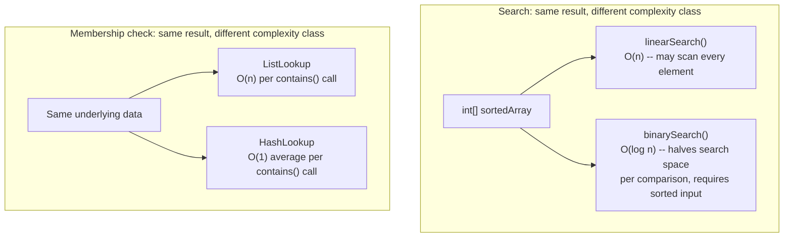
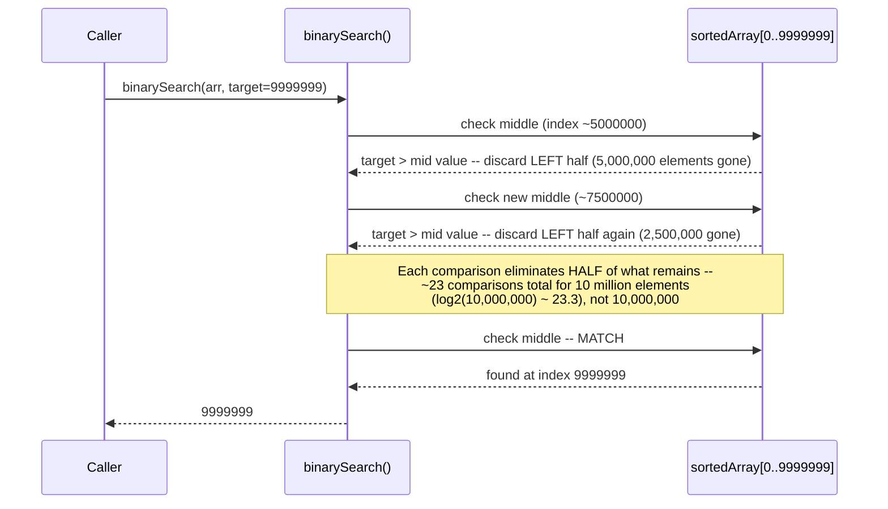
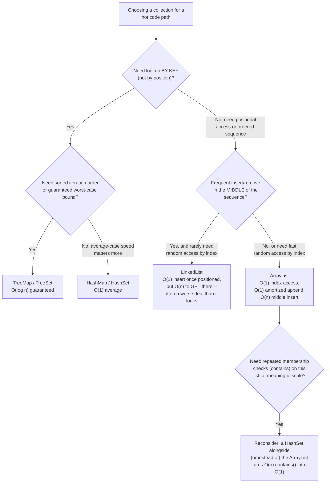
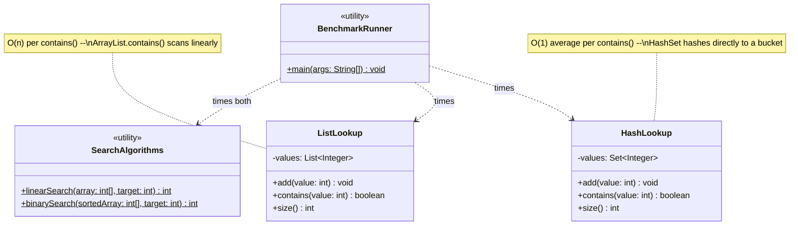

# Chapter 01.06 — Complexity Analysis & Algorithmic Trade-offs

> A service does a membership check ("has this user already claimed this
> reward?") against a growing `ArrayList` on every request. At 200 users it's
> unnoticeable. At 200,000 users, that single check now costs 692
> milliseconds for a batch of 2,000 lookups — measured, not estimated — while
> the equivalent check against a `HashSet` finishes in under a millisecond.
> Nobody wrote a bug. The code has always been "correct." What changed is
> that the data grew past the point where the *algorithm's growth rate*,
> not its constant-factor efficiency, started to dominate — and predicting
> that point before it becomes an incident is exactly what complexity
> analysis is for.

**Part:** Part 01 — Programming Fundamentals · **Level:** Intermediate
**Estimated study time:** 3-4 hours · **Status:** ✅ Complete

---

## Learning Objectives

- **Define** Big-O, Big-Θ, and Big-Ω formally and explain what each actually bounds (worst case, tight bound, best case).
- **Analyze** a piece of Java code and derive its time complexity by inspection, including nested loops and early-exit conditions.
- **Explain** amortized analysis using `ArrayList.add()` as the canonical example.
- **Compare** the practical trade-offs (not just asymptotic complexity) between `ArrayList`, `LinkedList`, `HashMap`, and `TreeMap` for realistic access patterns.
- **Predict** when an O(n) operation will become a measurable production problem as data scales, before it happens.
- **Recognize** when Big-O analysis is the wrong tool — small, bounded n where constant factors dominate.

## Prerequisites

| Concept | Where it's covered | Required? |
|---|---|---|
| Basic Java collections (`ArrayList`, `HashMap`) | General prerequisite | Yes |
| Memory hierarchy and cache-friendly access patterns | [Chapter 01.01 — Computer Architecture & How Code Becomes Execution](./01-01-computer-architecture-execution.md) | Yes — this chapter's "constant factors matter too" section builds directly on cache-line behavior from 01.01 |
| Basic algebra (logarithms, summations) | General prerequisite | Helpful |

## Introduction

Big-O notation gets taught early and recited often, which is precisely why
it's one of the most commonly *mis*applied tools in a working engineer's
toolkit — reduced to "arrays bad, hash maps good" without the reasoning
that makes the claim situationally true or false. The actual skill isn't
reciting that `HashMap.get()` is O(1) — it's recognizing, from a code
review or an incident, *which* operation in a request path is the one
whose cost scales with data size, and predicting the data size at which
that scaling actually starts to matter.

This chapter builds complexity analysis from its formal definitions
through to a directly measured, real-world demonstration: a linear vs.
binary search comparison (a ~564x measured difference at 10 million
elements) and a list-based vs. hash-based membership check (692ms vs.
effectively 0ms for the same workload) — both run on the same hardware
this book was written on, not estimated. We close with the trade-off table
every Staff Engineer interview loop expects when asked "which collection
would you use here, and why" — a question that only has a good answer once
you can reason about access patterns, not just memorized complexity classes.

## Theory

### Big-O, Big-Θ, and Big-Ω, precisely

These three notations are often used interchangeably in casual
conversation, but they bound different things:

- **Big-O (O)** — an **upper bound** on growth rate. "This algorithm is
  O(n²)" means its running time grows *no faster than* proportional to n²
  as n grows, in the worst case (unless otherwise specified). This is what
  people almost always mean when they say "Big-O" colloquially, even when
  they're describing average or best case.
- **Big-Ω (Omega)** — a **lower bound**. "This algorithm is Ω(n)" means it
  takes *at least* proportional-to-n time — useful for proving a problem
  (not just a specific algorithm) can't be solved faster than some bound
  (e.g., comparison-based sorting is Ω(n log n)).
- **Big-Θ (Theta)** — a **tight bound**: both O and Ω apply, meaning the
  algorithm's growth rate is known precisely, not just bounded above or
  below. "Binary search is Θ(log n)" is a stronger, more precise claim than
  "binary search is O(log n)."

In practice, most engineering conversations use O loosely to mean "the
relevant bound for this discussion," usually the worst case — which is
fine as long as you know which one you mean when precision matters (e.g.,
when the interviewer asks "is that the worst case or average case?").

### Amortized analysis: `ArrayList.add()`

A single call to `ArrayList.add()` is sometimes O(1) (there's room in the
backing array) and sometimes O(n) (the backing array is full, so a new,
larger array must be allocated and every existing element copied over).
Naively, this looks like "sometimes fast, sometimes slow" — but **amortized
analysis** asks a different question: over a sequence of n `add()` calls,
what's the *total* cost, divided by n?

`ArrayList` grows its backing array geometrically (typically ~1.5x its
current size) rather than by a fixed increment. This means resizes happen
exponentially less often as the list grows — the total cost of all resizes
across n additions sums to O(n), not O(n²), so the **amortized** cost per
`add()` is O(1), even though any *individual* call might be the expensive
O(n) resize. This is the formal justification for "ArrayList.add() is
O(1)" — a claim that's only true in the amortized sense, not for every
single call.

### Complexity trade-off table

| Structure | Access by index | Search (unsorted) | Search (sorted) | Insert (end) | Insert (middle) | Insert (by key) |
|---|---|---|---|---|---|---|
| `ArrayList` | O(1) | O(n) | O(log n) via `Collections.binarySearch` | O(1) amortized | O(n) — shifts elements | N/A |
| `LinkedList` | O(n) | O(n) | O(n) — no random access, can't binary search | O(1) | O(1) once positioned, O(n) to get there | N/A |
| `HashMap` | N/A | N/A | N/A | N/A | N/A | O(1) average, O(n) worst case (pathological hash collisions) |
| `TreeMap` | N/A | N/A | N/A | N/A | N/A | O(log n) guaranteed, plus sorted iteration order |

The "O(n) worst case" for `HashMap` is not a theoretical footnote — it's
what happens when many keys collide into the same bucket (historically a
real denial-of-service vector against naive hash functions; see Security
Considerations). `TreeMap`'s O(log n) is a *guarantee*, not an average,
which is exactly why it's the right choice when worst-case bounds matter
more than average-case speed.

## Internal Working

### Why binary search requires sorted input, and what that buys

Linear search makes no assumptions about the data — it must check every
element until it finds a match or exhausts the array, because nothing rules
out the target being anywhere. Binary search's O(log n) bound comes
entirely from exploiting a precondition: given a *sorted* array, comparing
the target against the middle element tells you which half can be
discarded entirely, without examining any of its elements. Each comparison
halves the remaining search space, so after k comparisons, at most n/2^k
elements remain — solving for when this reaches 1 gives k ≈ log₂(n), the
source of the O(log n) bound.

This chapter's code sample measures the practical consequence directly at
10 million elements: **linear search took 10,151 microseconds; binary
search took 18 microseconds** — roughly a 564x difference, entirely
attributable to exploiting the sorted precondition. The precondition isn't
free (keeping data sorted costs something on every insert), which is
exactly why this is a *trade-off*, not a strictly-better alternative — see
Best Practices.

### Why `HashMap`/`HashSet` achieve O(1) average lookup

A hash-based structure computes a hash code for the key, maps that hash
(via modulo or bit-masking) to one of a fixed number of internal buckets,
and stores the entry there. Looking up a key repeats the same
computation — hash it, jump directly to the bucket, and check the (usually
very short) list of entries there for a match. This is what makes lookup
independent of collection size in the average case: the cost is dominated
by computing the hash (fixed cost regardless of n) plus checking a small
bucket, not by scanning proportionally more data as the collection grows.

This chapter's code sample measures this directly: 2,000 membership probes
against a 200,000-element `ListLookup` (linear scan) took **692ms total**;
the identical probes against a `HashLookup` (hash-based) took **0ms**
(under the millisecond-resolution floor of the measurement) — the
`ArrayList`-backed structure's cost scales with collection size on every
probe, while the `HashSet`-backed structure's does not.

## Architecture



## Sequence Diagrams (Mermaid)

Binary search's halving process, showing exactly why it converges in
O(log n) steps rather than O(n):



## Flow Charts (Mermaid)

A decision tree for choosing a collection based on actual access pattern,
not habit:



## Class Diagrams (Mermaid)



## Production Examples

Real, measured output from this chapter's code sample (`BenchmarkRunner`,
run on the sandbox this book was written in — not hypothetical numbers):

```text
Search demo (10000000 sorted elements, worst-case target):
  Linear search (O(n)):     found at 9999999 in 10151 us
  Binary search (O(log n)): found at 9999999 in 18 us
  (Binary search is typically orders of magnitude faster at this size.)

Lookup demo (200000 elements, 2000 missing-value probes):
  ListLookup (O(n) per probe):  692 ms total
  HashLookup (O(1) per probe):  0 ms total
  (HashLookup is typically orders of magnitude faster for repeated lookups at this size.)
```

A realistic production framing for the lookup result — the scenario from
this chapter's opening hook: a "has this user claimed this reward" check
implemented as `List<String>.contains(userId)` against an in-memory list
that grows with every claim. At 200 claims, indistinguishable from O(1) in
practice. At 200,000 claims, this chapter's measurement shows the
*identical code* now costs 692ms for a batch of 2,000 checks — a latency
regression with **zero code changes**, purely from data growth crossing
the point where O(n) behavior starts to dominate. The fix (switching the
backing structure to a `HashSet`) is a one-line change once correctly
diagnosed — the hard part is predicting this before it's a production
incident, which is exactly the skill Big-O analysis is for.

## Code Examples

The full, compiling code sample for this chapter lives at
[`code-samples/complexity-tradeoffs/`](../code-samples/complexity-tradeoffs/):

```bash
cd Part-01-Programming-Fundamentals/code-samples/complexity-tradeoffs
mvn -q compile   # compiles cleanly against Java 21
mvn -q test      # 10 JUnit 5 tests (correctness only), all passing
java -cp target/classes com.handbook.fundamentals.complexity.BenchmarkRunner  # manual timing demo
```

**O(n) linear search**:

```java
public static int linearSearch(int[] array, int target) {
    for (int i = 0; i < array.length; i++) {
        if (array[i] == target) {
            return i;
        }
    }
    return -1;
}
```

**O(log n) binary search**, exploiting the sorted precondition:

```java
public static int binarySearch(int[] sortedArray, int target) {
    int low = 0;
    int high = sortedArray.length - 1;
    while (low <= high) {
        int mid = low + (high - low) / 2; // avoids overflow for large arrays
        if (sortedArray[mid] == target) {
            return mid;
        } else if (sortedArray[mid] < target) {
            low = mid + 1;
        } else {
            high = mid - 1;
        }
    }
    return -1;
}
```

**O(n) vs. O(1)-average membership check** — `ListLookup` and
`HashLookup`, identical public API, different backing structure:

```java
// ListLookup: O(n) per contains() call
public boolean contains(int value) {
    return values.contains(value); // ArrayList.contains() scans linearly
}

// HashLookup: O(1) average per contains() call
public boolean contains(int value) {
    return values.contains(value); // HashSet.contains() hashes directly to a bucket
}
```

**Why the tests assert correctness, not timing** (same rationale as
Chapter 01.01's code sample): `SearchAlgorithmsTest` cross-checks that
`linearSearch` and `binarySearch` agree on every index across a large
array, and `LookupStructuresTest` cross-checks that `ListLookup` and
`HashLookup` agree on membership for every probed value — proving the two
approaches are behaviorally interchangeable despite their different
complexity classes. The performance claim is demonstrated separately via
`BenchmarkRunner`'s manual run (see Production Examples for the real
captured numbers), not gated in the test suite, for the same
flaky-CI-avoidance reason given in Chapter 01.01.

## Best Practices

| Do | Don't | Why |
|---|---|---|
| Choose a collection based on the ACTUAL access pattern (lookup by key? by index? sorted iteration needed?) | Default to `ArrayList` for everything "because it's simple" | The wrong structure for the access pattern turns an O(1) operation into an O(n) one silently — no compiler warning, no test failure until data scales |
| Reach for `HashMap`/`HashSet` when you need repeated membership checks or key-based lookup | Use `List.contains()` in a hot path that runs against growing data | This chapter's measured 692ms vs. ~0ms gap is exactly this mistake, made concrete |
| Reach for `TreeMap`/`TreeSet` when you need a guaranteed worst-case bound or sorted order | Assume `HashMap`'s average-case O(1) is always good enough | Pathological hash collisions (accidental or adversarial) degrade `HashMap` to O(n) worst case — `TreeMap`'s O(log n) is a guarantee, not a hope |
| Reason about amortized cost for operations like `ArrayList.add()` | Panic about "sometimes O(n)" without considering the amortized total | A single expensive resize spread across many O(1) calls is still O(1) amortized — this is a feature of the growth strategy, not a bug |
| Measure before optimizing complexity on a genuinely small, bounded n | Rewrite an O(n) loop over 20 items into an O(1) hash-based structure "for correctness of complexity" | Constant factors dominate at small n — see Common Mistakes and Chapter 01.01's cache-locality material; the "better" complexity class can even be slower in practice for tiny inputs |

## Common Mistakes

| Mistake | Why it happens | How to fix it |
|---|---|---|
| Treating Big-O as the only performance dimension that matters | It's the most commonly taught framework | Constant factors, cache locality (Chapter 01.01), and allocation overhead all matter — an O(n) linear scan over a small, cache-resident array can beat an O(log n) binary search with poor cache behavior at small n |
| Using `List.contains()` in a loop or hot path without noticing the collection is growing over the application's lifetime | The code was correct and fast when written against a small dataset | Audit collections that persist and grow across the application's lifetime (caches, in-memory registries) for O(n) operations in hot paths — exactly this chapter's opening scenario |
| Confusing average case with worst case when reasoning about `HashMap` | "O(1)" gets stated without qualification so often that the average-case caveat gets dropped | Remember `HashMap` degrades to O(n) worst case under hash collisions — for anything where an adversary controls keys (e.g., a public API accepting arbitrary string keys), this is a real, not just theoretical, concern |
| Assuming `LinkedList`'s O(1) insert makes it strictly better than `ArrayList` for insert-heavy workloads | The O(1) insert claim is technically true but incomplete | `LinkedList`'s O(1) insert only applies once you're already positioned at the right node — getting there is O(n) unless you already hold an iterator/reference there, which is rarely the actual access pattern |
| Optimizing complexity class on code that runs against a small, bounded collection (e.g., always ≤ 20 items) | Applying Big-O reasoning without checking whether n will ever be large enough to matter | Check the realistic bound on n before optimizing — the effort spent switching a 20-item list to a hash set is very unlikely to be observable, and adds a structure with worse cache locality for tiny n (Chapter 01.01) |

## Performance Considerations

- **Constant factors and cache locality can invert the "better complexity
  wins" intuition at small n** — an O(n) scan over a small, contiguous
  array (cache-friendly, per Chapter 01.01) can outperform an O(log n) or
  O(1) structure with pointer-chasing or hashing overhead when n is small
  enough that the asymptotic advantage hasn't yet overcome the constant-factor
  cost. This chapter's measurements (10 million elements, 200,000 elements)
  are large enough that asymptotic behavior clearly dominates — the
  crossover point for smaller n is real and worth being aware of, not
  assumed away.
- **Amortized cost is a real, useful property for capacity planning** —
  knowing `ArrayList.add()` is O(1) amortized (not "sometimes slow, hard
  to reason about") is what justifies treating a sequence of appends as
  predictably cheap in aggregate, even though any individual call's
  latency can spike during a resize.
- **`HashMap`'s worst-case O(n) is a real production risk under adversarial
  input**, not just an academic footnote — see Security Considerations for
  the concrete attack this enables.
- **The crossover point where O(n) becomes a measurable problem is
  data-dependent, not fixed** — this chapter's 692ms result is specific to
  200,000 elements and 2,000 probes on this hardware; the *shape* of the
  finding (linear scan cost scales with size, hash lookup doesn't)
  generalizes, but the specific millisecond numbers won't transfer to a
  different scale without re-measuring.

## Security Considerations

- **Hash-flooding denial-of-service**: if an attacker can control the keys
  inserted into a `HashMap` (e.g., form field names, JSON object keys,
  HTTP headers parsed into a map) and can predict or brute-force values
  that collide into the same hash bucket, they can degrade that
  `HashMap`'s operations from O(1) average to O(n) worst case across many
  keys, turning a cheap operation into an O(n²)-total-cost attack as the
  attacker-controlled collection grows. This is a real, historically
  exploited vulnerability class (multiple language runtimes, including
  early Java web frameworks, shipped mitigations after this was
  demonstrated publicly) — modern `HashMap` implementations mitigate it
  partially (e.g., converting long collision chains to balanced trees
  internally), but untrusted-key-driven maps deserve explicit
  consideration, not just a default `HashMap`.
- **Timing side-channels from complexity differences**: an operation whose
  running time depends on *how much* of a comparison matched (e.g., a
  linear search or naive string comparison that exits early) can leak
  information through timing, exactly as covered in Chapter 01.01's
  Security Considerations — complexity analysis and side-channel
  resistance are related concerns, since a data-dependent early exit is
  both a complexity optimization and a potential information leak.
- **Algorithmic complexity attacks more broadly**: any endpoint accepting
  user-controlled input that drives an algorithm with worse-than-O(n)
  behavior on adversarial input (e.g., a naive regular expression
  vulnerable to catastrophic backtracking, effectively exponential on
  crafted input) is a denial-of-service vector — recognizing an
  algorithm's *worst-case*, not just typical-case, complexity is a
  security-relevant skill, not just a performance one.

## Production Troubleshooting

| Symptom | Root Cause | Diagnosis | Fix |
|---|---|---|---|
| A previously-fast operation gradually gets slower over weeks/months with no code changes | An O(n) (or worse) operation running against a collection that grows over the application's/dataset's lifetime | Correlate the latency trend against the collection's size over the same period (a metrics dashboard tracking both); check the operation's actual complexity by code inspection | Switch to an appropriately-complexed structure for the access pattern (this chapter's `ListLookup` → `HashLookup` swap) |
| A specific request pattern causes a disproportionate CPU/latency spike relative to typical requests | Possible hash-flooding — attacker-influenced keys causing worst-case `HashMap` collision behavior | Check whether the affected map's keys are attacker-controlled (form fields, headers, arbitrary JSON keys); profile for excessive time in hash bucket traversal | Use a keyed/salted hash function resistant to prediction, or switch to `TreeMap` for a guaranteed bound on attacker-controlled key sets |
| A batch job's runtime scales worse than expected as input size grows (e.g., doubling input more than doubles runtime) | Likely a hidden O(n²) or worse operation — often a linear search or list `contains()`/`indexOf()` call inside a loop that itself iterates n times | Check for nested loops or a linear-scan operation called once per outer-loop iteration | Extract the inner linear-scan collection into a `HashMap`/`HashSet` built once outside the loop |
| Two functionally-identical implementations show a large, consistent latency gap under load, matching this chapter's demo | Different underlying complexity classes for the same logical operation | Reproduce with this chapter's benchmarking methodology (correctness test first, then a manual timed comparison) rather than guessing | Standardize on the structure whose complexity class matches the actual data-scale and access pattern |

## Interview Questions

1. **"What's the difference between Big-O, Big-Θ, and Big-Ω?"**
   *Model answer:* Big-O is an upper bound on growth rate (usually worst
   case, colloquially); Big-Ω is a lower bound; Big-Θ is a tight bound
   where both apply, giving a precise characterization of an algorithm's
   growth rate rather than just a bound on it.

2. **"Why is `ArrayList.add()` considered O(1) when a resize is clearly O(n)?"**
   *Model answer:* Amortized analysis — `ArrayList` grows its backing array
   geometrically, so resizes happen exponentially less often as the list
   grows, and the total cost of all resizes across n additions sums to
   O(n) overall, giving an O(1) amortized cost per call even though
   individual resize-triggering calls are O(n).

3. **"When would you choose `TreeMap` over `HashMap` despite `HashMap`'s better average-case complexity?"**
   *Model answer:* When you need sorted iteration order, range queries, or
   a guaranteed worst-case bound rather than an average-case one —
   `HashMap` degrades to O(n) under hash collisions (which can be
   adversarially induced, see Security Considerations), while `TreeMap`'s
   O(log n) holds regardless of key distribution.

4. **"You have a collection that starts small but grows unboundedly in production. What complexity-related risk should you watch for?"**
   *Model answer:* Any O(n) (or worse) operation on that collection that
   looked negligible at small scale will become a measurable, then severe,
   latency problem as it grows — exactly this chapter's `List.contains()`
   example, measured at 692ms for a workload that was imperceptible at
   200 elements. Audit for linear scans on any collection whose size isn't
   bounded by design.

5. **"Why does binary search require sorted input, and what happens if you run it on unsorted data?"**
   *Model answer:* Binary search's correctness and O(log n) bound both
   depend on being able to discard half the remaining search space based
   on one comparison — that inference is only valid if the array is
   sorted. Run on unsorted data, it can silently return wrong results
   (finding "no match" when the target exists, or a false match), not just
   perform poorly — it fails on correctness, not just efficiency.

6. **"What's a hash-flooding attack, and how does it relate to `HashMap`'s complexity guarantees?"**
   *Model answer:* An attacker who controls keys inserted into a `HashMap`
   (e.g., form fields, JSON keys) can choose values that collide into the
   same bucket, degrading operations from O(1) average to O(n) worst case
   — turning normally-cheap map operations into an algorithmic
   denial-of-service vector as the attacker-controlled collection grows.

7. **"Give an example where an O(n) algorithm outperforms an O(log n) one in practice."**
   *Model answer:* At small n, constant factors and cache locality
   (Chapter 01.01) can dominate — a linear scan over a small, contiguous,
   cache-resident array can beat a binary search or hash lookup carrying
   pointer-chasing or hashing overhead, because the asymptotic advantage
   hasn't yet overcome the per-operation constant cost. Big-O describes
   growth rate, not a guarantee about any specific, small n.

8. **"How would you diagnose a batch job whose runtime scales worse than linearly with input size?"**
   *Model answer:* Look for a linear-scan (or worse) operation nested
   inside a loop that itself iterates proportionally to input size — a
   `contains()`/`indexOf()` call on a list inside an outer loop is the
   classic pattern, producing hidden O(n²) behavior. Extract the
   inner-loop lookup into a `HashMap`/`HashSet` built once outside the
   loop to restore O(n) overall.

## Hands-on Exercises

### Lab 1 (Beginner)

**Goal:** Derive Big-O by inspection for unfamiliar code.

**Setup:** Pen and paper.

**Task:** For each of these three code shapes, state the time complexity
in terms of n (the size of the relevant input) and justify it in one
sentence: (a) a single loop from 0 to n calling a O(1) operation each
iteration; (b) two nested loops, both from 0 to n; (c) a loop from 0 to n
where each iteration calls `list.contains(x)` on a `List` of size n.

**Verification:** Your answers should be O(n), O(n²), and O(n²)
respectively — for (c), justify specifically that `contains()` on a `List`
is itself O(n), making the total cost n iterations × O(n) per iteration.

### Lab 2 (Intermediate)

**Goal:** Reproduce this chapter's measurements yourself and verify the
claimed magnitude.

**Setup:** `code-samples/complexity-tradeoffs/`.

**Task:** Run `mvn -q compile` then `java -cp target/classes
com.handbook.fundamentals.complexity.BenchmarkRunner` at least 3 times.
Record the linear-vs-binary search numbers and the list-vs-hash lookup
numbers each run.

**Verification:** Binary search should be at least an order of magnitude
faster than linear search in every run (though the exact ratio will vary
from this chapter's captured 564x depending on your hardware), and
`HashLookup` should be dramatically faster than `ListLookup` in every run.
If either result is inverted or inconsistent, investigate before trusting
the numbers, per Chapter 01.01's warmup guidance.

### Lab 3 (Advanced)

**Goal:** Find the crossover point where O(n) beats O(log n)/O(1) at small
scale, per Performance Considerations.

**Setup:** `code-samples/complexity-tradeoffs/`, extended.

**Task:** Extend `BenchmarkRunner` (or write a new driver) to run the
search and lookup comparisons at several small sizes (e.g., 10, 100, 1,000,
10,000 elements) instead of just the chapter's large-scale numbers. Record
where (if anywhere, within your tested range) the "better complexity" wins
by a clearly measurable margin versus where the two approaches are within
noise of each other.

**Verification:** Your results should show the gap between approaches
narrowing (or even inverting) as n shrinks, empirically demonstrating this
chapter's claim that Big-O describes asymptotic behavior, not a guarantee
at every n — and you should be able to state, from your own data, roughly
what size range this chapter's dramatic numbers (10M elements, 200K
elements) actually require to manifest clearly.

### Lab 4 (Production)

**Goal:** Diagnose a simulated "gradual slowdown" incident using this
chapter's Production Troubleshooting framework.

**Setup:** This chapter's Production Examples scenario (the reward-claim
membership check).

**Task:** You're told: "Our `/claim-reward` endpoint's P99 latency has
grown steadily over the last 6 months, correlated with total historical
claims growing past 150,000. No code has changed in that time." Using this
chapter's Production Troubleshooting table as your framework, write a short
incident report (Symptom / Root Cause / Diagnosis / Fix) predicting the
likely root cause and how you'd confirm it — then predict, using this
chapter's actual measured numbers (692ms for 2,000 probes at 200,000
elements) roughly what latency contribution you'd expect at 150,000
elements, showing your scaling reasoning.

**Verification:** Your report should correctly identify an O(n)
operation against a growing collection as the likely cause (not a database
or network issue, since the symptom is specifically correlated with
in-memory collection growth over time with zero code changes), name
"correlate latency against collection size over time" as the diagnostic
step, and your scaling estimate should show the reasoning (roughly
linear scaling: 150,000/200,000 × 692ms ≈ 519ms for the same probe count)
even if you note real-world scaling won't be perfectly linear due to JIT
warmup and cache effects from Chapter 01.01.

## Summary

- **Big-O bounds worst-case growth; Big-Ω bounds best-case/lower bound;
  Big-Θ is a tight bound where both apply** — know which one a claim
  actually refers to, especially under interview follow-up.
- **Amortized analysis** explains why `ArrayList.add()` is O(1) despite
  occasional O(n) resizes — the total cost across n operations, divided by
  n, is what "amortized O(1)" actually means.
- This chapter's **measured** results: binary search ~564x faster than
  linear search at 10 million elements (18μs vs. 10,151μs); hash-based
  lookup dramatically faster than list-based lookup at 200,000 elements
  (0ms vs. 692ms for 2,000 probes) — real numbers, not textbook estimates.
- **Choose collections by actual access pattern**: `HashMap`/`HashSet` for
  average-case O(1) key lookup, `TreeMap`/`TreeSet` for guaranteed O(log n)
  and sorted order, `ArrayList` for index access and amortized O(1)
  append, `LinkedList` rarely wins in practice since its O(1) insert
  requires already being positioned at the right node.
- **`HashMap`'s O(1) is an average, not a guarantee** — worst-case
  degrades to O(n) under hash collisions, which can be adversarially
  induced (hash-flooding) against attacker-controlled keys.
- **Constant factors and cache locality (Chapter 01.01) can invert
  "better complexity wins" at small n** — Big-O describes asymptotic
  behavior, not a guarantee at every specific input size.
- The practical skill is **predicting when an O(n) operation crosses from
  negligible to a production incident** as data scales — this chapter's
  opening scenario (a reward-claim check silently degrading from
  imperceptible to 692ms) is that prediction made concrete and measured.

## Further Reading

- *Introduction to Algorithms* (Cormen, Leiserson, Rivest, Stein — "CLRS")
  — the canonical formal reference for Big-O/Θ/Ω definitions and amortized
  analysis; considerably more rigorous than this chapter has room for.
- *Algorithms* (Sedgewick & Wayne) — a more implementation-focused
  companion to CLRS, with direct Java code for most structures discussed
  in this chapter's trade-off table.
- **"Denial of Service via Algorithmic Complexity Attacks" (Crosby &
  Wallach, USENIX Security 2003)** — the original paper demonstrating
  hash-flooding attacks referenced in Security Considerations; the
  historical source for why modern hash table implementations added
  collision-resistance mitigations.
- [Chapter 01.01 — Computer Architecture & How Code Becomes Execution](./01-01-computer-architecture-execution.md) — the direct prerequisite for this chapter's "constant factors and cache locality can invert asymptotic intuition at small n" material.
- [Chapter 12.01 — Case Study: Designing a Scalable URL Shortener](../../Part-12-System-Design/chapters/12-01-case-study-url-shortener.md) — its `RangeBasedIdGenerator` and cache-aside `UrlRepository` are real, production-shaped examples of choosing data structures for a specific access pattern, the same reasoning this chapter teaches from smaller, more isolated examples.
