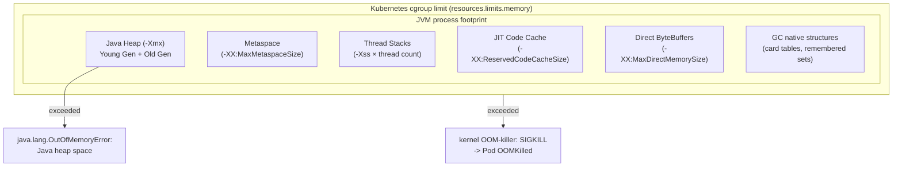
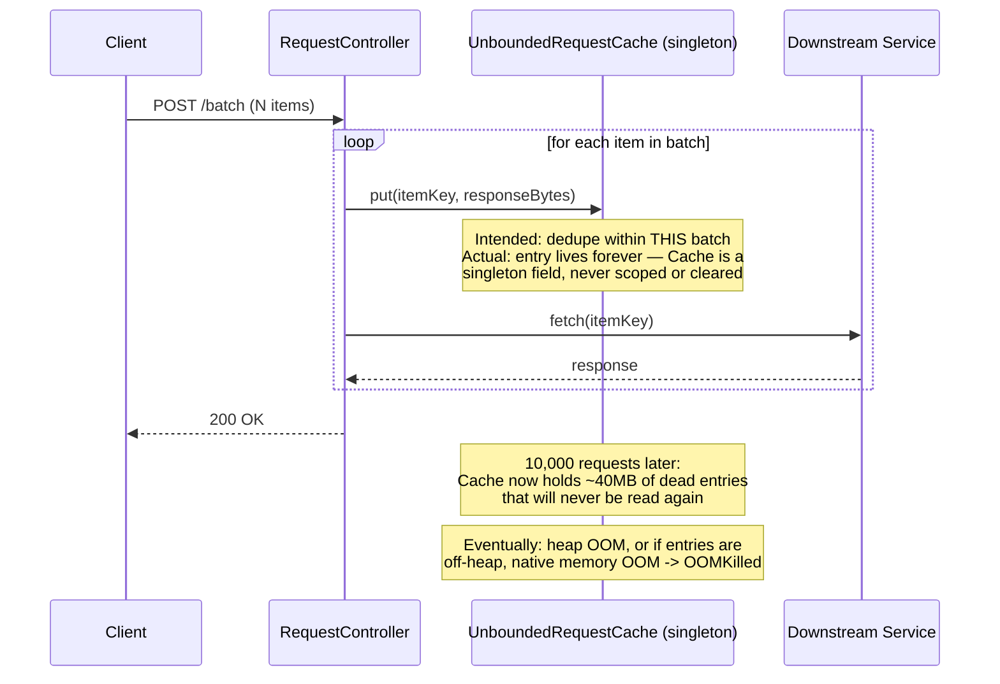
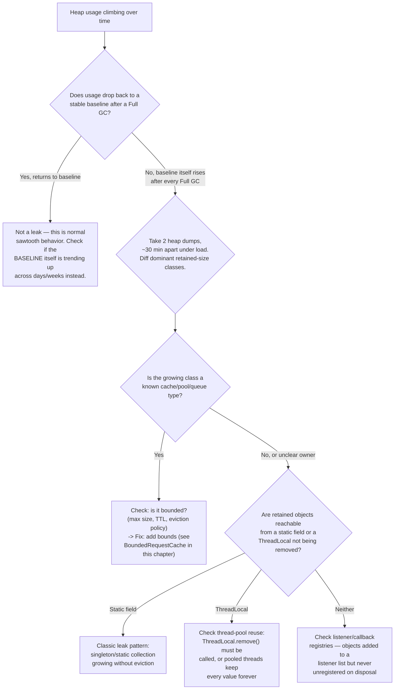
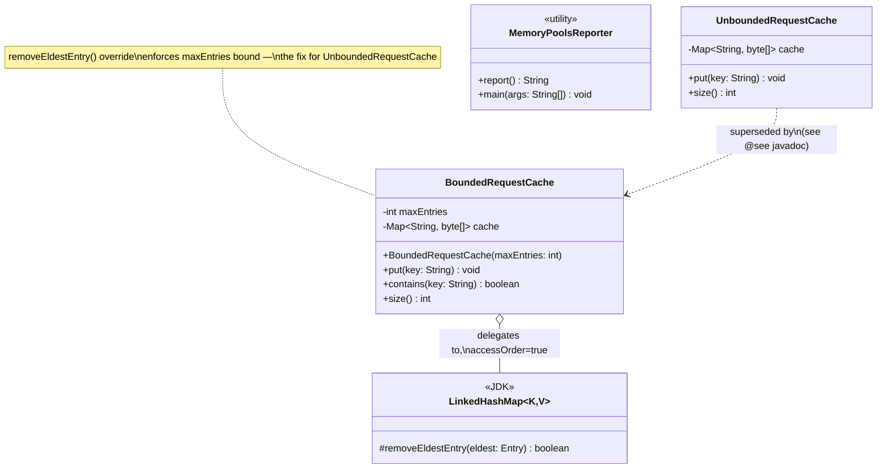

# Chapter 02.04 — JVM Internals: Memory Management, Garbage Collection & Performance Tuning

> It's 2 a.m. Your payments service has been restarting every 40 minutes for the
> last three hours. `kubectl describe pod` shows `OOMKilled`. The on-call
> dashboard shows heap usage sawtoothing normally right up until it doesn't —
> then a vertical cliff. Your first instinct is "bump the memory limit." That
> buys you until 6 a.m. A Staff Engineer's first instinct is different: is this
> heap, or off-heap? Is it a leak, or a legitimate working-set increase? Is the
> container even telling the JVM the truth about how much memory it has? This
> chapter is what separates "bump the limit" from actually knowing.

**Part:** Part 02 — Core Java · **Level:** Advanced / Production
**Estimated study time:** 5-6 hours · **Status:** ✅ Complete

---

## Learning Objectives

- **Explain** the JVM's runtime memory layout (heap, stack, metaspace, code cache, direct buffers) and which JVM flags size each region.
- **Compare** the generational collectors available on JDK 21 (Serial, Parallel, G1, ZGC, generational ZGC, Shenandoah) and pick the right one for a given latency/throughput budget.
- **Diagnose** an `OutOfMemoryError` or Kubernetes `OOMKilled` event by distinguishing a heap leak, a native/off-heap leak, and a legitimate working-set increase.
- **Implement** a bounded, thread-safe LRU cache using JDK-only primitives and explain the concurrency hazard in the naive version.
- **Tune** container-aware JVM ergonomics (`-XX:MaxRAMPercentage`, `-XX:+UseContainerSupport`) so a JVM's idea of "available memory" matches its cgroup limit.
- **Use** heap dumps, JFR, and async-profiler to go from "heap usage is climbing" to a specific allocation site in under 15 minutes.
- **Diagnose** GC pause problems from GC logs alone, including distinguishing a young-gen sizing problem from genuine promotion pressure.

## Prerequisites

| Concept | Where it's covered | Required? |
|---|---|---|
| Java generics, collections (`Map`, `List`) | Part 01 — Programming Fundamentals (📝 planned) | Yes |
| Basic multithreading (`synchronized`, `Thread`) | Part 02 — Core Java, *Concurrency & the Java Memory Model* (📝 planned) | Yes |
| Kubernetes resource requests/limits, `OOMKilled` semantics | [Part 07 — Kubernetes: Workloads, Resource Management & Production Deployment Patterns](../../Part-07-Kubernetes/chapters/07-02-workloads-resource-mgmt-deployment.md) | Helpful, not required — this chapter explains the container angle from scratch |
| Maven basics (`pom.xml`, `mvn compile`) | Part 02 — Core Java, *Build Tooling* (📝 planned) | Helpful |

## Introduction

Ask a room of Java engineers "how does garbage collection work?" and most will
say some version of "it frees memory you're not using anymore." That answer
is correct and useless — it tells you nothing about why your P99 latency has
a 400ms tail once an hour, or why a service with a 2Gi Kubernetes memory limit
gets killed even though `jconsole` swears the heap never went past 900MB.

The gap between "GC frees memory" and being able to fix a live production
incident is exactly the gap this chapter closes. We'll build the mental model
in three layers:

1. **Where does memory actually live** — heap vs. stack vs. metaspace vs.
   native/off-heap, and why "heap usage looks fine" doesn't mean "the JVM's
   memory usage looks fine."
2. **How collection actually works** — generational hypothesis, the
   collectors available on JDK 21, and the concrete trade-off each one makes
   between throughput, pause time, and memory footprint.
3. **What breaks in production, and how you find it** — the OOMKilled/GC-pause
   runbook that anchors the Production Troubleshooting section, worked
   through with a real (distilled) incident: an unbounded request cache that
   silently grows until the container is killed, and the JDK-only fix for it.

Staff Engineer interviews probe this chapter's material harder than almost
any other Core Java topic, for a simple reason: it is one of the few areas
where "I read about it" and "I've fixed it in production at 2 a.m." produce
observably different answers. This chapter is written to make you capable of
the second kind of answer.

## Theory

### The generational hypothesis

Almost every production GC in the JVM (Serial, Parallel, G1, and — with
caveats — ZGC's generational mode added in JDK 21) is built on one empirical
observation, the **weak generational hypothesis**: *most objects die young*.
A request-scoped DTO, a `StringBuilder` used to assemble a log line, an
`ArrayList` returned from a repository query — the overwhelming majority of
objects allocated by a typical service become garbage within microseconds to
milliseconds of allocation. A small minority (caches, connection pools,
singletons, long-lived domain objects) survive for the life of the process.

This hypothesis justifies splitting the heap into generations and using a
*different, cheaper* algorithm for the common case (young objects) than for
the rare case (old objects):

- **Young generation** — where all objects are born. Subdivided into **Eden**
  (where allocation happens) and two **Survivor spaces** (`S0`/`S1`), used
  alternately as a copy target during minor GCs. A minor GC copies every
  *live* object out of Eden (usually a tiny fraction of it, since most
  objects there are already garbage) into a survivor space, which is why
  minor GCs are fast: their cost is proportional to the *live set*, not to
  the size of Eden.
- **Old generation (tenured)** — objects that have survived enough minor GCs
  (tracked via an **age** counter incremented on every survivor-space copy,
  compared against `-XX:MaxTenuringThreshold`, default 15) get *promoted*
  here. Old-gen collections are more expensive because the old generation is
  usually much larger and has a much higher live-object ratio — the
  generational hypothesis doesn't help there, which is exactly why old-gen
  collection algorithms (mark-sweep-compact, or concurrent variants) look
  completely different from young-gen copying collection.

### Why copying collection is fast for young gen

A **copying collector** never "frees" garbage in the sense of walking it and
reclaiming space object by object. Instead it walks the *live* objects
(reachable from GC roots: stack frames, static fields, JNI handles) and
copies each one to a new region; anything left behind in the old region is,
by definition, garbage, and the entire region is reclaimed by resetting a
bump-pointer allocator to its start. Cost is `O(live objects)`, not
`O(total objects)` — with a young generation where 95%+ of objects die every
cycle, this is why minor GCs typically complete in single-digit milliseconds
even on multi-hundred-megabyte young generations.

### Mark-sweep-compact for old gen

Old-gen collection can't use pure copying at scale (copying a multi-gigabyte,
mostly-live old generation on every collection would be prohibitively
expensive), so mature collectors use variants of **mark-sweep-compact**:
mark every reachable object (a graph traversal from GC roots), sweep
(reclaim space occupied by unmarked objects), and periodically compact
(slide live objects together to eliminate fragmentation and keep allocation
a cheap bump-pointer operation). The "periodically" is the crux of every
collector's design trade-off — G1 compacts incrementally per-region, ZGC and
Shenandoah compact concurrently with almost no stop-the-world pause, and
Parallel GC does a full stop-the-world compaction pass.

### STW pauses and safepoints

Any phase that needs a consistent view of the heap — most obviously "mark
everywhere without objects moving under you" — requires bringing every
application thread to a **safepoint** (a point where its stack, registers,
and thread-local state are guaranteed consistent) and stopping it there.
This is why GC pause time, not "GC CPU time," is what latency-sensitive
services actually care about: a **stop-the-world (STW)** pause blocks every
application thread simultaneously, showing up directly in P99/P99.9 latency
regardless of how much idle CPU capacity the box has.

## Internal Working

### JDK 21's collector line-up

| Collector | Young collection | Old collection | Typical pause | Best for |
|---|---|---|---|---|
| Serial (`-XX:+UseSerialGC`) | STW copying, single-threaded | STW mark-sweep-compact, single-threaded | Long, scales with heap | Small heaps (<100MB), constrained containers, CLI tools |
| Parallel (`-XX:+UseParallelGC`) | STW copying, multi-threaded | STW mark-sweep-compact, multi-threaded | Shorter than Serial, still scales with heap | Batch/throughput workloads that tolerate pauses (max throughput per CPU-hour) |
| G1 (`-XX:+UseG1GC`, **default since JDK 9**) | STW copying, region-based, prioritizes highest-garbage regions ("garbage-first") | Mostly-concurrent marking + incremental, region-at-a-time evacuation | Target-based via `-XX:MaxGCPauseMillis` (default 200ms), typically tens of ms | The default choice for most services — balances throughput and pause time without tuning |
| ZGC (`-XX:+UseZGC`) | Concurrent, colored pointers / load barriers | Fully concurrent, no STW compaction pause | **Sub-millisecond**, independent of heap size | Latency-critical services, very large heaps (multi-hundred-GB) |
| Generational ZGC (JDK 21 default mode for `-XX:+UseZGC`) | Concurrent, now with a real young generation | Fully concurrent | Sub-millisecond, better throughput than single-gen ZGC | Same as ZGC, but without ZGC's older throughput penalty on allocation-heavy workloads |
| Shenandoah (`-XX:+UseShenandoahGC`, Red Hat-contributed) | Concurrent, Brooks-pointer forwarding | Fully concurrent | Sub-to-low-double-digit ms, independent of heap size | Similar niche to ZGC; JDK 21 makes ZGC generational the more common production default |

Two JDK-21-specific facts worth knowing cold for an interview:

1. **Generational ZGC** (JEP 439, finalized in JDK 21) is the single biggest
   ZGC change in years — pre-21 ZGC treated the whole heap as one generation,
   which meant it re-scanned long-lived objects on every cycle, capping its
   throughput below G1's for allocation-heavy workloads. Generational ZGC
   applies the same generational hypothesis from the Theory section to a
   concurrent collector, closing most of that throughput gap while keeping
   ZGC's headline feature: pause times that don't scale with heap size.
2. **G1 is still the right default for most services.** ZGC's sub-millisecond
   pauses are real, but they come from *load barriers* — extra work on every
   reference load/store to handle concurrent object relocation — which is a
   genuine (if usually small, single-digit-percent) throughput tax. Reach for
   ZGC when you have measured a pause-time problem G1 can't tune away, not by
   default.

### Object layout and the metaspace

Every object on the heap carries a **header** (on a 64-bit JVM with compressed
oops, typically 12-16 bytes: a mark word for hashcode/lock state/GC age, plus
a compressed class pointer) before its fields — this is why a `Boolean`
field costs far more than one bit, and why wide, sparse object graphs (a
million tiny objects) put more GC pressure than the same data packed into
primitive arrays.

**Metaspace** (which replaced PermGen in JDK 8) holds class metadata —
method bytecode, constant pools, `Class` objects — and lives in **native
memory**, not the heap. This matters enormously for troubleshooting: a
metaspace leak (typically caused by classloader leaks — a webapp redeployed
repeatedly without its old `URLClassLoader` being fully collected) will
*not* show up in heap usage graphs at all. `-Xmx` doesn't bound it;
`-XX:MaxMetaspaceSize` does, and leaving it unbounded on a service that does
dynamic class generation (proxies, bytecode-weaving frameworks) is a common
cause of native-memory OOMKilled events that heap dumps can't explain.

### Container-aware ergonomics

Before JDK 10 (backported to 8u191+), the JVM read `/proc/meminfo` for "how
much RAM does this machine have," completely blind to cgroup limits — a JVM
in a container `limit: 2Gi` on a host with 64GB of RAM would default its heap
sizing (`-XX:MaxRAMPercentage`, default 25% of *detected* RAM) against the
64GB figure, not the 2Gi cgroup limit, reliably OOMKilling itself. **This is
one of the single most common root causes of OOMKilled pods that "worked
fine outside Kubernetes."**

Modern JDKs (10+, container support on by default since JDK 10, and the
default behavior on every JDK you'd deploy today including 21) read the
cgroup limit correctly via `-XX:+UseContainerSupport` (on by default) and
size `-Xmx` from `-XX:MaxRAMPercentage` *against the cgroup limit*. The
practical tuning takeaway:

- **Never** set `-Xmx` to the full container memory limit. The heap is only
  one consumer of the container's memory budget — metaspace, thread stacks
  (`-Xss` × thread count, and modern services can easily run 200+ threads
  between the HTTP server, DB connection pool, and async executors), direct
  `ByteBuffer`s (very common with Netty-based HTTP clients/Kafka clients),
  JIT code cache, and the JVM's own native structures all come out of the
  same cgroup budget, none of it counted in `-Xmx`.
- A defensible starting point: `-XX:MaxRAMPercentage=70.0` (leaves ~30% for
  everything else), then *tune from real data* — take a heap dump and a
  native memory summary (`jcmd <pid> VM.native_memory summary`, requires
  `-XX:NativeMemoryTracking=summary`) under representative load rather than
  guessing.

## Architecture

A production JVM's memory is best understood as three concentric budgets,
each of which can independently cause an incident:

1. **The container's cgroup memory limit** (Kubernetes `resources.limits.memory`)
   is the outermost, hardest boundary — the kernel OOM-killer enforces it
   with `SIGKILL`, no exceptions, no graceful degradation. Exceeding it is
   what produces `OOMKilled` in `kubectl describe pod`.
2. **The JVM process's total footprint** (heap + metaspace + thread stacks +
   code cache + direct buffers + GC's own bookkeeping structures) must stay
   under budget #1. This is what `-XX:MaxRAMPercentage` and friends are
   trying to keep bounded, and it's the layer most engineers forget exists —
   they only think about budget #3.
3. **The Java heap** (`-Xmx`) is the innermost, most-visible-but-not-only
   budget — this is what throws `java.lang.OutOfMemoryError: Java heap
   space`, and what `jconsole`/heap-usage dashboards show you by default.



The incident this chapter is built around — and the code sample backing it —
is the single most common instance of a **budget #3-looking problem that is
actually a budget #2 or #1 problem**: an unbounded in-memory cache. From the
heap's perspective, nothing is wrong until very late (heap usage climbs
steadily, GC works harder and harder to reclaim less and less, and
eventually you get a real heap OOM) — but if the cache stores objects with
native-backed memory (direct buffers, off-heap structures) instead of plain
heap objects, the *heap* graph can look completely flat right up until the
container is `OOMKilled`, because the leak never touched the heap at all.

## Sequence Diagrams (Mermaid)

The sequence below shows the request path that creates the leak in the code
sample: every inbound request populates a "dedupe cache" intended to avoid
redundant downstream calls *within* a single request batch, but the cache
was implemented as a long-lived singleton field instead of being scoped to
the request/batch — so entries from every request pile up for the life of
the JVM.



## Flow Charts (Mermaid)

A decision tree for the single most common on-call question this chapter
prepares you for: *"heap usage is climbing — is this a leak?"*



## Class Diagrams (Mermaid)



## Production Examples

The distilled incident behind this chapter's code sample, as it would appear
in an actual postmortem:

```text
Incident: payments-batch-service repeated OOMKilled restarts
Timeline (UTC):
  02:14  Deploy of v2.31.0 (added request-batch dedup optimization)
  04:52  First OOMKilled restart (container had been up ~2h38m)
  05:31  Second OOMKilled restart (up ~39m — faster this time: batch
         traffic was higher in this window, so the leak accumulated faster)
  05:40  On-call bumps memory limit 1Gi -> 2Gi as a stopgap (buys time,
         does not fix root cause — confirmed leak rate ~15MB/min at
         steady batch-traffic volume, so 2Gi only doubles time-to-kill)
  06:05  Heap dump captured via `kubectl exec ... jcmd 1 GC.heap_dump`
         immediately before a manual restart
  06:20  Dump analysis: dominant retained class is `byte[]`, retained by
         a single `java.util.concurrent.ConcurrentHashMap` instance held
         by a static field on `RequestDedupeCache` — 41,203 entries,
         ~4KB average, ~161MB retained and rising
  06:35  Root cause confirmed: RequestDedupeCache was intended to be
         request-batch-scoped (created per incoming batch, discarded
         after) but was refactored in v2.31.0 into an eagerly-initialized
         singleton field "to avoid re-allocating it every batch" —
         eliminating the natural per-batch garbage collection boundary
  07:10  Fix deployed: bounded LRU replacement (see Code Examples below),
         capacity chosen as 5x the p99 observed batch size
  Follow-up: added a Prometheus gauge on cache.size() with an alert
         threshold, so a regression trips an alert long before the next
         OOMKilled cycle
```

A representative `MemoryPoolsReporter` run (see Code Examples) on a
container-limited JVM, showing why "heap looks fine" wasn't the whole
picture in this incident — most of the growth was in `byte[]` retained by
the map, which *does* show in heap usage, but on a service where the cached
payload were `DirectByteBuffer`s instead, this same leak would have shown up
as *native* memory growth with a perfectly flat heap graph:

```text
Pool                         Type          Used(MB) Committed(MB)      Max(MB)
G1 Eden Space                HEAP              48.0          64.0    unbounded
G1 Survivor Space             HEAP               8.0           8.0    unbounded
G1 Old Gen                    HEAP             612.4         704.0       896.0
Metaspace                     NON_HEAP          58.7          61.4     unbounded
CodeHeap 'non-nmethods'       NON_HEAP           1.3           2.4         5.7
CodeHeap 'profiled nmethods'  NON_HEAP          14.2          14.9        58.0
Compressed Class Space        NON_HEAP           7.1           7.9      1024.0
```

## Code Examples

The full, compiling code sample for this chapter lives at
[`code-samples/jvm-internals/`](../code-samples/jvm-internals/) — a
deliberately Spring-Boot-free Maven module (JVM memory and GC behavior is
identical with or without a framework in the picture; pulling in Spring Boot
here would be decorative, not illustrative). Build and test it with:

```bash
cd Part-02-Core-Java/code-samples/jvm-internals
mvn -q compile   # compiles cleanly against Java 21 (release 21)
mvn -q test      # 3 JUnit 5 tests, all passing
```

**The bug** — `UnboundedRequestCache`, a `ConcurrentHashMap`-backed cache
that never evicts anything:

```java
package com.handbook.jvm;

import java.util.Map;
import java.util.concurrent.ConcurrentHashMap;

public final class UnboundedRequestCache {

    private final Map<String, byte[]> cache = new ConcurrentHashMap<>();

    /** Simulates caching a ~4 KB response body per unique key. Never evicts. */
    public void put(String key) {
        cache.put(key, new byte[4096]);
    }

    public int size() {
        return cache.size();
    }
}
```

**The fix** — `BoundedRequestCache`, a `LinkedHashMap`-backed LRU cache using
only JDK primitives (no Caffeine/Guava dependency needed for something this
simple):

```java
package com.handbook.jvm;

import java.util.LinkedHashMap;
import java.util.Map;

public final class BoundedRequestCache {

    private final int maxEntries;
    private final Map<String, byte[]> cache;

    public BoundedRequestCache(int maxEntries) {
        this.maxEntries = maxEntries;
        // accessOrder=true turns this into an LRU (not insertion-order) list.
        this.cache = new LinkedHashMap<>(maxEntries, 0.75f, true) {
            @Override
            protected boolean removeEldestEntry(Map.Entry<String, byte[]> eldest) {
                return size() > BoundedRequestCache.this.maxEntries;
            }
        };
    }

    public synchronized void put(String key) {
        cache.put(key, new byte[4096]);
    }

    public synchronized boolean contains(String key) {
        // Must be get(), not containsKey(): access-order LinkedHashMap only
        // reorders its internal list on get(), so containsKey() would silently
        // fail to protect this key from the next eviction.
        return cache.get(key) != null;
    }

    public synchronized int size() {
        return cache.size();
    }
}
```

This exact `contains()` bug — using `containsKey()` instead of `get()` on an
access-order `LinkedHashMap` — is a real, easy-to-write bug: it compiles,
`size()`-bounding still works (so a quick smoke test looks fine), and it only
surfaces as *wrong entries getting evicted* under a specific access pattern,
exactly the kind of thing that passes code review and fails quietly in
production. The test suite (`BoundedRequestCacheTest`) pins this down:

```java
@Test
void evictsLeastRecentlyUsedFirst() {
    BoundedRequestCache cache = new BoundedRequestCache(2);

    cache.put("a");
    cache.put("b");
    cache.contains("a"); // touch "a" so "b" becomes the LRU entry
    cache.put("c");      // capacity 2 exceeded -> evict LRU ("b")

    assertTrue(cache.contains("a"), "recently-touched entry should survive eviction");
    assertFalse(cache.contains("b"), "least-recently-used entry should be evicted");
    assertTrue(cache.contains("c"), "newly-inserted entry should be present");
}
```

**Why `synchronized` on every method, not a `ReadWriteLock`:** it's tempting
to think `contains()`/`size()` are "reads" that could share a read lock while
`put()` takes a write lock. They can't — `LinkedHashMap` in access-order mode
*mutates* its internal doubly-linked list on `get()` (a "read") just as much
as on `put()`, so a `ReadWriteLock` allowing concurrent reads would let two
threads corrupt that internal list concurrently. A plain `synchronized`
block is the correct, simplest fix here; if this cache becomes a measured
contention hot spot, that's the signal to reach for Caffeine (segmented
locking, per-entry TinyLFU eviction) rather than hand-rolling a fancier lock.

`MemoryPoolsReporter` (used to produce the Production Examples table above)
reads live memory pools via `ManagementFactory.getMemoryPoolMXBeans()`:

```java
public static void main(String[] args) {
    System.out.println(report());
}

static String report() {
    List<MemoryPoolMXBean> pools = ManagementFactory.getMemoryPoolMXBeans();
    // ... formats Pool / Type / Used / Committed / Max per pool
}
```

Run it under different collectors to see the pool names and counts change —
this is a fast, dependency-free way to build intuition for what each
collector actually manages:

```bash
java -XX:+UseG1GC -cp target/classes com.handbook.jvm.MemoryPoolsReporter
java -XX:+UseZGC  -cp target/classes com.handbook.jvm.MemoryPoolsReporter
```

## Best Practices

| Do | Don't | Why |
|---|---|---|
| Set `-Xmx` explicitly (or `-XX:MaxRAMPercentage`) even in containers | Rely on JVM defaults without verifying what they resolve to | Defaults are a reasonable starting point, not a substitute for knowing your actual number — verify with `java -XX:+PrintFlagsFinal -version \| grep -i maxheap` |
| Bound every cache with a max size or TTL, even "small" ones | Add a "temporary" unbounded cache "just for this optimization" | Every unbounded collection with an unbounded key space is a leak waiting for enough traffic — this chapter's whole incident is exactly this pattern |
| Leave `-XX:+UseContainerSupport` on (it's the JDK 21 default) | Manually disable container support "for consistency with bare-metal tuning" | Disabling it reintroduces the pre-JDK-10 bug of sizing against host RAM instead of the cgroup limit |
| Reserve real headroom between `-Xmx` and the container memory limit (start at ~70% via `MaxRAMPercentage`, then tune from data) | Set `-Xmx` equal to (or near) the container's memory limit | Metaspace, thread stacks, direct buffers, and JIT code cache all come out of the same cgroup budget and are not counted in `-Xmx` |
| Capture and read GC logs (`-Xlog:gc*:file=...`) on every production service | Only look at GC behavior after an incident starts | GC logs are cheap (single-digit-percent overhead) and are the only artifact that reconstructs pause-time history after the fact |
| Pick G1 by default; move to (generational) ZGC only after measuring a pause-time problem G1 tuning can't fix | Reach for ZGC "because it's newer/faster" without a measured latency requirement | ZGC's load barriers carry a real (if usually small) throughput cost — it's a trade, not a strict upgrade |

## Common Mistakes

| Mistake | Why it happens | How to fix it |
|---|---|---|
| Treating a flat heap-usage graph as proof there's no leak | Off-heap/native leaks (direct buffers, metaspace/classloader leaks, native library allocations) never touch the Java heap at all | Track RSS (container memory usage) alongside heap usage; a divergence between the two is itself the diagnostic signal |
| Setting `-Xmx` = container memory limit "to give the JVM all the memory it's allowed" | Confusing the heap budget with the JVM process's total footprint | Reserve headroom (see Best Practices); verify with `jcmd <pid> VM.native_memory summary` under load |
| Using `containsKey()` to "peek" at an access-order `LinkedHashMap` without affecting LRU order | Looks like the safe, non-mutating choice — and for a normal `HashMap` it would be | Understand that access-order mode *is* a mutation on `get()`; there is no true non-mutating peek in this API — decide whether "touching" is intended and use `get()`/`containsKey()` accordingly |
| Diagnosing GC pauses by staring at CPU graphs | GC pause time is about *stopping application threads*, not about total CPU consumed — a box can have idle CPU headroom and still have terrible STW pauses | Read actual GC logs (`-Xlog:gc*`) or a GC-aware APM view; correlate P99 latency spikes against logged pause timestamps directly |
| Assuming a bigger heap always helps | A larger old generation means a larger live set to mark/compact — for STW-heavy collectors this can make pauses *worse*, not better | Size the heap to the working set plus headroom, not "as large as possible"; if pauses are the problem, a concurrent collector (G1 tuned, or ZGC) addresses it more directly than heap size alone |

## Performance Considerations

- **Minor GC cost scales with live set, not Eden size** — a larger Eden
  means *fewer* minor GCs (good for throughput), each doing roughly the same
  amount of work (copying the same live objects), so increasing
  `-XX:NewRatio`/young-gen size is usually a safe throughput lever until you
  start promoting more from a young gen that's now retaining objects longer
  before it fills.
- **Old-gen / full GC cost scales with live set size in the old generation**
  — this is the pause time that actually hurts latency-sensitive services,
  which is exactly why G1 was designed to prioritize old-gen regions with the
  *most garbage* per unit of work ("garbage-first," the collector's
  namesake) rather than collecting the whole old generation at once.
- **Allocation rate, not heap size, usually drives GC frequency.** A service
  allocating 500MB/sec of short-lived garbage will trigger frequent minor
  GCs regardless of how large Eden is; profiling *allocation rate* (via JFR's
  `jdk.ObjectAllocationSample` event, low-overhead by design) is usually a
  higher-leverage optimization target than heap tuning.
- **Concurrent collectors (G1's concurrent marking, ZGC, Shenandoah) trade
  CPU for pause time** — they do meaningfully more total work (concurrent
  marking runs alongside application threads, competing for CPU and cache)
  to achieve shorter STW pauses. On a CPU-constrained box this can *reduce*
  throughput even as it improves tail latency — measure both, not just one.
- **`LinkedHashMap` in access-order mode is O(1) per operation** (same
  amortized cost as `HashMap`, plus a small constant for the linked-list
  pointer updates) — the `BoundedRequestCache` fix in this chapter has
  effectively the same performance envelope as the unbounded version, which
  is exactly why "but bounding it will be slower" is not a valid objection
  to making this fix.

## Security Considerations

- **Heap dumps contain everything live on the heap** — credentials cached in
  memory, session tokens, PII in DTOs, decrypted payloads. Treat every heap
  dump (`.hprof` file) as being at the same sensitivity level as a database
  backup: encrypt at rest, restrict access, and delete it once the
  investigation is done. A heap dump pulled during an incident and left in a
  world-readable S3 bucket "for later analysis" is a real, common data
  exposure pattern.
- **Unbounded caches are a denial-of-service vector, not just a bug** — if
  cache keys are derived from user-controlled input (as in this chapter's
  incident: request-batch item keys), an attacker who can influence key
  cardinality can deliberately drive an unbounded cache to OOM the service —
  this is the same root cause as this chapter's accidental production
  incident, just triggered intentionally. Bounding caches is a resiliency
  fix *and* a security fix.
- **JFR and `jcmd` diagnostics require the same JVM process access as an
  attacker would want** — `jcmd <pid> GC.heap_dump`, `jcmd <pid>
  VM.native_memory`, and JMX in general can read live application memory. In
  Kubernetes, this means `kubectl exec` access to a pod is equivalent to
  read access to everything currently in that process's memory — scope RBAC
  for `pods/exec` accordingly, and don't assume a "read-only" diagnostic
  command is low-privilege.
- **Metaspace/classloader leaks in multi-tenant or plugin-loading systems**
  can be an intentional resource-exhaustion attack surface if untrusted code
  can trigger repeated class (re)loading — bound `-XX:MaxMetaspaceSize`
  explicitly on any service that dynamically loads classes from
  less-trusted sources, so a metaspace leak fails loudly (`OutOfMemoryError:
  Metaspace`) instead of silently consuming unbounded native memory.

## Production Troubleshooting

| Symptom | Root Cause | Diagnosis Commands | Fix |
|---|---|---|---|
| Pod repeatedly `OOMKilled`, heap dashboard shows nothing alarming | Off-heap/native growth (direct buffers, metaspace, native library) — heap graphs don't capture it | `kubectl describe pod <name>` (confirm `OOMKilled` + exit code 137); `jcmd <pid> VM.native_memory summary` (needs `-XX:NativeMemoryTracking=summary` set at startup) | Identify which native category is growing (`Internal`, `Class`, `Thread`, `GC`); bound the corresponding resource ( `-XX:MaxMetaspaceSize`, `-XX:MaxDirectMemorySize`, thread pool sizes) |
| Heap usage climbs steadily, Full GCs reclaim less and less each time | Genuine heap leak — a live, reachable collection growing without bound | Two heap dumps ~30 min apart under load: `jcmd <pid> GC.heap_dump /tmp/1.hprof` then again later; diff dominant retained-size classes (Eclipse MAT "Compare Basket", or `jhat`/`jhsdb`) | Find the GC-root path retaining the growing collection (usually a `static` field or a singleton bean); bound it (see `BoundedRequestCache`) |
| P99 latency has periodic multi-hundred-ms spikes, throughput otherwise fine | STW GC pauses (young or old gen) | `-Xlog:gc*:file=gc.log:time,uptime:filecount=5,filesize=50M` (cheap to leave on permanently); correlate pause timestamps in `gc.log` against latency-spike timestamps | If young-gen pauses: tune young-gen size / `-XX:MaxGCPauseMillis` (G1). If old-gen/mixed-collection pauses under G1: check for premature promotion (young gen too small, objects promoted before dying) or evaluate (generational) ZGC for a hard latency requirement |
| `OutOfMemoryError: Java heap space` immediately after a deploy, previously stable | Regression: new code path allocates far more, or a new unbounded collection was introduced | `git diff` against the last stable deploy for anything touching caches/collections/singletons; heap dump + retained-size diff as above | Roll back if urgent; fix the regression (bound the new collection) before re-deploying |
| `OutOfMemoryError: Metaspace` | Classloader leak — usually dynamic proxies, hot-redeploy, or a plugin system repeatedly loading classes without releasing the old `ClassLoader` | `jcmd <pid> VM.classloader_stats`; look for classloader instance counts growing over time for the same logical classloader "kind" | Ensure old classloaders are actually released (no lingering references from static fields, thread-locals, or shutdown hooks); if using a proxy/bytecode-gen framework, check it isn't regenerating classes per-request instead of caching them |
| Container restarts with exit code 137, but `dmesg`/kernel OOM killer log shows the *container's* cgroup was the trigger, not host memory pressure | Confirms this is budget #1 (Container Architecture diagram) — the JVM process, not the host, exceeded the limit | `dmesg -T \| grep -i "killed process"` on the node (if accessible); `kubectl get events` for the pod | Apply the container-aware ergonomics guidance in Internal Working — verify `-Xmx` actual resolved value against the limit, don't assume |

## Interview Questions

1. **"Explain the generational hypothesis and why it justifies having separate young/old generation algorithms."**
   *Model answer:* Most objects die young (weak generational hypothesis), so
   young-gen collection can use a cheap copying algorithm whose cost is
   proportional to the (small) live set, not total allocations. Old-gen
   objects have already proven long-lived, so their collection uses
   mark-sweep-compact variants instead, since copying a large, mostly-live
   region on every cycle would be far more expensive.

2. **"Your service has a 2Gi Kubernetes memory limit and `-Xmx1800m`. It still gets OOMKilled with heap usage never exceeding 1.2GB. Where do you look?"**
   *Model answer:* The gap is outside the heap — metaspace, thread stacks,
   direct buffers, JIT code cache, or GC native structures. Use `jcmd
   VM.native_memory summary` (with NMT enabled) to find which non-heap
   category is consuming the remaining ~800MB, rather than assuming it's a
   heap problem just because that's the default dashboard.

3. **"Why doesn't `ReadWriteLock` work correctly for an access-order `LinkedHashMap`-based cache?"**
   *Model answer:* Access-order mode mutates the map's internal linked list
   on `get()`, not just on structural changes like `put()`/`remove()`. A
   `ReadWriteLock` that allows concurrent readers would let two "read"
   threads corrupt that internal list concurrently, since `get()` isn't
   actually read-only at the data-structure level here.

4. **"What's the practical difference between G1 and ZGC, and how would you decide between them?"**
   *Model answer:* G1 targets a pause-time goal but still has STW phases that
   scale somewhat with heap/live-set size; ZGC (especially generational ZGC
   in JDK 21) keeps pauses sub-millisecond independent of heap size via
   concurrent marking/relocation and load barriers, at a small throughput
   cost. Default to G1; move to ZGC only after measuring a specific
   pause-time requirement G1 tuning genuinely can't meet.

5. **"A heap dump shows a `ConcurrentHashMap` retaining 40,000 `byte[]` entries via a static field. Walk me through your fix."**
   *Model answer:* This is an unbounded cache leak. Fix: replace with a
   bounded structure (LRU via access-order `LinkedHashMap` +
   `removeEldestEntry`, or a library like Caffeine for size/time-based
   eviction with better concurrency), choose a capacity from real p99 usage
   data, add a size metric with an alert threshold so a regression is caught
   before the next incident — not just patch this one instance.

6. **"What is a safepoint, and why do even 'concurrent' collectors like ZGC still have some STW pauses?"**
   *Model answer:* A safepoint is a point where every application thread's
   state (stack, registers) is consistent and safe to inspect/modify — GC
   phases that need a globally consistent view (e.g., root scanning) require
   bringing all threads to a safepoint. Even ZGC has brief STW phases for
   root scanning (though not for marking or relocation, unlike older
   collectors) — "concurrent" describes where *most* of the work happens,
   not zero STW pauses ever.

7. **"Why is `-Xmx` set equal to the container memory limit a mistake even though it seems like it maximizes available heap?"**
   *Model answer:* The heap is only one consumer of the container's total
   memory budget. Metaspace, thread stacks, direct buffers, and code cache
   all draw from the same cgroup limit but aren't counted against `-Xmx` —
   setting them equal guarantees the *other* consumers push the process over
   the limit under any real load, triggering `OOMKilled` even with heap
   usage well under `-Xmx`.

8. **"How would you distinguish 'the working set genuinely grew' from 'this is a leak' using only heap-usage graphs?"**
   *Model answer:* Look at the *post-Full-GC baseline*, not raw usage — a
   sawtooth that always returns to roughly the same floor after a Full GC is
   normal; a floor that itself trends upward across multiple GC cycles (and
   especially across days) indicates something reachable is accumulating
   and never being freed, i.e., a leak rather than a working-set increase.

9. **"What does `-XX:MaxTenuringThreshold` control, and what happens if it's set too low for a given workload?"**
   *Model answer:* It bounds how many minor-GC survivals (age increments) an
   object endures in the survivor spaces before being promoted to old gen
   regardless of whether it's actually long-lived. Set too low, medium-lived
   objects (e.g., a request that lives slightly longer than typical) get
   promoted prematurely, bloating old gen with objects that would have died
   in young gen given more time — increasing old-gen GC pressure and pause
   frequency.

10. **"Design a bounded cache without any third-party dependency. What are the concurrency pitfalls?"**
    *Model answer:* `LinkedHashMap` with `accessOrder=true` plus a
    `removeEldestEntry` override bounds size and implements LRU eviction
    using only JDK classes. Pitfalls: `LinkedHashMap` itself isn't
    thread-safe, and — critically — its access-order mode means `get()` is a
    mutating operation on the internal linked list, so naive
    `ReadWriteLock`-based "optimize for concurrent reads" designs are
    actually unsafe; a plain `synchronized` wrapper (as in this chapter's
    `BoundedRequestCache`) is the correct baseline, with Caffeine as the
    scale-up path if profiling shows real lock contention.

## Hands-on Exercises

### Lab 1 (Beginner)

**Goal:** Observe the generational hypothesis directly by comparing minor vs.
major GC pause times on the same heap.

**Setup:** Use `code-samples/jvm-internals/`. Add a small driver (or use
`jshell`) that allocates and discards millions of short-lived `byte[1024]`
objects in a loop, then separately allocates a smaller number of long-lived
objects retained in a static `List`.

**Task:** Run with `-Xlog:gc*:file=lab1-gc.log -Xmx256m -XX:+UseG1GC` and
generate at least 20 minor GCs and one full/mixed GC.

**Verification:** Grep `lab1-gc.log` for `Pause Young` vs. `Pause Full`/`Pause
Mixed` entries and compare their reported durations — minor GC pauses should
be at least an order of magnitude shorter than the full/mixed pause, despite
the young generation processing vastly more total allocations.

### Lab 2 (Intermediate)

**Goal:** Reproduce and fix the exact bug this chapter is built around.

**Setup:** `code-samples/jvm-internals/`, `BoundedRequestCacheTest.java`.

**Task:** Temporarily revert `BoundedRequestCache.contains()` back to
`cache.containsKey(key)` (matching the original bug) and re-run `mvn test`.
Confirm `evictsLeastRecentlyUsedFirst()` fails. Read the assertion failure
message carefully, explain in your own words (one paragraph) *why*
`containsKey()` doesn't protect the entry from eviction, then restore the
`get()`-based fix and confirm all 3 tests pass again.

**Verification:** `mvn -q test` exits 0 with the fix in place; you can
articulate the access-order-mutation-on-`get()` mechanism without looking it
up.

### Lab 3 (Advanced)

**Goal:** Reproduce container-aware ergonomics sizing behavior.

**Setup:** Docker (or Podman) with `--memory` limits, any JDK 21 image.

**Task:** Run `java -XX:+PrintFlagsFinal -version | grep -i
maxheapsize` inside three containers with `--memory=512m`, `--memory=2g`, and
`--memory=8g` respectively (same image, no explicit `-Xmx`). Record the
resolved `MaxHeapSize` for each.

**Verification:** Confirm `MaxHeapSize` scales with the container's memory
limit (roughly 25% of it, `MaxRAMPercentage`'s default), *not* with the
host's total physical memory — this is container-aware ergonomics working as
intended, and the exercise that would have caught the pre-JDK-10 host-RAM
sizing bug immediately.

### Lab 4 (Production)

**Goal:** Run the full OOMKilled-style incident end-to-end and produce a
mini-postmortem, mirroring the Production Troubleshooting runbook.

**Setup:** Package `UnboundedRequestCache` behind a tiny HTTP endpoint (or a
driver loop) running inside a container with a tight `--memory` limit (e.g.
`256m`) and a correspondingly modest `-Xmx200m`; drive enough distinct keys
through `put()` to exhaust it.

**Task:** Capture a heap dump just before the container is killed (`jcmd
<pid> GC.heap_dump /tmp/incident.hprof` on a timer/watch loop, or trigger
manually right before load finishes), then identify the dominant retained
class and its GC-root path using any heap-dump viewer available to you
(Eclipse MAT, VisualVM, or `jhat`).

**Verification:** Produce a short written incident report (Symptom / Root
Cause / Diagnosis steps taken / Fix) in the same shape as the Production
Troubleshooting table, referencing the actual heap dump evidence you
collected — then swap in `BoundedRequestCache` with a sane capacity and
confirm the same load no longer triggers the container kill.

## Summary

- Most JVM collectors (Serial, Parallel, G1, generational ZGC) rest on the
  **weak generational hypothesis**: most objects die young, so young-gen
  uses cheap copying collection while old-gen uses mark-sweep-compact.
- **G1 is the right default** for most services; reach for **(generational)
  ZGC** only after measuring a specific pause-time requirement G1 tuning
  can't satisfy — ZGC's sub-millisecond pauses come with a real, if usually
  small, throughput cost from load barriers.
- The JVM's memory footprint is **heap + metaspace + thread stacks + code
  cache + direct buffers + GC native structures** — never set `-Xmx` equal
  to the container memory limit; reserve real headroom for everything
  outside the heap.
- **Container-aware ergonomics** (`-XX:+UseContainerSupport`, on by default
  since JDK 10) size the heap against the cgroup limit, not host RAM —
  verify the resolved value, don't assume it.
- A flat heap-usage graph does **not** prove there's no leak — off-heap and
  native leaks (metaspace, direct buffers) never touch the heap; correlate
  heap usage against container RSS to catch these.
- The single most common production leak pattern is an **unbounded cache
  with an unbounded key space**, usually introduced when a request-scoped
  structure is accidentally refactored into a long-lived singleton.
- `LinkedHashMap` with `accessOrder=true` + `removeEldestEntry` is a
  JDK-only LRU cache — but remember `get()` mutates its internal ordering
  while `containsKey()` does not, a subtle bug source proven out in this
  chapter's code sample and test suite.
- Diagnose leaks with **heap dumps taken minutes apart under load**, diffing
  dominant retained-size classes; diagnose pause-time problems with **GC
  logs correlated against latency spikes**, not CPU graphs.

## Further Reading

- *Java Performance: The Definitive Guide* (Scott Oaks, O'Reilly) — the
  single best deep-dive on JVM memory, GC, and JIT tuning methodology; worth
  reading cover to cover before a Staff Engineer performance-focused loop.
- **JEP 439: Generational ZGC** (openjdk.org/jeps/439) — primary source for
  exactly what changed in JDK 21's ZGC and why it closes the throughput gap
  against G1.
- **"The Shenandoah GC" and "ZGC" chapters, OpenJDK Wiki** — collector
  internals straight from the implementers, useful when an interview goes
  deeper than "which collector would you pick."
- `jcmd` and JFR official documentation (docs.oracle.com, "Troubleshooting
  Guide") — the actual command reference for every diagnostic command used
  in the Production Troubleshooting table; skim once so you're not looking
  up flag names live during an incident.
- Eclipse Memory Analyzer (MAT) documentation — the tool referenced in Lab 4;
  its "Leak Suspects Report" and "Compare Basket" features are exactly what
  a real heap-dump-diffing investigation uses.
