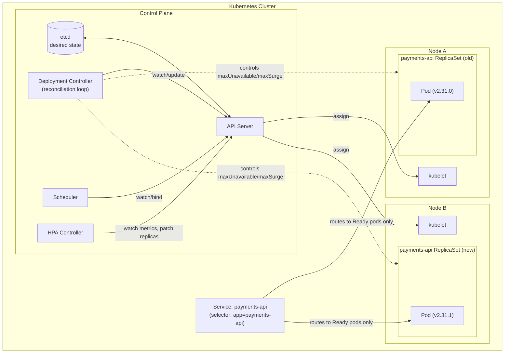
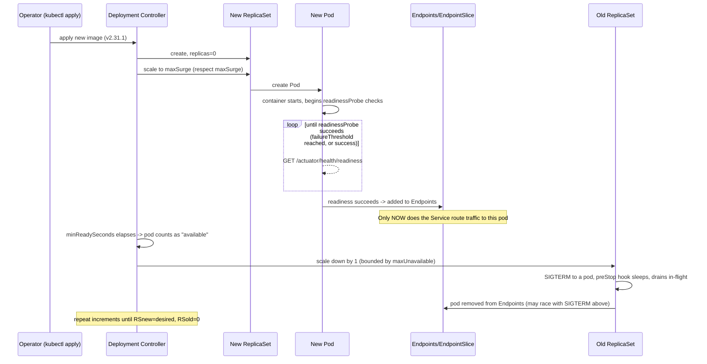
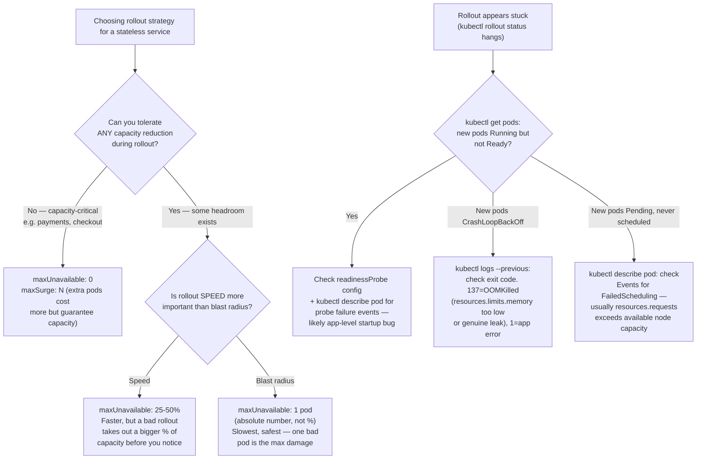
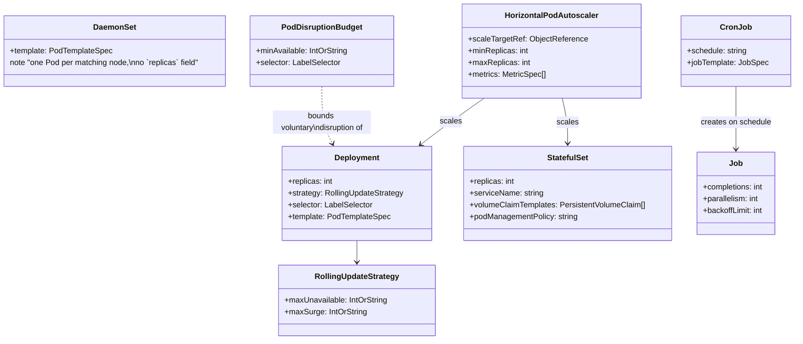

# Chapter 07.02 — Workloads, Resource Management & Production Deployment Patterns

> A rollout of `payments-api` starts at 14:00. By 14:02, error rates spike to
> 8%, and by 14:03 half the fleet is in `CrashLoopBackOff`. The on-call
> engineer's Slack message is "rolling back now" — but the rollback takes
> another four minutes to *also* roll out safely, because whoever configured
> this Deployment set `maxUnavailable: 50%` for "faster rollouts" and never
> tested what happens when the new version is actually broken. This chapter
> is about the difference between a Deployment spec that looks correct and
> one that has actually been pressure-tested against the failure modes that
> show up at 2 p.m. on a Tuesday, not just the happy path.

**Part:** Part 07 — Kubernetes · **Level:** Advanced / Production
**Estimated study time:** 5-6 hours · **Status:** ✅ Complete

---

## Learning Objectives

- **Compare** Deployments, StatefulSets, DaemonSets, and Jobs/CronJobs, and pick the correct workload type for a given service's state and scheduling needs.
- **Design** a rolling-update strategy (`maxUnavailable`/`maxSurge`/`minReadySeconds`) that trades off rollout speed against blast radius, and explain the failure mode of getting it wrong.
- **Implement** a replica-ratio canary deployment using only vanilla Kubernetes primitives (no service mesh required).
- **Explain** how `resources.requests`/`resources.limits` determine a Pod's QoS class, and how that class drives eviction order under node memory pressure.
- **Configure** a `HorizontalPodAutoscaler` using both a resource metric and a custom application metric, and justify why CPU alone is often a lagging signal for JVM services.
- **Diagnose** `CrashLoopBackOff` and `OOMKilled` from `kubectl describe`/`kubectl logs` output alone, distinguishing a resource-limit problem from an application bug.
- **Design** rollout safety nets (readiness probes, `PodDisruptionBudget`, `preStop` hooks) that make a bad deploy fail safely instead of catastrophically.

## Prerequisites

| Concept | Where it's covered | Required? |
|---|---|---|
| Basic Kubernetes objects (Pod, Service, Namespace) | [Part 07.01 — Kubernetes Architecture: Control Plane & Node Components](../README.md) (📝 planned) | Helpful, not required — this chapter defines what it needs inline |
| JVM container-aware memory ergonomics, `OOMKilled` root-causing | [Chapter 02.04 — JVM Internals: Memory Management, Garbage Collection & Performance Tuning](../../Part-02-Core-Java/chapters/02-04-jvm-internals-memory-gc.md) | Yes — this chapter's resource-sizing guidance builds directly on it |
| YAML syntax | General prerequisite | Yes |
| Basic Linux process signals (`SIGTERM`, `SIGKILL`) | General prerequisite | Yes |

## Introduction

Every Kubernetes tutorial shows you `kubectl apply -f deployment.yaml` and a
Pod turns `Running`. What it doesn't show you is the Deployment that looked
identical in review, passed staging, and then took down production during a
routine rollout — because the difference between "works in the demo" and
"survives a bad deploy in production" isn't in the container image at all.
It's in a handful of fields most engineers never touch: `maxUnavailable`,
`readinessProbe`, `resources.requests`, `terminationGracePeriodSeconds`.

This chapter treats workload configuration as what it actually is at Staff
Engineer level: a set of deliberate trade-offs between rollout speed, blast
radius, resource efficiency, and failure isolation — not YAML boilerplate to
copy from a previous service. We'll cover the workload types themselves
(Deployment/StatefulSet/DaemonSet/Job), then go deep on the two areas that
generate the most production incidents: **resource management** (requests,
limits, QoS classes, and how they interact with the kubelet's eviction
policy) and **deployment strategy** (rolling updates, canary, and the
specific safety nets — readiness probes, PDBs, graceful shutdown — that
determine whether a bad rollout is a non-event or an outage).

## Theory

### The reconciliation model

Kubernetes workload controllers (Deployment, StatefulSet, DaemonSet, Job)
all implement the same core pattern: a **control loop** that continuously
compares *desired state* (your YAML, stored in etcd) against *observed
state* (what's actually running) and issues API calls to close the gap. A
Deployment doesn't "do" a rolling update as a single imperative action — it
creates a new ReplicaSet at the new Pod template, then repeatedly nudges the
old and new ReplicaSets' replica counts toward each other, respecting
`maxUnavailable`/`maxSurge` as hard constraints on each nudge, until the new
ReplicaSet is at full desired capacity and the old one is at zero. This
matters practically: a rollout is not atomic, has no built-in
"transaction," and can be paused, resumed, or interrupted by another
`kubectl apply` at any point mid-reconciliation.

### Requests vs. limits: two different mechanisms entirely

`resources.requests` and `resources.limits` are not "minimum and maximum" in
a symmetric sense — they're consumed by entirely different subsystems:

- **`requests`** feed the **scheduler**. The scheduler only ever looks at
  requests when deciding which node has room for a new Pod — a node with
  8 CPU cores and 4 already "requested" by other pods has 4 requestable
  cores left, *regardless* of what those other pods are actually using at
  that instant. Requests are a *reservation*, not a *measurement*.
- **`limits`** feed the **kernel's cgroup enforcement** on the node
  (kubelet configures cgroup `memory.max` from `limits.memory`, and CPU
  throttling via `cpu.max` from `limits.cpu`). A container that tries to
  allocate memory past its limit gets `SIGKILL`ed by the kernel OOM-killer
  (visible as `OOMKilled` in `kubectl describe pod`); a container that
  tries to use more CPU than its limit gets **throttled** (not killed) —
  its cgroup CPU bandwidt is capped, which shows up as *increased latency*,
  not an error, making CPU throttling one of the most under-diagnosed
  production performance problems in Kubernetes fleets.

### QoS classes: how the kubelet ranks eviction priority

The **QoS (Quality of Service) class** is derived purely from the *shape* of
a Pod's requests/limits — no separate field sets it directly:

| Class | Condition | Eviction priority under node memory pressure |
|---|---|---|
| **Guaranteed** | Every container sets `requests == limits` for *every* resource | Evicted last — only if the node itself is critically starved |
| **Burstable** | At least one container sets a request, but requests ≠ limits somewhere | Evicted after BestEffort, ordered by how far usage exceeds requests |
| **BestEffort** | No `resources` block at all (no requests, no limits) | Evicted first |

This is why "no `resources:` block" is not a neutral default — it's an
explicit request to be first in line for eviction the moment the node comes
under memory pressure, with the scheduler additionally unable to reason
about how much room this Pod actually needs.

## Internal Working

### What actually happens during a rolling update

1. `kubectl apply` (or `kubectl set image`) updates the Deployment object's
   Pod template. The Deployment controller notices the template hash
   changed and creates a **new ReplicaSet** with `replicas: 0`.
2. The controller computes how many new pods it's allowed to add right now:
   `min(maxSurge, desired - currentNewReplicas)`, bounded so that
   `currentTotal <= desired + maxSurge`. It scales the new ReplicaSet up by
   that amount.
3. As each new Pod passes its **readiness probe**, the Deployment controller
   becomes willing to scale the *old* ReplicaSet down — but only down to the
   point where `currentTotal >= desired - maxUnavailable`. A Pod that never
   becomes Ready simply blocks the rollout from progressing past that point
   — it does **not** cause an automatic rollback (that requires either a
   `kubectl rollout undo` or an external controller like Argo Rollouts
   watching a `progressDeadlineSeconds` timeout).
4. This repeats in small increments (governed by `minReadySeconds` as a
   throttle — the controller waits at least that long after a Pod reports
   Ready before counting it as available for the *next* increment) until the
   new ReplicaSet reaches `replicas: <desired>` and the old ReplicaSet
   reaches `replicas: 0`. The old ReplicaSet object is *kept* (up to
   `revisionHistoryLimit`), not deleted — this is what `kubectl rollout
   undo` rolls back to.

### The SIGTERM race and why `preStop` matters

When a Pod is deleted (by a rollout, a scale-down, or `PodDisruptionBudget`-
gated eviction), two things happen **concurrently**, not sequentially:

1. The kubelet sends `SIGTERM` to the container's main process, starting a
   `terminationGracePeriodSeconds` countdown to `SIGKILL`.
2. The API server removes the Pod from every Service's `Endpoints`/
   `EndpointSlice` object, and `kube-proxy` on every node eventually updates
   its iptables/IPVS rules to stop routing new connections to it.

Step 2 is **not instantaneous** and is **not synchronized** with step 1 —
`kube-proxy` propagation across a cluster can lag by anywhere from tens of
milliseconds to a few seconds depending on cluster size and load. Without a
`preStop` hook, a container can receive `SIGTERM` and shut down *before*
every node has stopped routing traffic to it, dropping in-flight (and
newly-arriving) requests. A `preStop` hook that simply sleeps for a few
seconds before the main process actually stops accepting new work closes
this race: the container keeps serving (or at least keeps its listening
socket open) during the endpoint-propagation window, while typically also
signaling the application layer (e.g., a Spring Boot graceful-shutdown
trigger) to stop accepting *new* work and drain in-flight requests.

### Eviction under node pressure: the actual kubelet algorithm

When the kubelet detects a node resource under pressure (memory, disk, PIDs)
crossing an eviction threshold, it doesn't kill pods at random. It ranks
candidates by:

1. **QoS class first** (BestEffort > Burstable > Guaranteed, in eviction
   priority — BestEffort goes first).
2. **Within the same class**, by how far usage exceeds requests (for the
   resource under pressure) — the Pod using the most *over its request* is
   evicted first. This is why a Burstable Pod that requests little but
   bursts high is a much more likely eviction target than one that requests
   accurately.

This is a *node-local, resource-pressure-triggered* mechanism, distinct
from — and much blunter than — a `PodDisruptionBudget`, which only governs
*voluntary*, cluster-initiated disruptions like drains and autoscaler
scale-downs, and has no say at all over a kubelet evicting a Pod under
memory pressure.

## Architecture



## Sequence Diagrams (Mermaid)

A safe rolling update, showing why readiness (not just process-start) is
what actually gates traffic:



## Flow Charts (Mermaid)

The decision tree for choosing `maxUnavailable`/`maxSurge`, and separately,
for diagnosing a stuck or failing rollout:



## Class Diagrams (Mermaid)

Not literal Java classes here — the "class diagram" for this chapter models
the Kubernetes workload-object type hierarchy and how they compose, which is
the equivalent structural relationship for this domain.



## Production Examples

The `CrashLoopBackOff` incident referenced in this chapter's introduction,
as it would be diagnosed in real time:

```text
$ kubectl get pods -n payments -l app=payments-api
NAME                            READY   STATUS             RESTARTS   AGE
payments-api-7d9f8b6c9d-2kxpl   0/1     CrashLoopBackOff   4          3m12s
payments-api-7d9f8b6c9d-8mzqr   0/1     CrashLoopBackOff   4          3m8s
payments-api-7d9f8b6c9d-vw3fn   1/1     Running            0          14m
...

$ kubectl describe pod payments-api-7d9f8b6c9d-2kxpl -n payments
...
Last State:     Terminated
  Reason:       OOMKilled
  Exit Code:    137
...
Limits:
  memory:  768Mi
Requests:
  memory:  512Mi
...

$ kubectl logs payments-api-7d9f8b6c9d-2kxpl -n payments --previous | tail -5
2026-07-08T13:59:58.221Z INFO  Started PaymentsApiApplication
2026-07-08T14:00:41.887Z WARN  GC (Allocation Failure) old gen fill ratio: 94%
2026-07-08T14:00:44.103Z WARN  GC (Allocation Failure) old gen fill ratio: 97%
# then nothing — the JVM was SIGKILLed by the kernel, not a graceful exit
```

Root cause: `limits.memory: 768Mi` with no `-Xmx` override meant the JVM
sized its heap against 70% of *768Mi*, correctly by container-aware
ergonomics standards (see Chapter 02.04) — but the *new* code path in
v2.31.1 introduced a genuinely larger working set. This is a real
capacity-planning failure, not a JVM tuning failure: the fix was raising
`limits.memory` after confirming (via a heap dump, per Chapter 02.04's
runbook) that the growth was a legitimate working-set increase and not the
unbounded-cache leak pattern from that chapter.

## Code Examples

Full manifests for this chapter live in
[`code-samples/workload-patterns/`](../code-samples/workload-patterns/) and
validate cleanly (`./validate.sh` — YAML parses, every document carries
required `apiVersion`/`kind`/`metadata`; this sandbox has no live cluster,
so this is the strongest offline verification, with `kubectl apply
--dry-run=server` recommended as a stronger check wherever a cluster is
available).

**Safe rolling update** — `deployment-rolling-update.yaml`:

```yaml
spec:
  replicas: 6
  strategy:
    type: RollingUpdate
    rollingUpdate:
      maxUnavailable: 0     # never drop below `replicas` during rollout
      maxSurge: 2
  minReadySeconds: 15
  template:
    spec:
      terminationGracePeriodSeconds: 45
      containers:
        - name: payments-api
          env:
            - name: JAVA_TOOL_OPTIONS
              value: >-
                -XX:MaxRAMPercentage=70.0
                -XX:+UseContainerSupport
                -XX:+ExitOnOutOfMemoryError
          lifecycle:
            preStop:
              exec:
                command: ["sh", "-c", "sleep 10"]
```

**Replica-ratio canary (no mesh)** — `deployment-canary.yaml`: two
Deployments (`track: stable` / `track: canary`) selected by a single
Service whose selector deliberately omits the `track` label, so it
load-balances round-robin across both — a 9:1 replica ratio approximates a
90/10 traffic split.

**Autoscaling on more than CPU** — `hpa-and-pdb.yaml` scales on both CPU
utilization and a custom `http_requests_per_second` metric (via an adapter
like `prometheus-adapter`), because CPU is a lagging indicator for
allocation-heavy JVM workloads — GC pause and latency often degrade before
CPU% crosses a scaling threshold.

## Best Practices

| Do | Don't | Why |
|---|---|---|
| Set `maxUnavailable: 0` for capacity-critical services, accepting the extra `maxSurge` cost | Default to percentage-based `maxUnavailable` "because it rolls out faster" | A bad rollout with `maxUnavailable: 0` never drops capacity; with `maxUnavailable: 50%` it can halve capacity before anyone notices |
| Always set both `requests` and `limits` on every container | Ship a container with no `resources` block | No `resources` block = BestEffort QoS = first evicted under any node pressure, and unschedulable-capacity-planning becomes impossible |
| Use a `preStop` hook that sleeps briefly before the app stops accepting connections | Assume `SIGTERM` and Service-endpoint removal are synchronized | They're concurrent, not sequential — without a drain buffer, in-flight (and freshly-routed) requests get dropped |
| Back every capacity-critical Deployment with a `PodDisruptionBudget` | Rely on `maxUnavailable` alone to protect against cluster-initiated disruption | PDBs bound *voluntary* disruption (drains, autoscaler scale-down) — a separate mechanism from rollout strategy entirely |
| Scale on an application-level metric (RPS, queue depth) alongside CPU | Scale on CPU utilization alone for JVM services | CPU is often a lagging signal — GC pause/latency degrade before CPU% crosses a threshold |
| Choose StatefulSet for anything needing stable network identity or per-replica storage | Use a Deployment "because it's simpler" for a service with per-instance state | Deployment Pods are fungible and interchangeable by design; a service needing stable identity/storage under a Deployment will break on any rescheduling |

## Common Mistakes

| Mistake | Why it happens | How to fix it |
|---|---|---|
| No `readinessProbe` at all (only `livenessProbe`, or neither) | Looks equivalent to "the pod is Running" during manual testing | Add a `readinessProbe` distinct from liveness — without one, a rollout considers a Pod available the instant its container starts, before the app can actually serve traffic |
| Setting `limits.cpu` aggressively low "to be efficient" | CPU limits look like a safety mechanism the same way memory limits are | CPU limits throttle (silently increasing latency), they don't fail loudly like memory OOM — an aggressively low CPU limit is a hidden, hard-to-diagnose latency tax |
| `terminationGracePeriodSeconds` left at the 30s default for a service with long-running requests | Nobody revisits the default until a request gets cut mid-flight | Set it to comfortably exceed your longest expected in-flight request duration plus drain buffer |
| Confusing `PodDisruptionBudget` with rollout safety | Both sound like "how many pods can go down at once" | PDB governs cluster-initiated *voluntary* disruption only (drains, autoscaler); rollout safety is `maxUnavailable`/`maxSurge` on the Deployment — configure both, they don't substitute for each other |
| Sizing `resources.requests.memory` from a quiet staging environment | Staging traffic patterns rarely match production peak working set | Size requests from production p95/p99 usage under real load (Chapter 02.04's `MemoryPoolsReporter`/heap-dump techniques apply directly here), with `limits` set above that with real headroom |

## Performance Considerations

- **CPU limits throttle via CFS bandwidth control** — a container hitting
  its CPU limit doesn't get killed, it gets its allowed CPU time per
  100ms period capped, which manifests as increased request latency and
  can be invisible in a naive "CPU% used" dashboard that doesn't also
  track throttling metrics (`container_cpu_cfs_throttled_periods_total` in
  cAdvisor/Prometheus).
- **`maxSurge` costs real capacity, temporarily** — a `maxSurge: 2` rollout
  on a 6-replica Deployment briefly runs 8 pods; if node capacity is tight,
  this can cause the surge pods to go `Pending`, stalling the rollout
  entirely rather than failing fast — verify cluster headroom before
  tightening `maxUnavailable` to 0 with a nonzero `maxSurge`.
- **HPA reaction time has an inherent lag** — the default metrics-server
  scrape interval (~15-30s) plus the HPA controller's own sync period
  (~15s default) plus new-pod startup time (JVM cold-start, readiness
  probe delay) together mean HPA-driven scale-out can lag a genuine traffic
  spike by 1-2 minutes — for spiky workloads, pair HPA with either
  over-provisioned `minReplicas` or a scheduled/predictive scaling
  mechanism rather than relying on reactive scaling alone.
- **`minReadySeconds` trades rollout speed for regression detection** —
  setting it too low (0, the default) lets a Pod that crashes 5 seconds
  after reporting Ready count as "successfully rolled out" before the
  crash happens; setting it meaningfully above your typical
  time-to-first-crash for a bad deploy (commonly 15-30s is enough to catch
  most immediate regressions) is a cheap insurance policy.

## Security Considerations

- **`resources.limits` is also a resource-exhaustion defense** — an
  unbounded (BestEffort/no-limits) Pod is a vector for a single compromised
  or buggy container to starve every other workload on its node; setting
  limits on every container is a security control, not just a cost/capacity
  one.
- **`PodDisruptionBudget` can be weaponized against your own drains** — an
  overly strict `minAvailable` (e.g. 100%) on a Deployment can block a node
  drain indefinitely, which in an incident-response scenario (draining a
  compromised node) is a availability-vs-security trade-off worth
  deliberately setting, not defaulting into.
- **`preStop` hooks run with the container's full privileges** — a
  `preStop exec` command is not a separate sandboxed context; don't put
  anything in it you wouldn't trust the main container process to run.
- **Canary deployments (this chapter's replica-ratio pattern) are a natural
  place to catch a supply-chain-compromised image before full rollout** —
  routing a small percentage of real traffic to a new image before 100%
  rollout is a detection control, not just a rollout-safety one; pair it
  with anomaly monitoring specifically scoped to the canary track.

## Production Troubleshooting

| Symptom | Root Cause | Diagnosis Commands | Fix |
|---|---|---|---|
| New pods stuck `Pending` during rollout | `maxSurge` pods can't be scheduled — insufficient node capacity for `requests` | `kubectl describe pod <name>` → `Events: FailedScheduling` | Reduce `maxSurge`, add node capacity, or verify `requests` values reflect real usage (not inflated) |
| New pods `CrashLoopBackOff`, exit code 137 | OOMKilled — `limits.memory` too low for actual working set, or a genuine leak (see Chapter 02.04) | `kubectl describe pod` (Last State: Terminated, Reason: OOMKilled); `kubectl logs --previous` for the last log lines before the kill | Distinguish legitimate working-set growth from a leak (heap dump per Chapter 02.04) before just raising the limit |
| New pods `Running` but never `Ready`, rollout stuck | Readiness probe failing — app-level startup issue, misconfigured probe path/port, or slow dependency (DB migration, cache warm) | `kubectl describe pod` → probe failure events; `kubectl logs` for startup errors; `kubectl exec` + manual `curl` to the readiness endpoint | Fix the underlying startup issue, or extend `initialDelaySeconds`/`failureThreshold` if slow-but-healthy startup is expected |
| Rollout "succeeds" but error rate spikes right after | `minReadySeconds` too low — pods crash shortly after passing readiness, but the controller already counted them as available and torn down old capacity | Compare rollout completion timestamp against error-spike timestamp; check for a delayed-onset crash pattern in new-pod logs | Raise `minReadySeconds`; add a synthetic post-deploy smoke test gate before the rollout is considered "done" for on-call purposes |
| Latency degrades under load with no visible errors, CPU% "looks fine" | CPU throttling — `limits.cpu` too tight, container is being throttled (not killed) | `container_cpu_cfs_throttled_periods_total` / `throttled_time_seconds` (cAdvisor/Prometheus); compare against `container_cpu_cfs_periods_total` for throttle ratio | Raise `limits.cpu`, or (if a genuine burst pattern) reconsider Guaranteed QoS with higher baseline `requests.cpu` |
| Node drain hangs indefinitely | `PodDisruptionBudget.minAvailable` too strict for the number of nodes being drained simultaneously | `kubectl get pdb -n <ns>`; `kubectl describe pdb` shows `Allowed Disruptions: 0` | Temporarily relax the PDB for planned maintenance, or drain fewer nodes concurrently |

## Interview Questions

1. **"What's the difference between `resources.requests` and `resources.limits`, mechanically?"**
   *Model answer:* Requests feed the scheduler's bin-packing decision (a
   reservation, checked once at scheduling time); limits feed cgroup
   enforcement on the node at runtime (memory limit → OOM-killed via
   `SIGKILL` if exceeded; CPU limit → throttled via CFS bandwidth control,
   not killed). They're consumed by entirely different subsystems, not two
   ends of one range.

2. **"A Pod has no `resources` block. What QoS class is it, and what does that mean under node memory pressure?"**
   *Model answer:* BestEffort — no requests or limits set on any resource.
   It's evicted first under node memory pressure, before any Burstable or
   Guaranteed pod, and the scheduler has no basis to reason about how much
   room it actually needs.

3. **"Why doesn't `SIGTERM` alone guarantee zero dropped requests during a rolling update?"**
   *Model answer:* `SIGTERM` delivery and Service-endpoint removal happen
   concurrently, not sequentially — `kube-proxy`'s propagation of the
   updated endpoint list across the cluster isn't instantaneous, so a
   container can stop accepting connections before every node has stopped
   routing to it. A `preStop` hook that briefly delays actual shutdown
   closes this race.

4. **"Design a canary deployment using only vanilla Kubernetes, no service mesh."**
   *Model answer:* Two Deployments with a shared `app` label but distinct
   `track` labels (`stable`/`canary`), and one Service whose selector uses
   only the shared `app` label so it load-balances round-robin across both.
   The replica ratio between the two Deployments approximates the traffic
   split (e.g., 9:1 replicas ≈ 90/10) — coarse-grained compared to a
   mesh's weighted routing, but requires no additional infrastructure.

5. **"Why might CPU-based HPA scaling be a poor fit for a JVM service?"**
   *Model answer:* CPU utilization is often a lagging indicator for
   allocation-heavy JVM workloads — GC pause time and request latency can
   degrade under load before CPU% crosses a scaling threshold, since GC
   work competes for the same CPU the request-handling threads use.
   Scaling on an application-level metric (RPS, queue depth, or a custom
   GC-pressure signal) alongside CPU catches degradation earlier.

6. **"What's the difference between a `PodDisruptionBudget` and a Deployment's `maxUnavailable`?"**
   *Model answer:* `maxUnavailable` on a Deployment governs the
   *Deployment's own* rollout process. A `PodDisruptionBudget` governs
   *cluster-initiated voluntary disruptions* (node drains, cluster-autoscaler
   scale-down) that are entirely independent of any rollout — they answer
   different questions and are both needed for full protection.

7. **"A rollout is stuck — new ReplicaSet at 3/6, old ReplicaSet at 4/6, `kubectl rollout status` hangs. How do you diagnose it?"**
   *Model answer:* Check new-Pod state first: `Pending` → scheduling
   failure, usually insufficient node capacity for `requests`;
   `CrashLoopBackOff` → check exit code via `kubectl describe`, 137 means
   OOMKilled; `Running` but not `Ready` → readiness probe failing, check
   probe config and application startup logs.

8. **"Why would you choose a StatefulSet over a Deployment?"**
   *Model answer:* When Pods need stable, predictable network identity
   (`<name>-0`, `<name>-1`, ...) and/or a dedicated PersistentVolumeClaim
   per replica that survives rescheduling — Deployment Pods are fungible
   and interchangeable by design, which breaks anything relying on
   per-instance identity or storage (databases, brokers, anything doing
   leader election by ordinal).

9. **"What does `minReadySeconds` actually protect against that a readiness probe alone doesn't?"**
   *Model answer:* A readiness probe answers "is this Pod ready right now."
   `minReadySeconds` adds a required dwell time *after* readiness succeeds
   before the controller counts the Pod as available for the next rollout
   increment — catching a Pod that reports Ready but crashes shortly after,
   which a readiness probe check alone (evaluated once) would miss.

10. **"Explain CPU throttling as a production incident — how would it present, and how would you confirm it?"**
    *Model answer:* It presents as elevated latency under load with no
    errors and a CPU utilization graph that looks unremarkable (because
    average utilization can look fine while individual 100ms CFS periods
    are being throttled). Confirm via `container_cpu_cfs_throttled_periods_total`
    (or `_seconds_total`) from cAdvisor/Prometheus, compared against total
    periods — a nonzero, sustained throttle ratio confirms it, at which
    point the fix is raising `limits.cpu` or moving to Guaranteed QoS with
    a higher baseline.

## Hands-on Exercises

### Lab 1 (Beginner)

**Goal:** Observe how QoS class is derived purely from requests/limits shape.

**Setup:** `code-samples/workload-patterns/qos-class-examples.yaml`.

**Task:** For each of the three Pod specs, write down (without running
anything) what QoS class Kubernetes will assign and why, citing the specific
rule from the Theory section. Then, if you have access to any cluster
(`kind`/`minikube` is fine), apply the file and confirm with `kubectl get
pod <name> -o jsonpath='{.status.qosClass}'`.

**Verification:** Your predicted classes match `kubectl`'s reported
`qosClass` for all three pods (or match the documented derivation rule if no
cluster is available).

### Lab 2 (Intermediate)

**Goal:** Design a rollout strategy for a stated capacity/blast-radius
requirement.

**Setup:** `code-samples/workload-patterns/deployment-rolling-update.yaml`
as a starting point.

**Task:** You're told: "This service must never drop below 100% of current
capacity during a rollout, and a bad deploy must be limited to affecting at
most 1 pod's worth of traffic before the rollout visibly stalls." Modify
`maxUnavailable`/`maxSurge`/`minReadySeconds` to satisfy this, and write one
sentence justifying each value.

**Verification:** Run `./validate.sh` in the code-samples directory to
confirm your edited YAML is still valid; your `maxUnavailable` must be
exactly `0` and your reasoning must correctly explain why `maxSurge`
controls the "1 pod's worth of blast radius" requirement, not
`maxUnavailable`.

### Lab 3 (Advanced)

**Goal:** Build a working replica-ratio canary and reason about its traffic
distribution.

**Setup:** `code-samples/workload-patterns/deployment-canary.yaml`.

**Task:** Modify the stable/canary replica counts to approximate a 95/5
traffic split instead of the current 90/10, and explain in one paragraph why
this approximation gets *less* precise (not more) as total replica count
decreases — e.g., what happens to your ability to approximate a 5% split at
a total of 4 replicas versus 100.

**Verification:** `./validate.sh` passes on your edited file; your written
explanation correctly identifies that replica-ratio canaries quantize to
`1/total_replicas` granularity, making low-replica-count services a poor fit
for fine-grained percentage splits without a mesh/weighted-routing layer.

### Lab 4 (Production)

**Goal:** Diagnose a simulated `CrashLoopBackOff` incident end-to-end,
mirroring the Production Examples scenario.

**Setup:** `code-samples/workload-patterns/deployment-rolling-update.yaml`,
plus (if you have cluster access) deliberately set `limits.memory` far below
a realistic working set for a JVM service and deploy any Spring Boot app
image you have available.

**Task:** Using only `kubectl describe pod` and `kubectl logs --previous`
output (real, if you have cluster access; otherwise work from the
Production Examples transcript in this chapter), produce a short incident
report: Symptom / Root Cause / Diagnosis steps / Fix, explicitly stating
whether you believe this is a capacity-planning problem or an application
leak, and what additional evidence (referencing Chapter 02.04's heap-dump
technique) would let you tell the two apart with certainty.

**Verification:** Your report correctly identifies exit code 137 as
OOMKilled (not a generic crash), and correctly states that distinguishing
"legitimate working-set growth" from "a leak" requires evidence beyond the
`OOMKilled` event itself — the same heap-dump-diffing method from Chapter
02.04's Production Troubleshooting table.

## Summary

- Kubernetes workload controllers reconcile *desired* state (your YAML)
  against *observed* state continuously — a rollout is a sequence of small,
  constraint-bounded nudges (`maxUnavailable`/`maxSurge`), not an atomic
  operation.
- `requests` feed the **scheduler** (a reservation); `limits` feed
  **cgroup enforcement** on the node (memory → `OOMKilled` via `SIGKILL`;
  CPU → throttled, not killed) — they are different mechanisms, not two
  ends of one range.
- **QoS class** (Guaranteed/Burstable/BestEffort) is derived purely from
  the shape of requests/limits and directly drives kubelet eviction order
  under node memory pressure.
- `SIGTERM` delivery and Service-endpoint removal are **concurrent, not
  sequential** — a `preStop` hook that briefly delays shutdown is what
  actually prevents dropped requests during termination.
- A **replica-ratio canary** (two Deployments, one Service selecting both
  via a shared label) needs no service mesh, but only approximates a
  traffic split at `1/total_replicas` granularity.
- **CPU throttling is silent** — it degrades latency without producing
  errors or an alarming CPU% graph; `container_cpu_cfs_throttled_*`
  metrics are the only reliable way to detect it.
- `PodDisruptionBudget` and Deployment `maxUnavailable` solve **different
  problems** (voluntary cluster-initiated disruption vs. the Deployment's
  own rollout) and must both be configured — neither substitutes for the
  other.
- `minReadySeconds` protects against a Pod that passes readiness but
  crashes shortly after — a readiness probe alone only proves "ready right
  now," not "stays healthy."

## Further Reading

- **Kubernetes official docs — "Managing Resources for Containers"** —
  primary source for requests/limits/QoS mechanics; read this before any
  resource-tuning work, since defaults and edge cases change across
  Kubernetes minor versions.
- **Kubernetes official docs — "Pod Lifecycle"** — the authoritative
  reference for the `SIGTERM`/`preStop`/`terminationGracePeriodSeconds`
  sequence covered in Internal Working.
- *Kubernetes Patterns* (Bilgin Ibryam & Roland Huß, O'Reilly) — covers the
  workload-type decision framework (Deployment vs. StatefulSet vs.
  DaemonSet vs. Job) in more structural depth than this chapter has room
  for.
- **"CPU Manager, Topology Manager" (Kubernetes docs)** — for anyone who
  needs to go past this chapter's throttling discussion into NUMA-aware /
  exclusive-core CPU pinning for latency-critical Guaranteed-QoS workloads.
- [Chapter 02.04 — JVM Internals: Memory Management, Garbage Collection & Performance Tuning](../../Part-02-Core-Java/chapters/02-04-jvm-internals-memory-gc.md) — the direct prerequisite for correctly sizing `resources.limits.memory` against JVM container-aware ergonomics.
