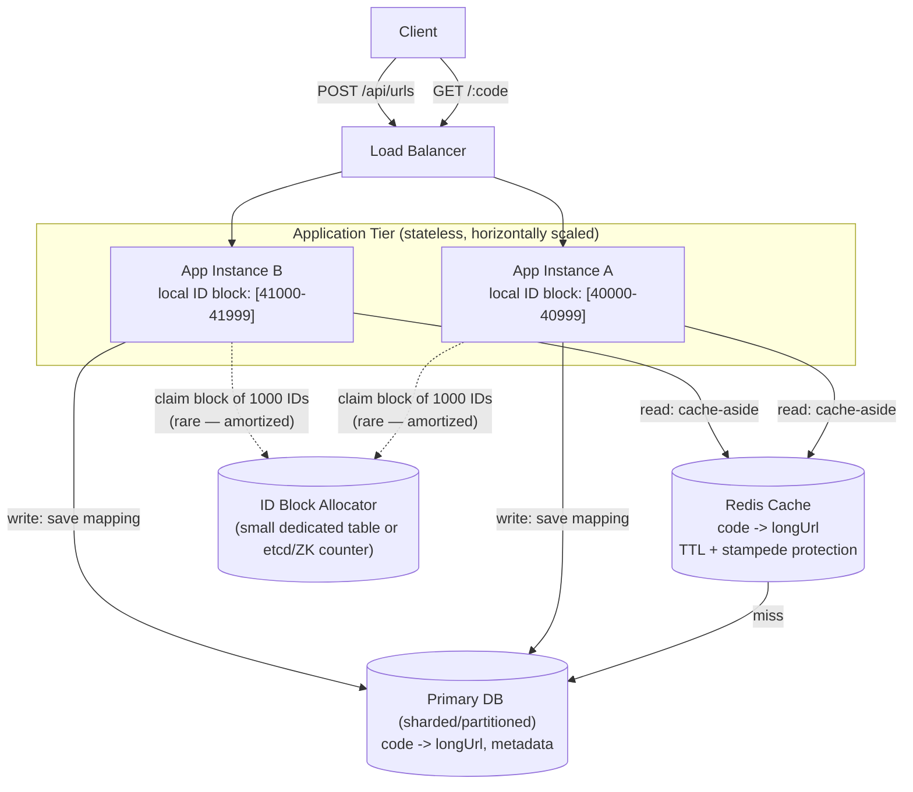
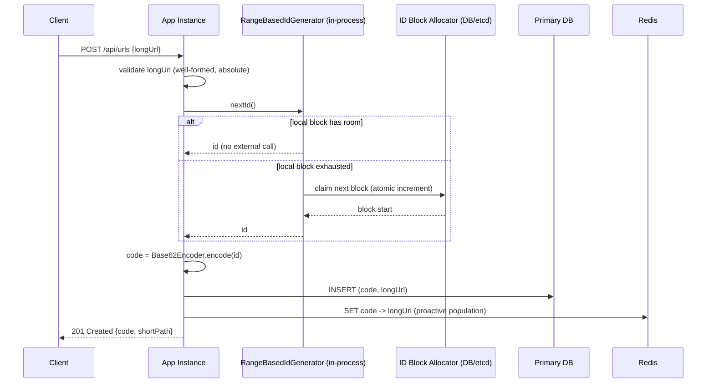
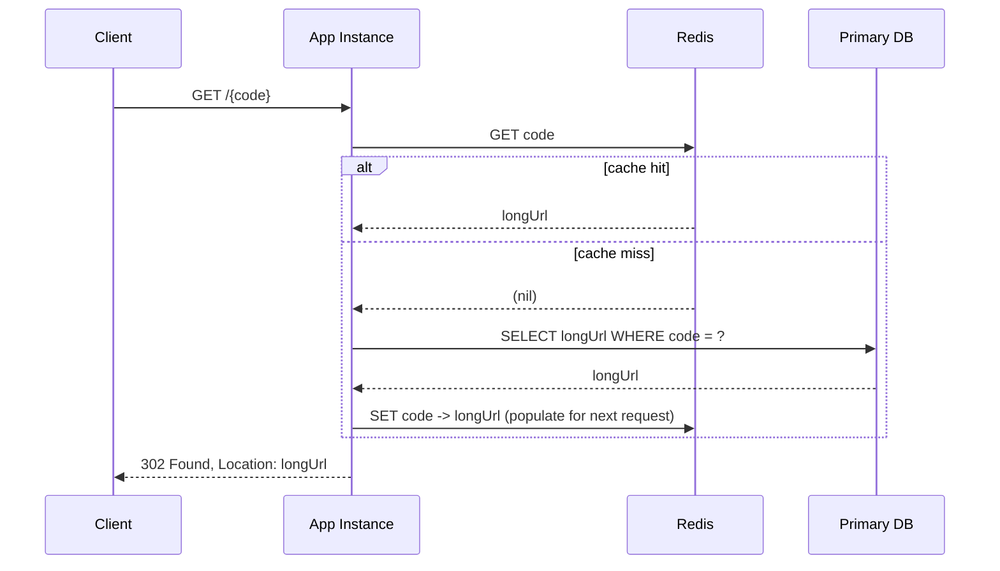
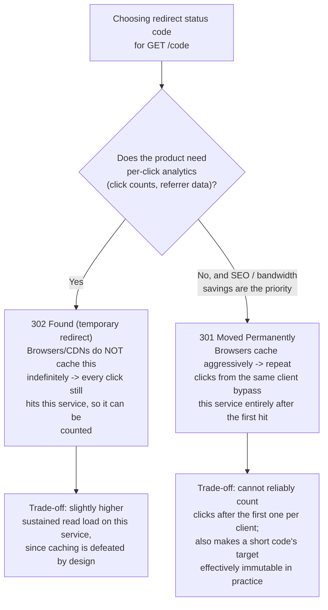
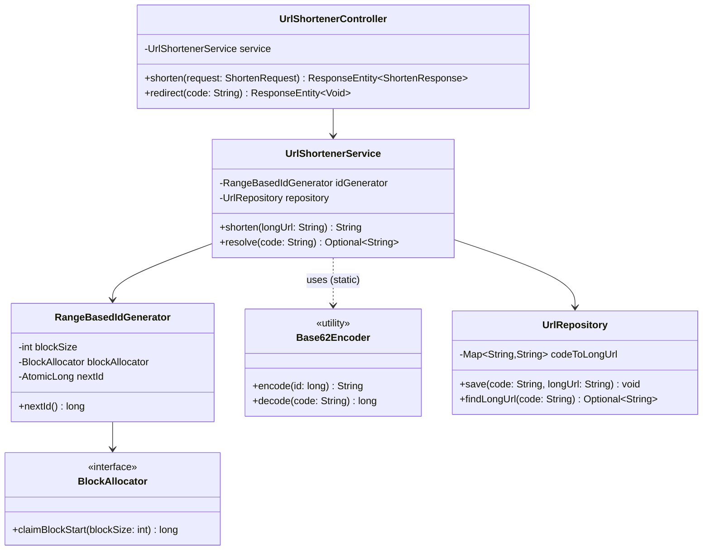

# Chapter 12.01 — Case Study: Designing a Scalable URL Shortener

> "Design TinyURL" is the system design interview's version of FizzBuzz —
> everyone's seen it, which is exactly why it's a poor place to coast on a
> memorized answer. The interviewer isn't testing whether you know Base62
> exists. They're testing what happens when they push: "your ID generator is
> a single Postgres sequence — what happens at 50,000 writes/sec?" or "how do
> you stop the same URL from getting shortened twice by two concurrent
> requests?" This chapter builds the design to the depth those follow-ups
> actually require, not the depth that survives only the first two minutes.

**Part:** Part 12 — System Design · **Level:** Advanced / Production
**Estimated study time:** 4-5 hours · **Status:** ✅ Complete

---

## Learning Objectives

- **Derive** capacity estimates (QPS, storage, bandwidth) from stated requirements and use them to justify every subsequent design decision.
- **Design** a collision-free, horizontally-scalable ID generation scheme and compare at least three alternatives on concrete trade-offs.
- **Design** a normalized database schema plus a caching layer for a read-heavy (100:1+) workload, with explicit cache-invalidation and cache-stampede handling.
- **Explain** the redirect-status-code trade-off (301 vs. 302) and its concrete effect on analytics accuracy.
- **Implement** the core of the design (ID generation, encoding, cache-aside repository, REST API) in compiling, tested Java/Spring Boot code.
- **Diagnose** the specific production failure modes of a URL shortener (hot-key skew, DB sequence contention, cache stampede) and design mitigations for each.
- **Produce** a defensible trade-offs table for every major decision, in the format a Staff Engineer interview loop expects.

## Prerequisites

| Concept | Where it's covered | Required? |
|---|---|---|
| Basic REST API design (HTTP methods, status codes) | Part 05 — Microservices (📝 planned) | Yes |
| Relational database indexing basics | Part 04 — Databases (📝 planned) | Yes |
| Caching fundamentals (cache-aside, TTL, eviction) | Part 04 — Databases (📝 planned) | Helpful — this chapter explains what it needs inline |
| JVM container-aware resource sizing, for the deployment section | [Chapter 02.04 — JVM Internals](../../Part-02-Core-Java/chapters/02-04-jvm-internals-memory-gc.md) | Helpful |
| Kubernetes workload/scaling patterns, for the deployment section | [Chapter 07.02 — Workloads, Resource Management & Production Deployment Patterns](../../Part-07-Kubernetes/chapters/07-02-workloads-resource-mgmt-deployment.md) | Helpful |

## Introduction

A URL shortener takes a long URL (`https://example.com/some/very/long/path?with=query&params=here`)
and returns a short one (`https://sho.rt/b7`) that redirects to the
original. The product surface is trivially small — two endpoints, one piece
of state. That's precisely why it's a good interview vehicle: with no
product complexity to hide behind, every answer is a direct signal of how
you think about scale, consistency, and failure.

This chapter works the case study the way a Staff-level interview actually
runs: state requirements and get explicit numbers before designing anything,
propose a high-level architecture, then go deep on the two components that
carry all the real difficulty — **ID generation** (how do you produce a
unique short code, fast, without central-database contention becoming the
bottleneck) and **the read path** (how do you serve a 100:1+
read-to-write-skewed workload with single-digit-millisecond redirect
latency at scale). We close with the operational reality: deployment,
monitoring, and a trade-offs table an interviewer can push on.

## Theory

### Requirements gathering (do this out loud, first)

**Functional requirements:**
- Given a long URL, return a short URL.
- Given a short URL (redirect request), redirect to the original long URL.
- (Optional, stated explicitly as out-of-scope-unless-asked: custom aliases, expiration, click analytics — each adds real design surface; naming them as deliberately deferred, rather than silently ignoring them, is itself a signal.)

**Non-functional requirements:**
- **Read-heavy**: redirects vastly outnumber URL creations — a defensible
  assumption is 100:1 or higher (people click shortened links far more
  often than they create them).
- **Low latency on redirect** — this is the user-facing hot path; target
  single-digit milliseconds server-side.
- **High availability** preferred over strong consistency for the redirect
  path — a redirect served from a very-slightly-stale cache is a
  non-issue; a redirect that fails outright is a broken product.
- **Uniqueness**: two different long URLs must never map to the same short
  code (collisions are unacceptable — someone else's link must never
  silently redirect a user).

### Capacity estimation (numbers first, design decisions follow from them)

Assume: 100M new short URLs created per month, 100:1 read:write ratio.

- **Write QPS**: 100,000,000 / (30 × 24 × 3600) ≈ **~39 writes/sec average**.
  Assume peak is 5-10x average → **~200-400 writes/sec peak**.
- **Read QPS**: 100:1 ratio → **~3,900 reads/sec average**, peak
  **~20,000-40,000 reads/sec**.
- **Storage**: 100M new URLs/month × 5 years × (~500 bytes/record: short
  code + long URL + metadata) ≈ 100M × 60 × 500 bytes ≈ **~3TB over 5
  years** — large enough that a single relational instance needs sharding
  or partitioning eventually, but small enough that it comfortably fits in
  a caching layer's *hot subset* (see Architecture).
- **ID space**: at 100M/month × 60 months = 6B URLs over 5 years. Base62
  with 7 characters gives 62^7 ≈ 3.5 trillion combinations — comfortable
  headroom (see Code Examples' `Base62Encoder`, verified by its test
  suite's length-boundary assertions).

These numbers justify three design decisions made below: (1) the read path
needs a caching layer, not just a well-indexed DB, because 20-40K reads/sec
sustained against a single relational primary is not a safe assumption at
this scale; (2) ID generation must not be a synchronous per-request DB
write, because 200-400 writes/sec against a naive single-row auto-increment
counter is a real contention point; (3) 7-character Base62 codes are the
right length — long enough for 5+ years of headroom, short enough to stay
memorable/shareable.

## Internal Working

### ID generation: three approaches, and why range-based wins here

| Approach | Mechanism | Pros | Cons |
|---|---|---|---|
| **Random generation + collision check** | Generate a random Base62 string, check if it exists, retry on collision | Simple, no coordination needed | Collision probability rises as the keyspace fills — collision *checks* themselves become a DB read on every write, and retry loops under high fill-rate become a real tail-latency problem |
| **Single auto-increment DB counter, then Base62-encode it** | One row: `next_id`. Every write does `id = next_id++`, then encodes | Trivially unique by construction, monotonic | The single row is a serialization point — every writer contends on the same DB row's lock, capping write throughput regardless of how many application servers you add |
| **Range-based allocation ("ticket server" pattern)** — used in this chapter's code sample | Each app instance claims a *block* of IDs (e.g. 1,000) from a central counter in one atomic operation, then serves IDs from that block locally via an in-process atomic counter | Removes the DB from the hot path for 999 out of every 1,000 ID requests; trivially horizontally scalable | Wastes up to `blockSize - 1` IDs if an instance crashes mid-block (acceptable given the enormous headroom in a 7-char Base62 keyspace) |

Range-based allocation is the standard answer for exactly this reason: it
converts "one DB round trip per URL created" into "one DB round trip per
`blockSize` URLs created," decoupling write throughput from DB contention
almost entirely. See `RangeBasedIdGenerator` in Code Examples — its
concurrency test proves zero duplicate IDs across 8 threads × 500 requests
against a shared generator, the exact property this design exists to
guarantee.

### The read path: cache-aside with stampede protection

A plain cache-aside pattern (check cache, on miss read DB and populate
cache) has a known failure mode at this scale: a **cache stampede** — if a
popular short code's cache entry expires (or the cache node restarts), the
next burst of concurrent requests for that same code *all* miss
simultaneously and *all* hit the database at once, momentarily multiplying
DB load by the fan-in factor. Two standard mitigations, either viable
depending on infrastructure maturity:

1. **Request coalescing / single-flight**: the first request for a missing
   key acquires a short-lived lock (or uses a library primitive like
   Guava's `LoadingCache` or Caffeine's built-in single-flight semantics);
   concurrent requests for the same key wait on that first request's result
   instead of independently hitting the DB.
2. **Probabilistic early expiration**: instead of a hard TTL, refresh
   slightly *before* expiration with a probability that increases as the
   entry approaches its TTL — spreads refreshes out over time instead of
   letting them cluster at exactly the TTL boundary.

Given the read:write ratio here (100:1+), the working set of "recently
created or recently popular" URLs is what actually needs to be hot in
cache — a Zipfian access pattern (a small fraction of short URLs receive
the overwhelming majority of clicks — viral links, popular redirects) means
a cache sized well under the full 3TB dataset still achieves a very high hit
rate in practice.

## Architecture



Every application instance is stateless and horizontally scalable — the
only shared mutable state is the DB (mappings, durable) and the ID block
allocator (contended only once per `blockSize` requests, not per request).
This is what makes the design scale by adding app instances without a
corresponding scale-up in DB contention.

## Sequence Diagrams (Mermaid)

**Write path** — creating a short URL:



**Read path** — resolving a short URL, with a cache miss:



## Flow Charts (Mermaid)

Decision tree for the redirect status code — the single most commonly
under-discussed decision in this case study:



## Class Diagrams (Mermaid)



## Production Examples

A representative hot-key incident and its resolution, illustrating why the
Architecture section's caching layer needs stampede protection, not just a
cache:

```text
Incident: sho.rt read-path P99 latency spike, DB CPU at 98%
Timeline:
  A short URL behind a viral social media post received a sudden
  10,000 req/sec burst concentrated on a SINGLE short code. The Redis
  entry for that code had a 1-hour TTL and happened to expire right in
  the middle of the traffic spike.
  Every one of ~2,000 concurrent requests that arrived in the same
  ~200ms window after expiration missed the cache simultaneously and
  went straight to the primary DB for the SAME row -- a self-inflicted
  stampede on a single hot key, not a general capacity problem.
  Fix: introduced single-flight request coalescing at the cache-client
  layer (first miss triggers the DB read and populates cache; concurrent
  misses for the same key await that in-flight read's result instead of
  issuing their own). Re-tested against a synthetic 10K req/sec burst on
  one key: DB read count for that key dropped from ~2,000 (one per
  concurrent miss) to 1.
```

This is precisely the Zipfian-access-pattern risk named in Internal
Working: a design that handles *average* read QPS comfortably can still
fail under a *concentrated* burst on one key unless the cache layer
explicitly protects against simultaneous misses on the same key.

## Code Examples

The full, compiling implementation backing this design lives at
[`code-samples/url-shortener/`](../code-samples/url-shortener/) — a Spring
Boot 3.2 / Java 21 Maven module. Build and verify:

```bash
cd Part-12-System-Design/code-samples/url-shortener
mvn -q compile   # compiles cleanly, no deprecation warnings
mvn -q test      # 24 JUnit 5 tests (unit + a @WebMvcTest HTTP-layer slice), all passing
```

**Base62 encoding** (`Base62Encoder`) — pure, stateless, exhaustively
round-trip-tested including the length-boundary cases that prove the 7-char
budget claim from Capacity Estimation:

```java
public static String encode(long id) {
    if (id == 0) return String.valueOf(ALPHABET.charAt(0));
    StringBuilder sb = new StringBuilder();
    long remaining = id;
    while (remaining > 0) {
        sb.append(ALPHABET.charAt((int) (remaining % BASE)));
        remaining /= BASE;
    }
    return sb.reverse().toString();
}
```

**Range-based ID generation** (`RangeBasedIdGenerator`) — the "ticket
server" pattern from Internal Working, with a pluggable `BlockAllocator`
interface so the real DB-sequence-backed allocator can be swapped in for
production without touching the hot-path logic:

```java
public long nextId() {
    while (true) {
        long candidate = nextId.getAndIncrement();
        if (candidate < blockEnd) {
            return candidate;
        }
        claimNextBlock(candidate);
    }
}
```

Its test suite (`RangeBasedIdGeneratorTest`) includes a genuine concurrency
test — 8 threads × 500 IDs against one shared generator — asserting zero
duplicates, which is the load-bearing correctness property for the entire
range-allocation design:

```java
@Test
void neverReturnsDuplicateIdsUnderConcurrentLoad() throws Exception {
    RangeBasedIdGenerator generator = new RangeBasedIdGenerator(50, new CountingAllocator());
    // 8 threads, 500 IDs each, via an ExecutorService...
    // assertTrue(allIds.add(id), "duplicate id generated under concurrency: " + id);
}
```

**Why 302, not 301** — enforced directly in `UrlShortenerController`:

```java
@GetMapping("/{code}")
@ResponseStatus(HttpStatus.FOUND)
public ResponseEntity<Void> redirect(@PathVariable String code) {
    return service.resolve(code)
            .map(longUrl -> ResponseEntity.status(HttpStatus.FOUND)
                    .location(URI.create(longUrl))
                    .<Void>build())
            .orElseGet(() -> ResponseEntity.notFound().build());
}
```

## Best Practices

| Do | Don't | Why |
|---|---|---|
| Derive every design decision from explicit capacity numbers | Jump straight to "we'll use Base62 and Redis" without stating QPS/storage assumptions | Numbers are what let an interviewer (or a future teammate) evaluate whether a decision is actually justified, versus cargo-culted |
| Use range-based ID allocation for high write-throughput ID generation | Use a single auto-increment DB counter directly on the hot path | A single counter row is a serialization point that caps write throughput regardless of app-tier scale-out |
| Explicitly choose 301 vs. 302 based on stated analytics requirements | Default to 301 "because it's more standard" without considering the caching trade-off | 301 gets cached by browsers/CDNs indefinitely, silently defeating server-side click analytics after the first click |
| Add stampede protection (single-flight or probabilistic early expiration) to any cache fronting a Zipfian-access-pattern workload | Assume a cache-aside pattern alone is sufficient at scale | A popular key's simultaneous cache-miss burst can spike DB load far above what average-QPS capacity planning accounted for |
| Validate and normalize input URLs before spending an ID on them | Generate a short code first, validate after | Wastes an ID (cheap, given headroom) but more importantly produces a "successful" response for a request that should have failed — validate first, always |

## Common Mistakes

| Mistake | Why it happens | How to fix it |
|---|---|---|
| Designing the ID generator around a single DB auto-increment column | It's the simplest thing that works in a demo/prototype | Recognize the serialization bottleneck before an interviewer points it out — propose range-based allocation as the default, not an afterthought |
| Treating "cache-aside" as sufficient without discussing stampede risk | Cache-aside is the textbook answer and often the full extent of what's memorized | Name the Zipfian access pattern explicitly and propose a concrete mitigation (single-flight or probabilistic expiration) |
| Skipping capacity estimation and going straight to architecture | It feels like "getting to the interesting part" faster | Capacity numbers are what justify (or invalidate) every later decision — skipping them makes every subsequent choice unfalsifiable |
| Not stating the 301-vs-302 trade-off at all | It looks like a minor implementation detail | It has a first-order product impact (analytics accuracy) — naming it unprompted is a strong signal in an interview |
| Assuming uniform (not Zipfian) access patterns when sizing the cache | Simpler to reason about | A cache sized for uniform access either wastes memory (oversized) or has a much lower hit rate than a Zipfian-aware sizing would predict — always name the access-pattern assumption explicitly |

## Performance Considerations

- **Range-based ID allocation reduces DB round trips by a factor of
  `blockSize`** — at `blockSize=1000`, sustained write throughput of
  several hundred/sec (per Capacity Estimation) requires well under one
  allocator round trip per second, fully removing ID generation from the
  write-path latency budget for 999 of every 1,000 requests.
- **Cache hit rate, not raw cache size, determines read-path latency at
  scale** — given a Zipfian access pattern, a cache sized to hold the
  "hot" fraction of the dataset (often a small percentage of total URLs)
  can still achieve a 95%+ hit rate; oversizing the cache to approach 100%
  of the dataset yields diminishing returns relative to its cost.
- **301 vs. 302 has a direct, measurable effect on server-side load, not
  just analytics** — 301's browser/CDN caching means popular links'
  *repeat* clicks from the same client largely bypass this service after
  the first hit, meaningfully reducing sustained read QPS at the cost of
  analytics accuracy — a genuine trade-off, not a free win either way.
- **Sharding the primary DB by short code (e.g., consistent hashing on the
  code, or a simple modulo/range partition)** becomes necessary well before
  the full 5-year storage estimate is reached if write throughput or
  single-table index size becomes the bottleneck — plan the shard key
  (short code, since all lookups are by code) at schema design time, since
  retrofitting a shard key later requires a full data migration.

## Security Considerations

- **Open redirect risk**: a URL shortener is, by construction, a
  general-purpose redirect service — without validation, it can be abused
  to redirect to phishing/malware destinations while displaying a
  trusted-looking short domain. Mitigate with a destination allowlist/
  denylist check (or at minimum, malware/phishing URL reputation checks
  against a threat-intel feed) at creation time, not just well-formedness
  validation.
- **Enumeration/guessing**: sequential or predictable short codes (e.g., a
  naive incrementing-counter-without-Base62-obfuscation scheme) let an
  attacker enumerate every URL ever created, including ones intended to be
  effectively private-by-obscurity. Base62-encoding a monotonic ID
  (as this design does) is *not* true unguessability — for genuinely
  sensitive links, add a random component or move to a fully random code
  with a collision check.
- **Rate limiting on URL creation** — without it, the write path (and the
  ID space itself) is a resource-exhaustion vector; rate-limit creation per
  client/API-key, independent of the read path's much higher legitimate
  QPS budget.
- **Cache poisoning via race conditions** — ensure the write path populates
  the cache with the value it just durably wrote (not a value derived from
  a since-superseded request), and that no code path allows an
  unauthenticated write to overwrite an existing code's mapping.

## Production Troubleshooting

| Symptom | Root Cause | Diagnosis Commands | Fix |
|---|---|---|---|
| DB CPU spikes correlated with sudden P99 read-latency spikes | Cache stampede on a single hot key (viral link, cache entry expired mid-burst) | Correlate DB slow-query log timestamps against a specific `code` value; check cache-miss rate for that key specifically, not just aggregate miss rate | Add single-flight request coalescing (or probabilistic early expiration) at the cache-client layer |
| Write throughput plateaus well below expected capacity despite adding app instances | ID generation still bottlenecked on a single DB counter row (range-based allocation not actually in place, or `blockSize` too small) | Check DB lock-wait metrics on the counter table; check allocator-claim frequency vs. `blockSize` | Increase `blockSize`, or confirm range-based allocation is genuinely in the write path (not silently bypassed) |
| A specific short code redirects to the wrong destination | Two writers raced on the same short code without a uniqueness constraint, or a code was reused after an ID-space wraparound bug | Check DB unique constraint exists on `code` column; check for any code path that reuses/recomputes an already-issued code | Add (or confirm) a DB-level `UNIQUE` constraint on `code` as a hard backstop, independent of the ID generator's uniqueness guarantee |
| Redirect P99 latency degrades gradually over weeks with no code changes | Cache hit rate declining as dataset grows past cache capacity, more requests falling through to a growing DB table | Track cache hit-rate as an explicit metric over time, not just latency | Increase cache capacity, or revisit sharding/partitioning if DB read latency itself has grown (index bloat, table size) |
| Sudden spike in 400 Bad Request on URL creation | Upstream client change started sending malformed/relative URLs, or a validation regression was deployed | Check `UrlShortenerService.validate` rejection logs/metrics for the specific `URISyntaxException` messages | Confirm whether this is a legitimate client bug (communicate back) or a validation regression (roll back) |

## Interview Questions

1. **"Walk me through your capacity estimation before you design anything."**
   *Model answer:* State assumptions explicitly (URLs/month, read:write
   ratio), derive write QPS, read QPS (via the ratio), storage over a
   stated retention period, and required ID-space size from total URLs
   expected — then use those numbers to justify design choices later
   (caching necessity, ID generation approach, code length) rather than
   asserting them without grounding.

2. **"Why not just use a single database auto-increment ID for short codes?"**
   *Model answer:* It works correctly but caps write throughput at
   whatever a single row's lock contention allows, regardless of how many
   application servers exist — every writer serializes on that one row.
   Range-based allocation removes the DB from the hot path for all but 1
   in `blockSize` requests.

3. **"301 or 302 for the redirect — and why?"**
   *Model answer:* Depends on stated requirements: 302 if per-click
   analytics/counting matters (prevents aggressive browser/CDN caching, so
   every click still hits the service); 301 if SEO/bandwidth savings are
   the priority and analytics can be sacrificed, since 301 gets cached
   client-side and subsequent clicks from the same client bypass the
   service entirely.

4. **"How would a single hot short code (a viral link) break your design, and how would you prevent it?"**
   *Model answer:* A cache-aside design alone is vulnerable to a stampede:
   if that key's cache entry expires during a traffic burst, all
   concurrent requests miss simultaneously and hit the DB for the same
   row. Mitigate with single-flight request coalescing (first miss
   triggers the DB read, concurrent misses await its result) or
   probabilistic early cache refresh.

5. **"How do you guarantee two concurrent requests for two different long URLs never get the same short code?"**
   *Model answer:* The ID generator's uniqueness guarantee (each ID handed
   out exactly once, whether via a single counter or range-based
   allocation) composed with a deterministic, collision-free encoding
   (Base62 on a unique integer id) — plus, as a hard backstop, a database
   `UNIQUE` constraint on the code column independent of the generator's
   own correctness.

6. **"How would you shard the primary database as the dataset grows past what one instance can hold?"**
   *Model answer:* Shard by short code (the only lookup key on the read
   path) — either range-based partitioning or consistent hashing across
   shards. Plan the shard key at schema design time; retrofitting a
   different shard key later requires a full data migration, which is
   exactly the kind of decision worth getting right from the number
   estimates up front.

7. **"What's an open redirect vulnerability, and how does it apply here?"**
   *Model answer:* A URL shortener is inherently a redirect service — if
   destination URLs aren't validated/checked against a reputation
   allowlist or threat-intel feed, attackers can use a trusted short
   domain to redirect to phishing or malware sites, laundering the
   destination's untrustworthiness behind the shortener's reputation.

8. **"How would you support custom aliases (user-chosen short codes) without breaking the uniqueness guarantee?"**
   *Model answer:* Custom aliases bypass the ID generator entirely and go
   straight to a DB uniqueness check/insert (`INSERT ... ON CONFLICT DO
   NOTHING`-style, or an explicit `exists()` check inside a transaction) —
   the ID generator's range-allocation optimization doesn't apply here
   since custom aliases are inherently a low-throughput, user-driven path
   where a per-request DB round trip is acceptable.

9. **"Your cache and database can briefly disagree — is that acceptable here, and why?"**
   *Model answer:* Yes — this system explicitly favors availability over
   strict consistency on the read path (stated in Non-functional
   Requirements). A redirect served from a few-seconds-stale cache entry
   is a non-issue for this product; the risk that matters is availability
   (a failed redirect), not staleness.

10. **"What would you monitor in production for this system, and what would each metric tell you?"**
    *Model answer:* Cache hit rate (declining trend signals capacity or
    access-pattern shift), redirect P50/P99 latency (user-facing SLA), DB
    write latency and lock-wait time on the ID allocator (contention
    signal), and per-key request concentration (to catch hot-key/stampede
    risk before it becomes an incident) — matching the Production
    Troubleshooting table's diagnostic signals directly.

## Hands-on Exercises

### Lab 1 (Beginner)

**Goal:** Reproduce the capacity-estimation numbers from Theory independently.

**Setup:** Pen and paper, or a spreadsheet — no code needed.

**Task:** Given 500M new URLs/month and a 200:1 read:write ratio, derive
average and peak (5x) write QPS, average and peak read QPS, and total
storage over a 3-year retention period at 500 bytes/record. Then determine
the minimum Base62 code length needed for the total URL count expected over
that period.

**Verification:** Your derived code length, when checked against
`Base62Encoder.encode()` in the code sample (or by computing 62^N by hand),
comfortably exceeds the total URL count — show your headroom margin
explicitly.

### Lab 2 (Intermediate)

**Goal:** Extend the code sample to support custom aliases, per Interview
Question 8's answer.

**Setup:** `code-samples/url-shortener/`.

**Task:** Add a `shortenWithAlias(String longUrl, String alias)` method to
`UrlShortenerService` that bypasses `RangeBasedIdGenerator` entirely, checks
`UrlRepository.exists(alias)` first, and throws a clear exception
(`IllegalStateException` or a new dedicated exception type) if the alias is
already taken instead of silently overwriting it.

**Verification:** Write at least 2 new JUnit tests: one confirming a fresh
alias succeeds, one confirming a duplicate alias is rejected without
overwriting the existing mapping. `mvn -q test` passes with your additions.

### Lab 3 (Advanced)

**Goal:** Add single-flight cache-stampede protection to the read path,
per the Production Examples incident.

**Setup:** `code-samples/url-shortener/`, `UrlShortenerService.resolve()`.

**Task:** Since `UrlRepository` in this code sample is a single
`ConcurrentHashMap` (no separate cache/DB split), simulate the stampede
scenario directly: write a test that fires N concurrent `resolve()` calls
for the same nonexistent code and asserts your chosen concurrency primitive
(e.g., `ConcurrentHashMap.computeIfAbsent` semantics, or a small
per-key-lock map) ensures the "expensive lookup" path (simulate with a
counter incremented inside the lookup) executes at most once per key,
regardless of concurrent caller count.

**Verification:** Your test deterministically shows the "expensive lookup"
counter never exceeds 1 for a single key under concurrent load — mirroring
the real incident's "~2,000 concurrent misses → 1 DB read" resolution.

### Lab 4 (Production)

**Goal:** Design (in writing, not code) the monitoring dashboard and alert
thresholds for this system in production, then map each to a concrete
incident from this chapter.

**Setup:** This chapter's Production Troubleshooting table.

**Task:** Produce a short dashboard spec: for each of (cache hit rate,
redirect P99 latency, ID-allocator claim rate, per-key request
concentration, write-path 4xx rate), state a specific alert threshold and
which Production Troubleshooting row it would catch, and roughly how much
lead time it would give an on-call engineer before user impact becomes
severe.

**Verification:** Every row in the Production Troubleshooting table is
covered by at least one metric/alert in your spec; your stated lead times
are justified by reasoning about the underlying failure mode's ramp-up
speed (e.g., a hot-key stampede develops in seconds, a cache-capacity
decline develops over weeks — your alerting cadence should differ
accordingly).

## Summary

- **Always derive design decisions from explicit capacity numbers** —
  write/read QPS, storage, and ID-space requirements computed from stated
  assumptions, not asserted.
- **Range-based ("ticket server") ID allocation** removes per-request DB
  contention from write-path ID generation by amortizing DB round trips
  over `blockSize` requests — the standard answer to "how do you generate
  unique IDs at scale without a single point of contention."
- **Cache-aside alone is insufficient for a Zipfian access pattern at
  scale** — a popular key's cache-entry expiration during a traffic burst
  causes a stampede; single-flight coalescing or probabilistic early
  refresh are the standard mitigations.
- **301 vs. 302 is a real, first-order trade-off**, not a footnote —
  301's aggressive client-side caching defeats server-side analytics but
  reduces sustained load; 302 preserves analytics accuracy at a higher
  sustained read-QPS cost.
- **Uniqueness needs two layers**: the ID generator's own guarantee, plus a
  DB-level `UNIQUE` constraint as a hard backstop independent of generator
  correctness.
- **Open redirect and enumeration are the two headline security concerns**
  specific to this design — validate/reputation-check destinations, and
  understand that Base62-encoded sequential IDs are not true
  unguessability.
- **Sharding by short code** is the natural DB-scaling path once a single
  instance can't hold the dataset or sustain write throughput — plan the
  shard key at schema design time.

## Further Reading

- **"Designing Data-Intensive Applications"** (Martin Kleppmann,
  O'Reilly) — Chapter 6 (Partitioning) directly informs the sharding
  discussion in Performance Considerations; the book's treatment of
  consistency trade-offs underpins this chapter's availability-over-
  consistency stance.
- **System Design Interview** (Alex Xu) — the canonical treatment of this
  exact case study; useful for comparing this chapter's depth against the
  standard interview-prep framing, especially on capacity estimation
  format.
- **Caffeine's `LoadingCache` documentation** — a real Java library
  implementation of the single-flight/request-coalescing pattern named in
  Internal Working, useful as a production-ready alternative to hand-rolled
  per-key locking (Lab 3).
- [Chapter 02.04 — JVM Internals: Memory Management, Garbage Collection & Performance Tuning](../../Part-02-Core-Java/chapters/02-04-jvm-internals-memory-gc.md) — for sizing the application tier's container resources once this design is actually deployed.
- [Chapter 07.02 — Workloads, Resource Management & Production Deployment Patterns](../../Part-07-Kubernetes/chapters/07-02-workloads-resource-mgmt-deployment.md) — for the HPA/rollout-strategy decisions relevant to deploying this design's stateless application tier.
