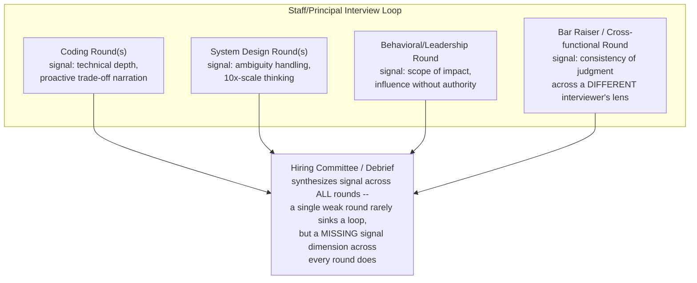
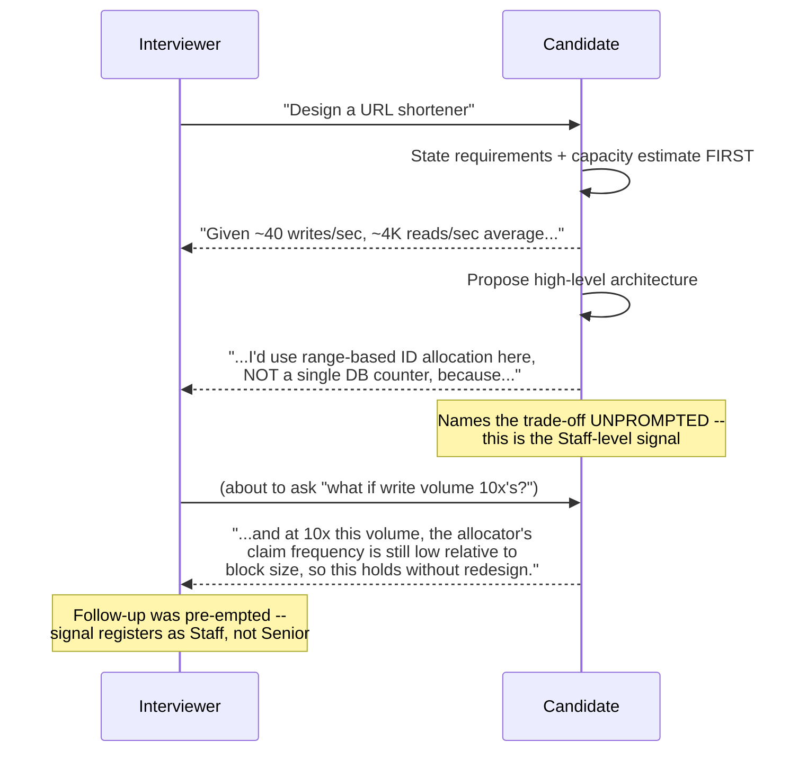
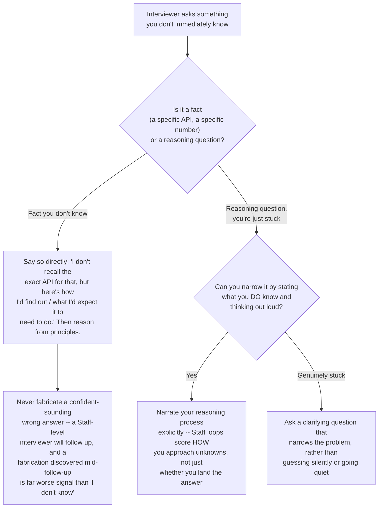
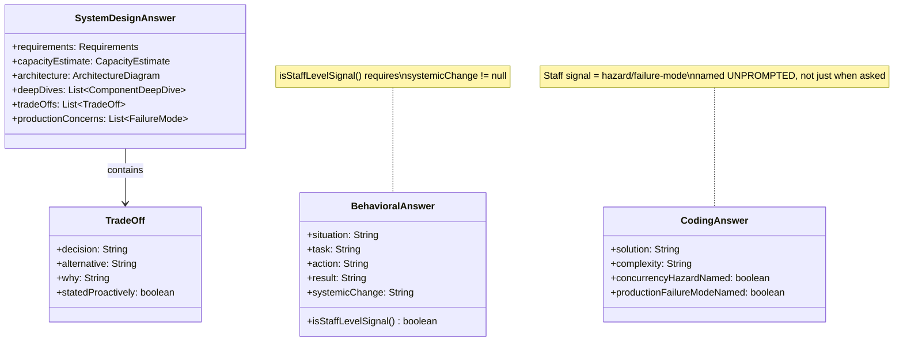

# Chapter 17.01 — Staff/Principal Engineer Interview Playbook

> A Senior Engineer with 7 years of experience walks into a Staff Engineer
> loop and answers every coding question flawlessly, every system design
> question with the right components in the right boxes — and doesn't get
> the offer. The debrief says "we didn't see Staff-level signal." This is
> the single most common outcome for strong Senior engineers interviewing up
> a level, and it isn't about knowledge gaps. It's about what the interviewer
> is actually listening for underneath the question, which is almost never
> the question on the page.

**Part:** Part 17 — Interview Preparation · **Level:** Advanced / Production
**Estimated study time:** 4-5 hours · **Status:** ✅ Complete

---

## Learning Objectives

- **Explain** the concrete behavioral differences a Staff-level interview loop is calibrated to detect, versus a Senior-level loop.
- **Apply** a repeatable framework for system design interviews that surfaces trade-offs proactively instead of waiting to be asked.
- **Answer** a curated set of rapid-fire Java/concurrency/Spring questions at the depth a Staff loop expects, with model answers.
- **Reframe** whiteboard coding answers to volunteer the follow-up an interviewer is about to ask, before they ask it.
- **Structure** behavioral answers (STAR+) to demonstrate organizational scope and influence-without-authority, not just individual technical execution.
- **Diagnose**, from a debrief or a bad interview experience, which specific signal was missing and what to change next time.
- **Design** your own 2-week interview-prep plan using this chapter's material as the backbone.

## Prerequisites

| Concept | Where it's covered | Required? |
|---|---|---|
| Core Java concurrency (locks, `BlockingQueue`, memory model basics) | Part 02 — Core Java (📝 planned, partially covered by this chapter's code samples) | Yes |
| At least one full system design case study worked end-to-end | [Chapter 12.01 — Case Study: Designing a Scalable URL Shortener](../../Part-12-System-Design/chapters/12-01-case-study-url-shortener.md) | Yes — this chapter's framework section assumes you've seen one case study executed in full |
| JVM memory/GC troubleshooting, for the "3am debugging" style questions | [Chapter 02.04 — JVM Internals: Memory Management, Garbage Collection & Performance Tuning](../../Part-02-Core-Java/chapters/02-04-jvm-internals-memory-gc.md) | Helpful |
| Kubernetes production deployment patterns, for scenario questions | [Chapter 07.02 — Workloads, Resource Management & Production Deployment Patterns](../../Part-07-Kubernetes/chapters/07-02-workloads-resource-mgmt-deployment.md) | Helpful |

## Introduction

Every level of software engineering interview asks variations of the same
three question types: coding, system design, behavioral. What changes
between Senior and Staff/Principal isn't the question format — it's the
**signal being extracted from the same format**. A Senior loop is largely
calibrated to answer "can this person execute a well-scoped technical
problem correctly and efficiently?" A Staff loop is calibrated to answer a
different question entirely: "can this person be handed an ambiguous,
under-specified problem, correctly scope it themselves, make (and defend)
the judgment calls that scoping requires, and multiply the effectiveness of
people around them while doing it?"

This distinction has concrete, actionable consequences for how you should
answer every single question in this chapter:

- A coding answer that's merely *correct* reads as Senior. A coding answer
  that proactively names the concurrency hazard, the Big-O trade-off, and
  the production failure mode of the naive alternative reads as Staff — not
  because the code is different, but because the *narration* demonstrates
  judgment the interviewer didn't have to extract with follow-up questions.
- A system design answer that draws the right boxes reads as Senior. One
  that states assumptions, quantifies them, and pre-empts the "what if this
  10x's" follow-up before being asked reads as Staff.
- A behavioral answer about "what I did" reads as Senior. One about "how I
  changed what a team of people believed or how they worked" reads as
  Staff/Principal.

This chapter is organized in three playbooks matching that structure:
rapid-fire technical Q&A, a system-design interview framework, and a
behavioral answer framework — each written to make that Senior-vs-Staff
signal difference concrete and practicable, not just named.

## Theory

### The leveling signal model

Every well-run Staff/Principal loop is, underneath its specific questions,
scoring against a small number of signal dimensions. The exact rubric
varies by company, but converges on something close to this:

| Signal dimension | Senior bar | Staff/Principal bar |
|---|---|---|
| **Technical depth** | Solves the stated problem correctly | Solves it, then identifies the next three problems that arise from the solution at 10x scale, unprompted |
| **Ambiguity handling** | Asks clarifying questions when the prompt is ambiguous | *Also* states the assumption they'd make and proceeds, rather than stalling — because a Staff engineer in production doesn't always get to ask |
| **Trade-off articulation** | Can explain a trade-off when asked | States the trade-off before being asked, as part of proposing the design |
| **Scope of impact (behavioral)** | "I fixed X" | "I changed how the team approaches X, and it's still the standard 18 months later" |
| **Influence without authority** | Works well within their reporting structure | Can describe getting buy-in from a peer team or a skeptical stakeholder with no direct authority over them |
| **Failure ownership** | Describes a mistake and the fix | Describes a mistake, the fix, *and* the systemic change that prevents the class of mistake, not just the instance |

The rest of this chapter is built to help you produce answers that hit the
right-hand column, not just the left.

### Why "rapid-fire" questions are still a depth signal

Staff loops often include a fast-paced Q&A round precisely because it's
efficient at separating "has memorized the answer" from "understands the
mechanism well enough to reconstruct the answer under time pressure and
extend it to a variant." The goal in this chapter's rapid-fire bank isn't
memorization — it's understanding each answer well enough that a follow-up
variant ("what if it were a `TreeMap` instead of a `HashMap`?") doesn't
break you.

## Internal Working

### The STAR+ framework for behavioral answers

Standard STAR (Situation, Task, Action, Result) is necessary but
insufficient at Staff level — it stops at "what happened," which reads as
Senior-level individual execution. **STAR+** adds a fifth element:

- **Situation** — context, stated concisely (2-3 sentences max; interviewers
  penalize rambling setup more than they reward thoroughness here).
- **Task** — what needed to happen, and critically, *whose* problem it was
  (yours alone, or a team/org problem you stepped into).
- **Action** — what *you specifically* did — first person, not "we."
- **Result** — quantified where possible (latency, cost, incident
  frequency, team velocity).
- **+ (the Staff-level addition) — Systemic change**: what changed
  *beyond* the immediate result — a new default, a new review gate, a
  changed team norm, a pattern adopted elsewhere. This is the single
  highest-leverage addition to a Senior engineer's existing behavioral
  answers, because it's usually already true (most Senior engineers *do*
  leave some lasting change behind an incident) — it's just not being
  said.

### The system design interview framework

A structure that proactively surfaces trade-offs, mapped onto how Chapter
12.01 was actually built:

1. **Requirements** (functional + non-functional) — state them, and
   explicitly name what's out of scope, rather than silently ignoring it.
2. **Capacity estimation** — derive concrete numbers; use them to justify
   every later decision.
3. **High-level architecture** — the boxes-and-arrows diagram, narrated.
4. **Deep dive** on the 1-2 components with the most real difficulty — not
   uniform depth everywhere; this is where "10x scale" and "what if this
   component fails" questions should be pre-empted, not just answered when
   raised.
5. **Trade-offs table** — explicit, comparative, for every non-obvious
   decision.
6. **Production concerns** — deployment, monitoring, and at least one named
   failure mode with a mitigation.

This is the exact structure Chapter 12.01 follows section-by-section — if
you haven't worked through that chapter yet, do so before attempting Lab 3
below.

## Architecture

How a Staff-level interview loop typically composes its signal-gathering
across rounds — useful context for pacing your own preparation:



## Sequence Diagrams (Mermaid)

How a Staff-level candidate should narrate proposing and defending a design
decision — proactive, not reactive, to the trade-off question:



## Flow Charts (Mermaid)

A decision tree for triaging what to say when you don't immediately know an
answer — itself a tested behavior in Staff loops:



## Class Diagrams (Mermaid)

Modeling the STAR+ framework's structure as a "class diagram" — the
equivalent structural artifact for this chapter's domain:



## Production Examples

A real (anonymized/composited) Staff Engineer loop debrief, illustrating
the Senior-vs-Staff signal gap in practice:

```text
Candidate: 8 years experience, strong Senior-level performer at current company
Loop: Coding (2 rounds), System Design (1 round), Behavioral (1 round)

Coding Round 1 feedback: "Solved both problems correctly and efficiently.
  Did not proactively discuss complexity trade-offs or edge cases beyond
  what was asked. SENIOR-LEVEL SIGNAL."

System Design feedback: "Produced a correct, reasonably scaled design.
  When asked 'what happens at 10x this traffic,' took a moment to
  re-derive the bottleneck rather than having already flagged it as part
  of the original proposal. Trade-offs were sound when asked directly,
  not volunteered. SENIOR-LEVEL SIGNAL, borderline."

Behavioral feedback: "Described leading a migration project competently.
  All examples were framed as 'I did X, I fixed Y' -- did not describe
  any change in team practice, tooling, or norms that persisted after
  the immediate task. Could not clearly articulate influencing a team
  outside direct reporting line. SENIOR-LEVEL SIGNAL."

Committee outcome: Strong Senior hire signal across the board. NO
STAFF-LEVEL SIGNAL in any round -- not because of a mistake, but because
of an absence: nothing in the loop demonstrated organizational-scope
impact or proactive 10x-scale thinking. Recommendation: hire at Senior,
not Staff.
```

This is the composite pattern this entire chapter is built to prevent —
notice that nothing in the debrief describes an error. The candidate was
good. The gap was entirely about what was left unsaid.

## Code Examples

Three classic whiteboard coding problems, implemented at the depth and with
the proactive framing described in Theory — not just "correct," but
narrated the way a Staff-level answer should be. Full compiling code lives
at [`code-samples/coding-drills/`](../code-samples/coding-drills/):

```bash
cd Part-17-Interview/code-samples/coding-drills
mvn -q compile   # compiles cleanly against Java 21
mvn -q test      # JUnit 5 tests, including real concurrency tests, all passing
```

**"Design a rate limiter"** (`TokenBucketRateLimiter`) — a Senior-level
answer implements token bucket correctly. A Staff-level answer *also*
volunteers why it's lock-based rather than CAS-looped, unprompted:

```java
public boolean tryAcquire(long nowNanos) {
    synchronized (lock) {
        refill(nowNanos);
        if (availableTokens >= 1.0) {
            availableTokens -= 1.0;
            return true;
        }
        return false;
    }
}
```
*The narration to say out loud:* "I'm using a single lock around
refill-and-consume rather than a lock-free CAS loop, because the two steps
need to be observed atomically together — otherwise two racing threads
could each read the same pre-refill token count and both decide 'allowed'
when only one token was actually available."

**"Design an immutable value object"** (`ImmutableMoney`) — the
Staff-level answer proactively names the `BigDecimal` scale-vs-value
equality trap before being asked:

```java
@Override
public boolean equals(Object o) {
    // ...
    // compareTo, not equals, on BigDecimal: BigDecimal.equals() treats
    // 2.0 and 2.00 as UNEQUAL (differing scale) -- a well-known trap.
    return this.amount.compareTo(other.amount) == 0 && this.currency.equals(other.currency);
}
```

**"Design a producer-consumer queue with graceful shutdown"**
(`PoisonPillWorkQueue`) — the Staff-level answer names *why* a boolean flag
doesn't work before proposing the poison-pill fix, rather than jumping
straight to the fix:

```java
// A consumer blocked in queue.take() cannot be told "stop" by simply
// setting a boolean flag, because it's parked and not polling anything.
// The standard fix: a sentinel ("poison pill") value that tells the
// consumer to exit its loop instead of processing it as real work.
```

## Best Practices

| Do | Don't | Why |
|---|---|---|
| State assumptions and capacity numbers before designing anything | Jump straight into architecture | Ungrounded design decisions can't be evaluated or defended when pushed on |
| Volunteer the trade-off/hazard/failure-mode before being asked | Wait for the interviewer to ask "but what about..." | Proactive articulation is the single highest-leverage Senior-vs-Staff signal difference in this chapter's framework |
| Quantify behavioral answer results, and name the systemic change (STAR+) | Stop at STAR's "Result" | "I fixed it" reads as Senior execution; "and it's still the team default 18 months later" reads as Staff-level lasting impact |
| Say "I don't know, here's how I'd find out" when genuinely stuck on a fact | Fabricate a confident-sounding guess | A wrong guess discovered under follow-up is far worse signal than an honest gap |
| Practice out loud, not just in your head | Rehearse answers silently | Verbal fluency under time pressure is itself part of what's being evaluated — silent rehearsal doesn't train it |
| Prepare 2-3 behavioral stories that each cover MULTIPLE competencies (conflict, failure, influence) | Prepare one story per possible question | A loop asks many behavioral variants; flexible, multi-angle stories scale better than a large brittle library |

## Common Mistakes

| Mistake | Why it happens | How to fix it |
|---|---|---|
| Treating a Staff loop like "a harder version of the same Senior questions" | The question formats genuinely look identical | Recognize the signal being extracted is different (organizational scope, proactive judgment) even when the surface question is the same |
| Only mentioning trade-offs when directly asked | Feels safer to answer only what's asked | Practice narrating trade-offs as part of the initial proposal, not as a reactive add-on |
| Behavioral answers with no quantified result or systemic change | STAR alone feels "complete" | Explicitly add the "+ " — ask yourself "what changed that outlasted the immediate task" for every prepared story |
| Over-preparing memorized answers to exact expected questions | Feels like the safest prep strategy | Staff loops probe variants and follow-ups specifically to detect memorization without understanding — prepare mechanisms, not scripts |
| Going silent when stuck instead of narrating the reasoning attempt | Fear that "thinking out loud" reveals uncertainty | The reasoning process IS the signal at this level — silence gives the interviewer nothing to evaluate |
| Describing only individual technical execution in behavioral rounds | Genuinely the most concrete, easiest-to-verify thing to talk about | Staff loops specifically weight influence-without-authority and organizational impact — under-indexing on individual execution stories is often necessary, not just helpful |

## Performance Considerations

- **Time-boxing your own answers matters as much as their content** — a
  technically excellent system design answer that leaves no time for the
  deep-dive section or trade-offs table reads worse than a slightly less
  polished one that reaches every section of the framework; practice
  pacing against a clock, not just content accuracy.
- **Proactive trade-off narration has a real time cost per answer** — this
  is a genuine trade-off in interview performance itself: spending 30
  seconds volunteering a trade-off is time not spent elsewhere in a
  time-boxed round. Practice identifying the 1-2 highest-value trade-offs
  to volunteer per section rather than narrating everything, which reads
  as unfocused rather than thorough.
- **Rapid-fire question banks reward pattern recognition speed** — the
  practical training method is timed repetition (Lab 2), since real
  interview pacing rarely allows the leisurely reasoning-from-scratch pace
  available during initial study.

## Security Considerations

- **Behavioral answers about past incidents may involve real confidential
  or sensitive information** — practice a genericized version of any
  incident story that preserves the technical/leadership substance while
  removing anything covered by a former employer's confidentiality
  obligations; this is itself a signal of judgment, not just a legal
  formality.
- **Technical answers to security-adjacent questions** (e.g., "design an
  auth system," "design a rate limiter" as an abuse-prevention control, as
  in Chapter 12.01's rate-limiting discussion) should explicitly name the
  security angle even when the prompt is framed as a pure scalability
  problem — a Staff-level candidate is expected to volunteer the security
  dimension of a design unprompted, mirroring this chapter's core
  "proactive trade-off" theme applied specifically to security.

## Production Troubleshooting

Reframed for this chapter's domain: diagnosing what went wrong in an
interview loop or a debrief, and what to change.

| Symptom | Root Cause | Diagnosis | Fix |
|---|---|---|---|
| Debrief says "strong technically, no Staff signal" across every round | Trade-offs and 10x-scale thinking only surfaced when directly asked, never volunteered | Review your own answers (record a mock interview) for how often you say "one trade-off here is..." unprompted | Explicitly practice volunteering 1-2 trade-offs per section of every framework answer, timed |
| Behavioral round feedback: "couldn't articulate organizational impact" | Prepared stories were all individual-execution-framed | Check whether any prepared story has a "+"(systemic change) component at all | Rewrite 2-3 core stories explicitly adding the systemic-change element, even if it requires reaching further back for a real example |
| System design round: correct design, but ran out of time before trade-offs/production sections | No time-boxing practice; spent too long on requirements/architecture | Time a mock run against the 6-step framework in Internal Working | Practice with a visible timer; aim for a fixed rough time budget per section |
| Coding round: correct solution, interviewer had to extract every follow-up | Solution presented as "done" without narrating hazards/complexity | Compare your talk-track against this chapter's Code Examples' "narration to say out loud" callouts | Practice narrating a completed solution's hazards/trade-offs immediately after finishing it, before the interviewer has to ask |
| Freezing or going silent when a question's answer isn't immediately known | No practiced strategy for genuine uncertainty | Review the Flow Chart in this chapter — was the situation a fact-gap or a reasoning-gap? | Practice the specific verbal patterns ("I don't recall the exact API, but here's how I'd expect it to behave...") until they're automatic under pressure |

## Interview Questions

**Java & Concurrency rapid-fire (with model answers):**

1. **"What's the difference between `synchronized` and `ReentrantLock`?"**
   *Model answer:* `synchronized` is a JVM-managed intrinsic lock —
   simpler, automatically released on exception/scope exit, but inflexible
   (no tryLock, no fairness policy, no interruptible acquisition).
   `ReentrantLock` is an explicit API offering `tryLock()` (non-blocking
   attempt), `lockInterruptibly()`, configurable fairness, and multiple
   `Condition` objects per lock — reach for it when you need one of those
   specific capabilities, not by default.

2. **"Why is `String` immutable in Java, and what does that buy you?"**
   *Model answer:* Enables safe sharing across threads with no
   synchronization, safe use as a `HashMap` key (hashcode can be cached
   since it never changes), and the string pool/interning optimization
   (`String` literals can be safely shared since no code can mutate one out
   from under another reference).

3. **"Explain the Java Memory Model's `happens-before` relationship."**
   *Model answer:* It's the formal guarantee for when one thread's writes
   are guaranteed visible to another thread's reads — without an explicit
   happens-before edge (via `synchronized`, `volatile`, thread
   start/join, or higher-level concurrency utilities), the compiler/JIT/CPU
   are free to reorder or cache values such that a write in one thread may
   never become visible to another, even if it "looks" sequential in
   source order.

4. **"What's the difference between `volatile` and `AtomicInteger`?"**
   *Model answer:* `volatile` guarantees visibility (a write is always
   visible to subsequent reads) and prevents reordering around it, but does
   NOT make compound operations (like increment) atomic — `volatile int
   x; x++;` is still a race. `AtomicInteger` adds actual atomicity for
   compound read-modify-write operations via CAS.

5. **"When would you choose `CompletableFuture` over a raw `ExecutorService` submission?"**
   *Model answer:* When you need to compose asynchronous operations
   (chaining, combining multiple futures, exception handling pipelines)
   declaratively — `CompletableFuture` provides `thenApply`/`thenCompose`/
   `exceptionally` composition; a raw `Future` from `ExecutorService.submit`
   only gives you a blocking `get()`, with no composition support.

6. **"Why does `HashMap` (not `Hashtable` or `ConcurrentHashMap`) break under concurrent modification, concretely?"**
   *Model answer:* Concurrent structural modification (resize during
   rehashing) can corrupt the internal bucket linked-list/tree structure —
   classically, pre-Java-8 this could even produce an infinite loop during
   resize under concurrent `put()`s. `ConcurrentHashMap` uses
   finer-grained synchronization (segment/bucket-level in older versions,
   CAS + synchronized bins in modern versions) specifically engineered to
   avoid this.

**System Design rapid-fire:**

7. **"How do you decide between SQL and NoSQL for a given design?"**
   *Model answer:* Start from access patterns and consistency needs, not
   a general preference — strong relational integrity, joins, and ACID
   transactions favor SQL; extreme write scale, flexible/evolving schema,
   or a data model that's naturally denormalized (documents, wide-column)
   favor NoSQL. State the specific access pattern driving the choice,
   don't just assert a default.

8. **"What's the difference between horizontal and vertical scaling, and when does each stop working?"**
   *Model answer:* Vertical (bigger machine) is simpler but hits a hard
   ceiling (largest available instance) and doesn't improve availability;
   horizontal (more machines) scales further but requires the workload to
   actually be partitionable/stateless and introduces distributed-systems
   complexity (coordination, partial failure) that vertical scaling
   avoids entirely.

**Behavioral (STAR+ prompts to prepare for, not questions with fixed answers):**

9. **"Tell me about a time you influenced a decision outside your direct team."**
   *What a Staff-level answer needs:* A concrete stakeholder outside your
   reporting line, the specific mechanism of influence (data, a
   prototype, a design doc, a well-timed escalation), and — critically —
   what changed as a result that you didn't have direct authority to
   mandate.

10. **"Tell me about your biggest technical mistake and what you learned."**
    *What a Staff-level answer needs:* Own the mistake specifically and
    concretely (not vaguely), then go past "I learned to be more careful"
    to the systemic change — a new check, a new default, a changed
    process — that makes the *class* of mistake less likely for the whole
    team, not just for you personally next time.

## Hands-on Exercises

### Lab 1 (Beginner)

**Goal:** Diagnose the Senior-vs-Staff gap in your own existing answers.

**Setup:** Pick 2 behavioral stories and 1 system design answer you'd
currently give in an interview (write them out, or record yourself).

**Task:** Score each against the Theory section's signal-dimension table.
For the behavioral stories, explicitly check: is there a "+"
(systemic-change) component? For the design answer: are any trade-offs
stated proactively, or only reactively?

**Verification:** For each answer, you can point to a specific sentence (or
its absence) that would register as Senior- vs. Staff-level signal per this
chapter's framework — vague self-assessment ("I think it's pretty good")
doesn't count as complete.

### Lab 2 (Intermediate)

**Goal:** Build timed fluency on the rapid-fire question bank.

**Setup:** This chapter's Interview Questions section (or extend it with
your own variants).

**Task:** Set a 60-second timer per question. Answer out loud (not
silently), covering the mechanism, not just the conclusion (e.g., for
Q3 on happens-before, don't just say "you need synchronization" — explain
what breaks without it). Record yourself and review afterward for where you
paused, hedged, or went silent.

**Verification:** After 3 practice passes through the same question set,
your average time-to-first-word should measurably decrease, and you should
be able to identify at least one moment across the passes where you caught
yourself about to give a memorized-but-shallow answer and self-corrected to
explain the underlying mechanism instead.

### Lab 3 (Advanced)

**Goal:** Run a full mock system design interview against the framework in
Internal Working, using Chapter 12.01 as your reference depth bar.

**Setup:** Pick a system design prompt you have NOT already deeply prepared
(not the URL shortener from Chapter 12.01 — pick a genuinely new one, e.g.
"design a notification service" or "design a parking garage system").

**Task:** Time-box yourself to 45 minutes. Work through all 6 framework
steps (Requirements → Capacity → Architecture → Deep Dive → Trade-offs →
Production Concerns), narrating out loud as if an interviewer were present,
proactively stating at least 3 trade-offs before any point where you'd
expect to be asked about them.

**Verification:** Compare your output's structure section-by-section
against Chapter 12.01's actual chapter structure — every one of the 6
framework steps should be identifiably present in your mock answer, not
just architecture. If any step is missing or rushed, that's your specific
prep gap to close next.

### Lab 4 (Production)

**Goal:** Turn a real past incident or project into a STAR+ behavioral
story, mirroring the composite debrief in Production Examples.

**Setup:** Pick a real technical incident or project from your own
experience — ideally one where you already have a "what I did" story
prepared.

**Task:** Rewrite it explicitly through the STAR+ lens: keep Situation/Task/
Action/Result tight (2-4 sentences each), then spend genuine effort on the
"+": what changed *beyond* the immediate fix — a new runbook, a new
default configuration adopted team-wide, a review gate added, a pattern
that spread to another team. If you genuinely can't identify a systemic
change for this story, that itself is useful signal — pick a different
story, or be honest in the interview that the impact was scoped to the
immediate fix (better than fabricating a systemic change that didn't
happen).

**Verification:** Your rewritten story has an explicit, factual "+"
sentence that would survive a skeptical follow-up question ("how do you
know it's still the standard?") — not a vague claim of lasting impact.

## Summary

- Staff/Principal interview loops ask **the same question formats** as
  Senior loops (coding, system design, behavioral) but extract a
  **different signal**: proactive judgment and organizational-scope
  impact, not just correct individual execution.
- The single highest-leverage change for a strong Senior engineer moving
  up a level is **volunteering trade-offs, hazards, and 10x-scale
  implications before being asked**, not after.
- **STAR+** extends standard STAR with a systemic-change element — what
  changed beyond the immediate result — which is the concrete,
  practicable difference between a Senior-reading and Staff-reading
  behavioral answer.
- The **6-step system design framework** (Requirements → Capacity →
  Architecture → Deep Dive → Trade-offs → Production Concerns) is the
  structure Chapter 12.01 demonstrates in full — use it as your rehearsal
  template.
- When genuinely stuck, **narrate your reasoning process rather than
  going silent** — the reasoning process is itself the signal being
  evaluated at this level, and silence gives an interviewer nothing to
  score.
- **Never fabricate a confident wrong answer** — an honest "I don't know,
  here's how I'd find out" reads far better under follow-up than a
  guess that unravels.
- A debrief showing "strong technically, no Staff signal across every
  round" is almost always an **absence problem** (nothing demonstrated
  organizational scope or proactive judgment), not a competence problem —
  diagnose and fix accordingly, per the Production Troubleshooting table.

## Further Reading

- *The Staff Engineer's Path* (Tanya Reilly, O'Reilly) — the definitive
  treatment of what "Staff" actually means organizationally, underpinning
  this chapter's signal-dimension framework.
- *Staff Engineer: Leadership Beyond the Management Track* (Will
  Larson) — a structured survey of Staff-plus archetypes and scope, useful
  for calibrating which kind of Staff-level impact best matches your own
  career narrative for behavioral prep.
- [Chapter 12.01 — Case Study: Designing a Scalable URL Shortener](../../Part-12-System-Design/chapters/12-01-case-study-url-shortener.md) — the reference execution of this chapter's 6-step system design framework at full depth.
- [Chapter 02.04 — JVM Internals: Memory Management, Garbage Collection & Performance Tuning](../../Part-02-Core-Java/chapters/02-04-jvm-internals-memory-gc.md) — a strong source of "3am debugging" scenario-question material relevant to this chapter's rapid-fire and behavioral prep alike.
- **"Ask a Manager" / leveling-calibration blog posts from FAANG-adjacent engineering blogs** — useful for cross-checking company-specific leveling rubrics against this chapter's generalized signal-dimension model, since exact rubrics vary by company even where the underlying signal doesn't.
