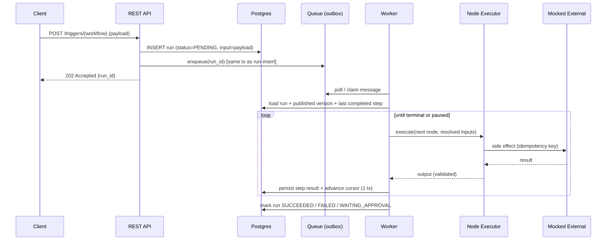

[← Relay README](README.md) · [Next: Data Model →](02-Data-Model.md)

# 1. Architecture

## 1.1 Components

Relay separates a **control plane** (authoring, triggering, observing) from a **data plane**
(durable execution of runs). This split is what keeps the engine correct and scalable.

| Layer | Component | Responsibility |
|-------|-----------|----------------|
| **Control plane** | **REST API** (Spring Boot) | Workflow CRUD + publish, triggers, approvals, run/trace queries |
| | **Console** | Web UI to watch runs, inspect traces, approve/reject |
| **Persistence** | **PostgreSQL** | Source of truth for definitions, runs, steps, approvals, traces; also the initial queue (outbox) |
| **Data plane** | **Durable queue** | Ordered, at-least-once delivery of "advance this run" messages |
| | **Worker pool** | Pulls work, drives the **step state machine**, persists after each step |
| | **Node executors** | Execute a single node: deterministic or AI |
| **Externals (mocked)** | **HTTP adapter** | Deterministic outbound calls (mocked world) |
| | **LLM provider adapter** | AI node calls (mocked, pluggable, LangChain/LangGraph-compatible) |

## 1.2 Request-to-execution flow

**Key property:** the run insert and its queue message are written in **one transaction**
(transactional outbox), so a run is never "started but unqueued" or "queued but unrecorded."

## 1.3 Control plane vs data plane (why it matters)

- The **API** must stay fast and available; it only reads/writes definitions and enqueues work —
  it never blocks on execution.
- The **workers** own execution and can scale horizontally and crash safely, because all state is
  in Postgres and each message is idempotently processed.
- This mirrors mature systems (and is a great interview talking point): *separate the thing that
  accepts work from the thing that performs it.*

## 1.4 Execution model: step-by-step, resumable

A run is a cursor walking a **DAG/sequence of nodes** from the published version. After **each**
node completes, the worker writes the step result and advances the cursor **in the same
transaction**. If the worker dies mid-node:

- Work not committed → the queue redelivers → the next worker recomputes that node. Because the
  node's side effect used an **idempotency key**, the external world isn't double-acted.
- Work committed → the cursor already advanced → the next worker continues from the next node.

This gives **at-least-once execution with exactly-once side effects** (see
[Guardrails](06-Guardrails-and-Security.md) and [Hard Problems](10-Hard-Problems.md)).

## 1.5 Scaling path (deliberately staged)

| Stage | Queue | When |
|-------|-------|------|
| v1 | **DB outbox table** + `SELECT ... FOR UPDATE SKIP LOCKED` poller | Capstone / low volume; simplest correct thing |
| v2 | **Kafka or RabbitMQ** | Only when throughput/latency needs exceed a single Postgres |

Starting with the DB outbox keeps the whole system in one transactional store (no dual-write
problem) and is trivial to reason about; the queue is an interface so swapping it later is local.

## 1.6 Technology choices & rationale

- **Java 21 / Spring Boot 3** — author's depth; mature transactions, scheduling, testing.
- **PostgreSQL** — ACID transactions are the backbone of exactly-once; `SKIP LOCKED` gives a
  competent queue for free; JSONB stores flexible node configs/inputs/outputs.
- **Adapters for externals** — HTTP and LLM behind interfaces; mocked implementations for the
  capstone make the whole system deterministic and testable.
- **JSON Schema** — validates AI output shape *before* any downstream node consumes it.

---

**Next → [2. Data Model](02-Data-Model.md)**
