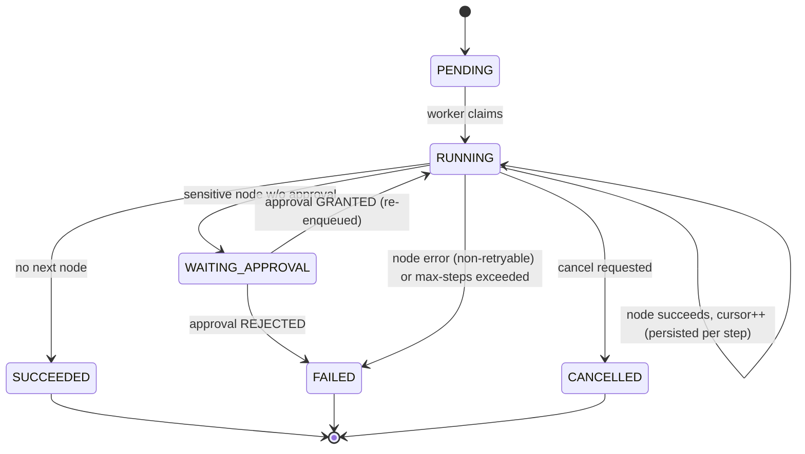

[← API Design](03-API-Design.md) · [Relay README](README.md) · [Next: Node Executors →](05-Node-Executors.md)

# 4. Execution Engine

The durable core. A **queue** feeds a **worker loop** that drives each run through a **step state
machine**, persisting after every step so a crash never loses or duplicates work.

## 4.1 The durable queue (v1: transactional outbox)

- When a run is created (trigger) or resumed (approval), we insert an `outbox` row **in the same
  transaction** as the state change. No dual-write, no lost/orphaned messages.
- Workers claim work with `SELECT ... FOR UPDATE SKIP LOCKED`, so many workers pull disjoint rows
  without blocking each other:

```sql
-- claim one ready run
UPDATE outbox SET status='DONE', locked_by=:worker, locked_at=now()
WHERE id = (
  SELECT id FROM outbox
  WHERE status='READY' AND available_at <= now()
  ORDER BY id
  FOR UPDATE SKIP LOCKED
  LIMIT 1
)
RETURNING run_id;
```

- `available_at` supports **delay nodes** and **retry backoff** (enqueue with a future time).
- Swapping to **Kafka/RabbitMQ** later means reimplementing this one interface; the state machine
  is unchanged.

## 4.2 The worker loop

```
loop:
  runId = queue.claim()            # SKIP LOCKED, at-least-once
  if none: sleep(backoff); continue
  run = load(runId)                # run + published version + last step
  advance(run)                     # drive the state machine (below)
```

`advance(run)` executes nodes until the run reaches a **yield point** — terminal (SUCCEEDED/
FAILED), **WAITING_APPROVAL**, or a **delay** — re-enqueuing itself when it should continue later.

## 4.3 Step state machine



**The critical transaction** — for each node the worker does, in **one DB transaction**:
1. Insert/So-update the `steps` row (`RUNNING` → result).
2. Write any `side_effects` ledger row(s) the node produced.
3. Advance `runs.step_cursor`, bump `runs.step_count`, update `runs.status`.
4. Append `traces`.

Because 1–4 commit atomically, the run's persisted cursor and the recorded work never disagree.

## 4.4 Crash recovery (resume from last completed step)

- Worker dies **before** committing the node's transaction → nothing advanced. The `outbox` lock
  lease expires (a reaper resets `locked_*` after a timeout back to `READY`), the message is
  redelivered, and another worker recomputes that node. The node's **idempotency key** makes the
  external side effect a no-op the second time (see [Node Executors](05-Node-Executors.md)).
- Worker dies **after** committing → cursor already advanced; the redelivered message simply
  continues from the next node.

Net effect: **at-least-once execution, exactly-once side effects.** No run restarts from scratch.

## 4.5 Pause & resume (approval gates)

- Reaching a sensitive node with no `GRANTED` approval: the worker creates a `PENDING` approval,
  sets `runs.status=WAITING_APPROVAL`, and **stops** (no re-enqueue). The run is now parked.
- `POST /approvals/{id}/grant` records the decision and inserts an `outbox` row for the run in the
  **same transaction**. A worker picks it up, re-checks the gate is satisfied, and continues.
- Pause/resume is enforced **by the engine**, structurally — never by asking the AI to wait. Keeping
  this correct across many concurrent runs is one of the [hard problems](10-Hard-Problems.md).

## 4.6 Retries, delays, and failure policy

- **Deterministic transient errors** (e.g., mocked HTTP 503): retry with exponential backoff by
  re-enqueuing with a future `available_at`, up to a per-node max; then mark the step FAILED.
- **Delay nodes**: yield and re-enqueue at `now + delay`.
- **Non-retryable errors / validation failures**: run → FAILED with the error captured on the step
  and trace.
- **Max steps**: before executing a node, if `runs.step_count >= MAX_STEPS`, fail the run
  (runaway-loop guardrail — see [Guardrails](06-Guardrails-and-Security.md)).

## 4.7 Concurrency & correctness notes

- A run is processed by **one worker at a time** — guaranteed by the `SKIP LOCKED` claim plus the
  per-step transaction; two workers cannot advance the same run's cursor concurrently.
- All decisions read committed state; the cursor is the single source of "where are we."
- Idempotency + single-writer-per-run + atomic step commit together give the exactly-once story.

---

**Next → [5. Node Executors](05-Node-Executors.md)**
