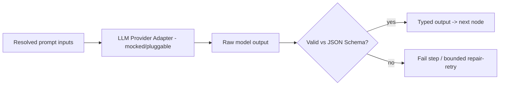

[← Execution Engine](04-Execution-Engine.md) · [Relay README](README.md) · [Next: Guardrails & Security →](06-Guardrails-and-Security.md)

# 5. Node Executors

A **node executor** runs a single node given its resolved inputs and returns an output. Executors
are a **Strategy** family behind one interface; the engine never special-cases node types.

```java
public interface NodeExecutor {
    String type();                                  // "http_request", "condition", "ai", ...
    NodeResult execute(NodeContext ctx);            // resolved inputs, idempotency key, trace sink
}
```

`NodeContext` provides: the node config, inputs resolved from prior step outputs, a stable
**idempotency key** (`run_id:node_id:attempt_key`), and a trace sink. A `NodeExecutorRegistry`
maps `type` → executor (Factory), so adding a node type is a new class, nothing else.

## 5.1 Deterministic nodes

| Type | Does | Side-effecting? |
|------|------|-----------------|
| `http_request` | Calls the (mocked) HTTP adapter | **Yes** — carries idempotency key |
| `condition` | Evaluates a boolean expression, picks `onTrue`/`onFalse` branch | No |
| `delay` | Yields; re-enqueues run at `now + duration` | No |
| `notify` | Sends a (mocked) notification | **Yes** — idempotency key |

- **Template resolution:** config values like `{{fetch_order.amount}}` resolve against earlier
  step outputs and the run input before execution. Resolution is pure and **unit-tested**
  (missing key → typed error, not a silent blank).
- **Side-effecting nodes** always go through the idempotency path (§5.4).

## 5.2 The AI node (different, and treated with suspicion)

The AI node calls an LLM via a **provider adapter**, then its output is **validated against a JSON
Schema before anything downstream can touch it**.



- **Provider adapter interface** (LangChain/LangGraph-compatible), mocked for the capstone so runs
  are deterministic and testable; real providers (OpenAI/Anthropic/Azure) drop in later.

```java
public interface LlmProvider {
    LlmResponse complete(LlmRequest req);           // prompt, params -> text + token usage
}
```

- **Schema enforcement:** each AI node declares an `outputSchema` (JSON Schema). The raw response
  is parsed and validated; **only validated, typed output flows downstream.** Invalid output →
  step fails (optionally one bounded "repair" retry with the validation error fed back). Schema
  enforcement is a **tested unit**.
- **Token usage** is captured into the trace for every AI call.
- **Trust boundary:** the AI node produces *data*, never *control*. It cannot approve a gate,
  raise the step cap, or trigger a side effect directly — those are engine decisions
  (see [Guardrails](06-Guardrails-and-Security.md)).

## 5.3 Node input handling & prompt-injection safety

- Inputs to the AI node are treated as **untrusted data**: they are passed as clearly delimited
  content, never concatenated into instruction context in a way that lets a payload rewrite the
  system prompt.
- Downstream behavior depends **only on schema-validated fields**, so an injected instruction in
  free text can't change which branch runs or bypass an approval.

## 5.4 Idempotency for side-effecting nodes

Every side-effecting call is wrapped so it executes **at most once**, even across retries/crashes:

```
key = idempotencyKey(run_id, node_id, attempt_key)   # deterministic per logical action
INSERT INTO side_effects(run_id, node_id, attempt_key, ...) VALUES (...)
   ON CONFLICT (run_id, node_id, attempt_key) DO NOTHING;
if inserted:
    result = adapter.call(...)          # actually perform the effect (mocked world)
    UPDATE side_effects SET result=... WHERE key=...
else:
    result = SELECT result FROM side_effects WHERE key=...   # replay prior result, no re-call
```

The unique constraint on `(run_id, node_id, attempt_key)` is the hard guarantee: a redelivered
message finds the row already present and **replays the stored result instead of re-calling** the
external world (see [Hard Problems §1](10-Hard-Problems.md)).

## 5.5 Adding a new node type

1. Implement `NodeExecutor` (declare `type()`), register it.
2. If side-effecting, use the idempotency wrapper.
3. Add definition-validation rules for its config (checked at publish).
4. Add unit tests (happy path, missing input, retry/idempotency if applicable).

---

**Next → [6. Guardrails & Security](06-Guardrails-and-Security.md)**
