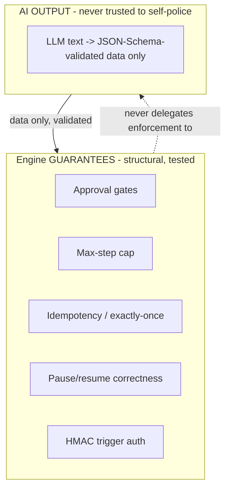

[← Node Executors](05-Node-Executors.md) · [Relay README](README.md) · [Next: Tracing & Console →](07-Tracing-and-Console.md)

# 6. Guardrails & Security

The core belief: **the engine guarantees safety structurally; the AI is never trusted to police
itself.** Every guardrail below is enforced in engine code or the database, not in a prompt.

## 6.1 Idempotency (exactly-once side effects)

- Every side-effecting call carries an **idempotency key**; a unique DB constraint on
  `side_effects(run_id, node_id, attempt_key)` makes the effect execute **at most once**.
- On retry/crash-redelivery the ledger row already exists, so the stored result is replayed rather
  than the call being repeated. (Mechanism in [Node Executors §5.4](05-Node-Executors.md).)
- **No exceptions:** *every* side-effecting node goes through this path.

## 6.2 Max-step cap (runaway-loop protection)

- `runs.step_count` increments per node; before executing a node the engine checks
  `step_count < MAX_STEPS` and fails the run otherwise.
- **v1: a hard engine constant, not author-configurable.** "A guardrail you can turn off isn't a
  guardrail." (Making it per-workflow configurable is a deliberate later decision, with a ceiling.)

## 6.3 Approval gates (hard blocks on sensitive actions)

- Nodes marked `sensitive: true` (e.g., "place an order") are **hard-blocked** without a
  `GRANTED` approval record on file.
- The gate is enforced in the **engine's** step evaluation, not by convention and never by asking
  the AI prompt to enforce it. Flow: reach sensitive node → create `PENDING` approval → park run
  (`WAITING_APPROVAL`) → human grants/rejects via API/console → engine re-checks and resumes.
- Rejection transitions the run to FAILED/CANCELLED; the sensitive side effect never fired.

## 6.4 Webhook authenticity (HMAC)

- Each workflow has a **secret**. Webhook triggers must send
  `X-Relay-Signature: sha256=HMAC(secret, rawBody)`.
- The server recomputes the HMAC over the **raw** request bytes and compares in **constant time**;
  mismatch → `401`. This stops forged triggers.
- Secrets are stored hashed/encrypted at rest; rotation supported by allowing a secondary secret
  during a rotation window.

## 6.5 Prompt-injection & untrusted input handling

- AI-node inputs are **untrusted data**, passed as clearly delimited content, never spliced into
  instruction context in a way that could rewrite the system prompt.
- **Control flow depends only on schema-validated fields**, so injected free-text instructions
  cannot change branching, bypass an approval, or trigger a side effect.
- The AI produces *data*, not *authority*: it can never approve a gate, raise the step cap, or call
  an external system directly.

## 6.6 The trust boundary (the most important line)

Everything in the left box is enforced by code/DB constraints and covered by tests. The AI feeds
**validated data** in; it never receives enforcement responsibility.

## 6.7 Other hardening (v1 scope notes)

- **Least-privilege mock adapters**: the mocked external world can't reach real systems.
- **Input size / rate limits** on triggers to bound abuse.
- **PII in traces**: redact/limit sensitive fields captured in traces.
- **API auth** (bearer token) is a natural v2 addition beyond the webhook HMAC.

---

**Next → [7. Tracing & Console](07-Tracing-and-Console.md)**
