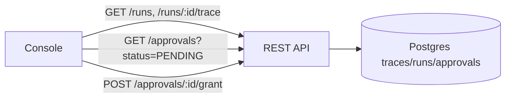

[← Guardrails & Security](06-Guardrails-and-Security.md) · [Relay README](README.md) · [Next: Testing & Verification →](08-Testing-and-Verification.md)

# 7. Tracing & Console

Every run must be **explainable after the fact** and **observable while it happens**. Tracing is
first-class; the console is a thin read/act layer over the API.

## 7.1 The trace model

Each run emits an append-only stream of `traces` rows. A trace entry records what happened at a
node so anyone can reconstruct the run without re-executing it.

| Trace kind | Captures |
|------------|----------|
| `RUN_STARTED` / `RUN_FINISHED` | Trigger source, input, final status, total timing |
| `INPUT_RESOLVED` | Node inputs after template resolution (the exact values used) |
| `NODE_RESULT` | Output, attempt number, duration, success/error |
| `LLM_CALL` | Prompt summary, model, **token usage**, latency, validation result |
| `SIDE_EFFECT` | Idempotency key, whether executed or replayed |
| `GATE` | Approval created/granted/rejected, who and when |
| `RETRY` / `DELAY` | Backoff decisions and scheduled resume times |

**What a trace answers:** resolved inputs and outputs, attempts, timing, AI token usage — "the
works." This is the audit trail and the debugging surface in one.

## 7.2 Observability beyond traces

- **Metrics** (Micrometer → Prometheus): runs started/succeeded/failed, step latency, queue depth
  (`outbox` READY count), worker throughput, LLM tokens, approval wait time.
- **Structured logs** with `run_id`/`node_id` correlation IDs on every line.
- **Health/readiness** endpoints; alert on rising queue depth or failed-run rate.

## 7.3 The console

A lightweight web UI (server-rendered pages or a small SPA) over the REST API. Deliberately
minimal — read and a couple of actions.

**Screens:**
1. **Runs list** — filter by workflow/status; live-ish via polling or SSE; shows status, current
   node, age.
2. **Run detail / trace** — the node timeline with per-step inputs/outputs, attempts, timing,
   token usage; failures and retries visible inline.
3. **Approvals inbox** — pending approvals with run context; **Approve / Reject** buttons calling
   the approval API.
4. (Optional) **Workflow list** — versions and publish status.

**Design intent:** anyone (not just engineers) can watch runs happen, dig into a trace, and clear
a pending approval with a click — closing the loop between the durable engine and the humans in it.

## 7.4 What the console must NOT do

- It never bypasses engine guarantees: "approve" writes an approval record the **engine**
  re-validates; it doesn't force a side effect. The console is a window and a doorbell, not a
  backdoor.

---

**Next → [8. Testing & Verification](08-Testing-and-Verification.md)**
