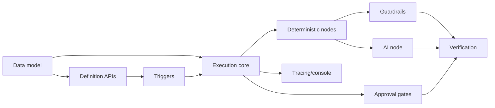

[← Testing & Verification](08-Testing-and-Verification.md) · [Relay README](README.md) · [Next: Hard Problems →](10-Hard-Problems.md)

# 9. Implementation Roadmap

Build order follows the one-pager: **data model first**, then definition APIs, triggers, the
durable core, node executors, gates, guardrails, tracing/console, and verification. Each phase is
independently demoable and testable.

## 9.1 Phased milestones

| Phase | Deliverable | Exit criteria |
|-------|-------------|---------------|
| **0. Scaffold** | Spring Boot app, Postgres via Testcontainers, Flyway migrations, CI | App boots; empty schema migrates; CI green |
| **1. Data model** | All tables (§[2](02-Data-Model.md)) + repositories | Schema created; entities persisted in tests |
| **2. Definition APIs** | Workflow/version CRUD + **publish validation** | Can create draft, publish freezes an immutable version; invalid defs rejected |
| **3. Triggers** | Webhook (HMAC) + manual trigger → creates run + outbox row (1 tx) | Trigger returns 202 with runId; run + message written atomically |
| **4. Execution core** | Outbox queue (`SKIP LOCKED`), worker loop, step state machine, per-step commit | A linear deterministic workflow runs end-to-end and persists each step |
| **5. Node executors** | `http_request`, `condition`, `delay`, `notify` + **idempotency wrapper** | Branching + side-effecting nodes work; idempotency ledger enforced |
| **6. AI node** | LLM provider adapter (mocked) + **JSON-Schema validation** | AI node output validated before downstream use; token usage traced |
| **7. Approval gates** | Pause/resume, approval APIs, sensitive-node hard block | Run parks and resumes correctly; sensitive node blocked without approval |
| **8. Guardrails** | Max-step cap, retry/backoff, prompt-injection-safe input handling | Runaway loop fails; forged webhook rejected; retries exercised |
| **9. Tracing & console** | Trace model + metrics + console (runs/trace/approvals) | Anyone can watch a run, inspect a trace, approve from the UI |
| **10. Verification** | Full test suite + **kill-and-resume demo** | All guarantee tests pass; demo shows zero duplicate side effects |

## 9.2 Suggested module layout (Spring Boot)

```
relay/
├── api/            # controllers: workflows, triggers, approvals, runs
├── domain/         # entities, value objects, state machine
├── engine/         # worker loop, queue (outbox), step executor, scheduler
├── nodes/          # NodeExecutor implementations + registry
├── ai/             # LlmProvider adapter (mock), schema validation
├── persistence/    # repositories, Flyway migrations
├── console/        # UI (server-rendered or small SPA) or served separately
└── test/           # unit + Testcontainers integration + kill-resume demo
```

## 9.3 Dependency order (what unblocks what)



## 9.4 Scope discipline (v1 vs later)

**In v1:** everything above with a **DB-backed outbox** queue, **mocked** HTTP + LLM, single
Postgres, hard-constant step cap, webhook HMAC.

**Deferred (v2+):** Kafka/RabbitMQ queue, real LLM providers, API bearer-token auth, per-workflow
(bounded) step-cap config, multi-region, richer console. Each is a localized change because queue
and providers are already interfaces.

## 9.5 Rough effort shape

The riskiest, highest-value phases are **4 (execution core)**, **5 (idempotency)**, and
**7 (pause/resume)** — budget the most time there and write their tests first. Phases 0–3 and
9 are comparatively mechanical. Verification (10) runs continuously, not just at the end.

---

**Next → [10. Hard Problems](10-Hard-Problems.md)**
